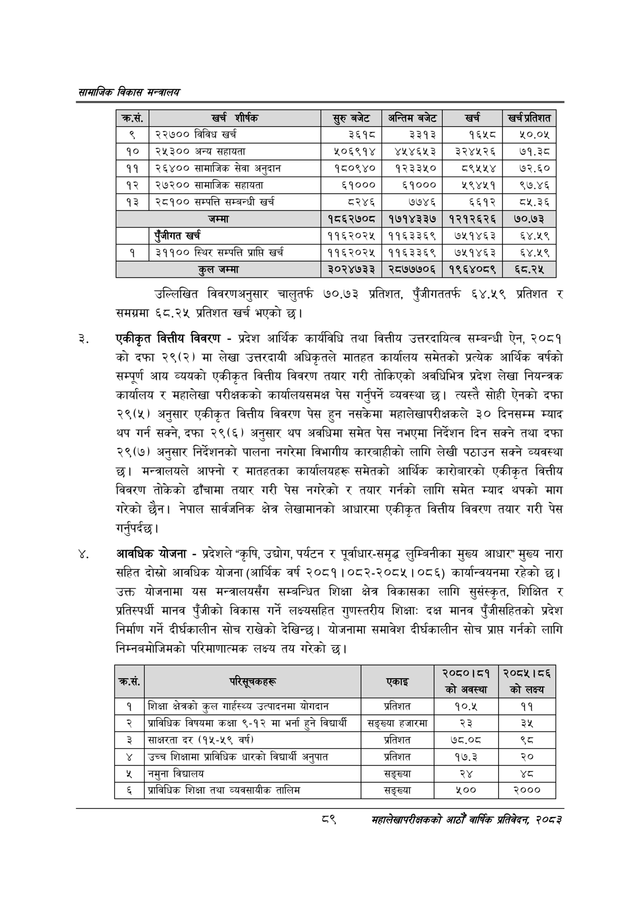

# Page 111 QA

## Rendered page


## Extracted text

```text
सायाजिक विकास सन्वालय
उल्लिखित विवरणअनुसार चालुतर्फ १७०,.७३ प्रतिशत, पुँजीगततर्फ ६४.५९ प्रतिशत र समग्रमा ६८.२४ प्रतिशत खर्च भएको छ।
एकीकृत वित्तीय विवरण -प्रदेश आर्थिक कार्यविधि तथा वित्तीय उत्तरदायित्व सम्बन्धी ऐन, २०८१ को दफा २९(२) मा लेखा उत्तरदायी अधिकृतले मातहत कार्यालय समेतको प्रत्येक आर्थिक वर्षको सम्पूर्ण आय व्ययको एकीकृत वित्तीय विवरण तयार गरी तोकिएको अवधिभित्र प्रदेश लेखा नियन्त्रक कार्यालय र महालेखा परीक्षकको कार्यालयसमक्ष पेस गर्नुपर्ने व्यवस्था छ। त्यस्तै सोही ऐनको दफा २९(५) अनुसार एकीकृत वित्तीय विवरण पेस हुन नसकेमा महालेखापरीक्षकले ३० दिनसम्म म्याद थप गर्न सक्ने, दफा २९(६) अनुसार थप अवधिमा समेत पेस नभएमा निर्देशन दिन सक्ने तथा दफा २९(७) अनुसार निर्देशनको पालना नगरेमा विभागीय कारबाहीको लागि लेखी पठाउन सक्ने व्यवस्था छ। मन्त्रालयले आफ्नो र मातहतका कार्यालयहरू समेतको आर्थिक कारोबारको एकीकृत वित्तीय विवरण तोकेको ढाँचामा तयार गरी पेस नगरेको र तयार गर्नको लागि समेत म्याद थपको माग गरेको छैन। नेपाल सार्वजनिक क्षेत्र लेखामानको आधारमा एकीकृत वित्तीय विवरण तयार गरी पेस गर्नुपर्दछ |
आवधिक योजना -प्रदेशले "कृषि, उद्योग, पर्यटन र पूर्वाधार-समृद्ध लुम्बिनीका मुख्य आधार" मुख्य नारा सहित दोस्रो आवधिक योजना (आर्थिक वर्ष २०८१।०८२-२०८५। ०८६) कार्यान्वयनमा रहेको छ। उक्त योजनामा यस मन्त्रालयसँग सम्बन्धित शिक्षा क्षेत्र विकासका लागि सुसंस्कृत, शिक्षित र प्रतिस्पर्धी मानव पुँजीको विकास गर्ने लक्ष्यसहित गुणस्तरीय शिक्षा: दक्ष मानव पुँजीसहितको प्रदेश निर्माण गर्ने दीर्घकालीन सोच राखेको देखिन्छ। योजनामा समावेश दीर्घकालीन सोच प्राप्त गर्नको लागि निम्नबमोजिमको परिमाणात्मक लक्ष्य तय गरेको छ।
व्९
सहालेखापरीक्षकको आठौँ वाषिकि प्रतिवेदन २०८२

| क्रस. | खर्च शीर्षक | सुरु बबेट | अन्तिम बजेट | खर्ड | खर्चप्र्तेशत |
| --- | --- | --- | --- | --- | --- |
| ९ | २२७०० विविध खर्च | ३६१८ | ३३१३ | १६५८ | १०.०५ |
| १० | २४५३०० अन्य सहायता | २०६९१४ | ४१४६५३ | ३२४१२६ | ७१.३८ |
| ११ | २६४०० कामाजिक सेवा अनुदान | १८०९४० | १२३३५० | ८९५५४ | ७२.६० |
| १२ | २७२०० सामाजिक सहायता | ६१००० | ६१००० | ५९४५१ | ९७.४६ |
| १३ | २८१०० सम्पत्ति सम्बन्धी खर्च | ८२४६ | ७७४६ | ६६१२ | ८५.३६ |
|  | जम्मा | १८६२७०८ | १७१४३३७ | १२१२६२६ | ७०.७३ |
|  | एंजीगत खर्च | ११६२०२५ | ११६३३६९ | ७५१४६३ | ६४.१९ |
| १ | ३११०० स्थिर सम्पत्ति प्राप्ति खर्च | ११६२०२५ | ११६३३६९ | ७५१४६३ | ६४.१९ |
|  | कुल जम्मा | ३०२४७३३ | २८७७७०६ | १९६४०८९ | ६८.२५ |

| \| क्रस. | - पारलूचकहरू | एकाइ | २०८०।८१ को अवस्था | २०८५।८६ को लक्ष्य |
| --- | --- | --- | --- | --- |
| १ | शिक्षा क्षेत्रको कुल मार्हस्थ्य उत्पादनमा योगदान | प्रतिशत | १०.४५ | ११ |
| २ | प्राविधिक विषय कक्षा ९-१२ मा भर्ना हुने विद्यार्थि | सङ्ख्या हजारमा | २३ | ३५ |
| ३ | साक्षरता दर (१५-५९ वर्ष) | प्रतिशत | ७८.०८ |  |
| ४ | उच्च शिक्षामा प्राविधिक धारको विद्यार्थी अनुपात | प्रतिशत | १७.३ | २० |
| ५ | नमुना विद्यालय | सङ्ख्या | २४ | थ्व |
| ६ | प्राविधिक शिक्षा तथा व्यवसायीक तालिम | सङ्ख्या | ५०० | २००० |
```

## Flags
- table_page
- medium_quality_table
