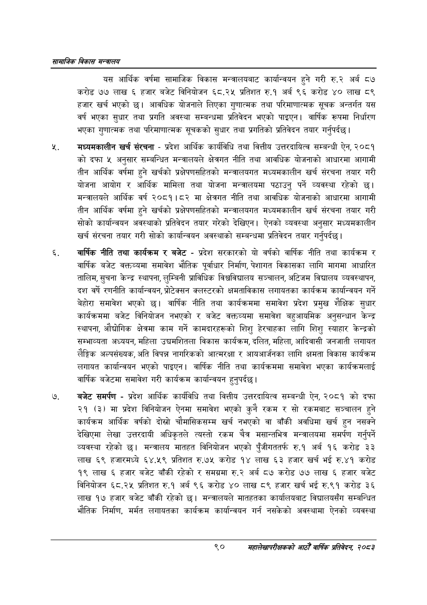

# Page 112 QA

## Rendered page


## Extracted text

```text
सायाजिक विकास सन्वालय
यस आर्थिक वर्षमा सामाजिक विकास मन्त्रालयबाट कार्यान्वयन हुने गरी रु.२ अर्ब ८७ करोड ७७ लाख ६ हजार बजेट विनियोजन ६८.२५ प्रतिशत रु.१ अर्ब ९६ करोड ४० लाख ८९ हजार खर्च भएको | आवधिक योजनाले लिएका गुणात्मक तथा परिमाणात्मक सूचक अन्तर्गत यस वर्ष भएका सुधार तथा प्रगति अवस्था सम्बन्धमा प्रतिवेदन भएको पाइएन। वार्षिक रूपमा निर्धारण भएका गुणात्मक तथा परिमाणात्मक सूचकको सुधार तथा प्रगतिको प्रतिवेदन तयार गर्नुपर्दछ |
मध्यमकालीन खर्च संरचना -प्रदेश आर्थिक कार्यविधि तथा वित्तीय उत्तरदायित्व सम्बन्धी ऐन, २०८१ को दफा ५ अनुसार सम्बन्धित मन्त्रालयले क्षेत्रगत नीति तथा आवधिक योजनाको आधारमा आगामी तीन आर्थिक वर्षमा हुने खर्चको प्रक्षेपणसहितको मन्त्रालयगत मध्यमकालीन खर्च संरचना तयार गरी योजना आयोग र आर्थिक मामिला तथा योजना मन्त्रालयमा पठाउनु पर्ने व्यवस्था रहेको छ। मन्त्रालयले आर्थिक वर्ष २०८१।८२ मा क्षेत्रगत नीति तथा आवधिक योजनाको आधारमा आगामी तीन आर्थिक वर्षमा हुने खर्चको प्रक्षेपणसहितको मन्त्रालयगत मध्यमकालीन खर्च संरचना तयार गरी सोको कार्यान्वयन अवस्थाको प्रतिवेदन तयार गरेको देखिएन। ऐनको व्यवस्था अनुसार मध्यमकालीन खर्च संरचना तयार गरी सोको कार्यान्वयन अवस्थाको सम्बन्धमा प्रतिवेदन तयार गर्नुपर्दछ |
वार्षिक नीति तथा कार्यक्रम र बजेट -प्रदेश सरकारको यो वर्षको वार्षिक नीति तथा कार्यक्रम र वार्षिक बजेट वक्तव्यमा समावेश भौतिक पूर्वाधार निर्माण, पेशागत विकासका लागि मागमा आधारित तालिम, सुचना केन्द्र स्थापना, लुम्बिनी प्राविधिक विश्वविद्यालय सञ्चालन, अटिजम विद्यालय व्यवस्थापन, दश वर्षे रणनीति कार्यान्वयन, प्रोटक्सन क्लस्टरको क्षमताविकास लगायतका कार्यक्रम कार्यान्वयन गर्ने बेहोरा समावेश भएको छ। वार्षिक नीति तथा कार्यक्रममा समावेश प्रदेश प्रमुख शैक्षिक सुधार कार्यक्रममा बजेट विनियोजन नभएको र बजेट वक्तव्यमा समावेश बहुआयमिक अनुसन्धान केन्द्र स्थापना, औद्योगिक क्षेत्रमा काम गर्ने कामदारहरूको शिशु हेरचाहका लागि शिशु स्याहार केन्द्रको सम्भाव्यता अध्ययन, महिला उद्यमशितला विकास कार्यक्रम, दलित, महिला, आदिवासी जनजाती लगायत लैङ्गिक अल्पसंख्यक, अति विपन्न नागरिकको आत्मरक्षा र आयआर्जनका लागि क्षमता विकास कार्यक्रम लगायत कार्यान्वयन भएको पाइएन। वार्षिक नीति तथा कार्यक्रममा समावेश भएका कार्यक्रमलाई वार्षिक बजेटमा समावेश गरी कार्यक्रम कार्यान्वयन हुनुपर्दछ |
बजेट समर्पण -प्रदेश आर्थिक कार्यविधि तथा वित्तीय उत्तरदायित्व सम्बन्धी ऐन, २०८१ को दफा २१ (३) मा प्रदेश विनियोजन ऐनमा समावेश भएको कुनै रकम र सो रकमबाट सञ्चालन हुने कार्यक्रम आर्थिक वर्षको दोस्रो चौमासिकसम्म खर्च नभएको वा बाँकी अवधिमा खर्च हुन नसक्ने देखिएमा लेखा उत्तरदायी अधिकृतले त्यस्तो रकम चैत्र मसान्तभित्र मन्त्रालयमा समर्पण गर्नुपर्ने व्यवस्था रहेको छ। मन्त्रालय मातहत विनियोजन भएको पुँजीगततर्फ रु.१ अर्ब १६ करोड ३३ लाख ६९ हजारमध्ये ६४.५९ प्रतिशत रु.७५ करोड १४ लाख ६३ हजार खर्च भई रु.४१ करोड १९ लाख ६ हजार बजेट बाँकी रहेको र समग्रमा रु.२ अर्ब ८७ करोड ७७ लाख ६ हजार बजेट विनियोजन ६८.२५ प्रतिशत रु.१ अर्ब ९६ करोड ४० लाख ८९ हजार खर्च भई रु.९१ करोड ३६ लाख १७ हजार बजेट बाँकी रहेको छ। मन्त्रालयले मातहतका कार्यालयबाट विद्यालयसँग सम्बन्धित भौतिक निर्माण, मर्मत लगायतका कार्यक्रम कार्यान्वयन गर्न नसकेको अवस्थामा ऐनको व्यवस्था
९०
सहालेखापरीक्षकको आठौँ वाषिकि प्रतिवेदन २०८२
```

## Flags
- None
