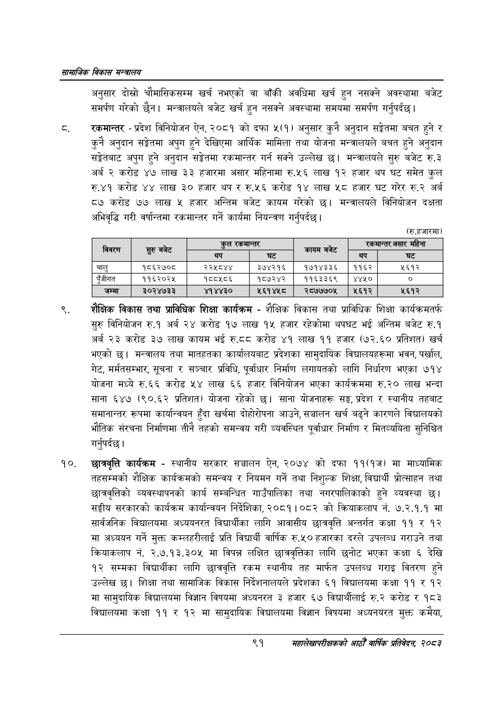

# Page 113 QA

## Rendered page


## Extracted text

```text
सायाजिक विकास सन्वालय
अनुसार दोस्रो चौमासिकसम्म खर्च नभएको वा बाँकी अवधिमा खर्च हुन नसक्ने अवस्थामा बजेट समर्पण गरेको छैन। मन्त्रालयले बजेट खर्च हुन नसक्ने अवस्थामा समयमा समर्पण गर्नुपर्दछ |
रकमान्तर -प्रदेश विनियोजन ऐन, २०८१ को दफा ५(१) अनुसार कुनै अनुदान सङ्ेतमा बचत हुने र कुनै अनुदान सङ्गेतमा अपुग हुने देखिएमा आर्थिक मामिला तथा योजना मन्त्रालयले बचत हुने अनुदान सङ्ेतबाट अपुग हुने अनुदान सङ्ेतमा रकमान्तर गर्न सक्ने उल्लेख छ। मन्त्रालयले सुरु बजेट रु.३ अर्ब २ करोड ४७ लाख ३३ हजारमा असार महिनामा रु.५६ लाख १२ हजार थप घट समेत कुल रु.४१ करोड ४४ लाख ३० हजार थप र रु.५६ करोड १४ लाख ५८ हजार घट गरेर रु.२ अर्ब ८७ करोड ७७ लाख ५ हजार अन्तिम बजेट कायम गरेको छ। मन्त्रालयले विनियोजन दक्षता अभिवृद्धि गरी वर्षान्तमा रकमान्तर गर्ने कार्यमा नियन्त्रण गर्नुपर्दछ |
शैक्षिक विकास तथा प्राविधिक शिक्षा कार्यक्रम -शैक्षिक विकास तथा प्राविधिक शिक्षा कार्यक्रमतर्फ सुरु विनियोजन रु.१ अर्ब २४ करोड १७ लाख १५ हजार रहेकोमा थपघट भई अन्तिम बजेट रु.१ अर्ब २३ करोड ३० लाख कायम भई रु.ठव करोड ४१ लाख ९९ हजार (७२.६० प्रतिशत) खर्च भएको | मन्त्रालय तथा मातहतका कार्यालयबाट प्रदेशका सामुदायिक विद्यालयहरूमा भवन, पर्खाल, गेट, मर्मतसम्भार, सूचना र सञ्चार प्रविधि, पूर्वाधार निर्माण लगायतको लागि निर्धारण भएका ७१४ योजना मध्ये रु.६६ करोड लाख ६६ हजार विनियोजन भएका कार्यक्रममा रु.२० लाख भन्दा साना ६४७ (९०.६२ प्रतिशत) योजना रहेको साना योजनाहरू सङ्घ, प्रदेश र स्थानीय तहबाट समानान्तर रूपमा कार्यान्वयन हुँदा खर्चमा दोहोरोपना आउने, सञ्चालन खर्च बढ्ने कारणले विद्यालयको भौतिक संरचना निर्माणमा तीनै तहको समन्वय गरी व्यवस्थित पूर्वाधार निर्माण र मितव्ययिता सुनिश्चित गर्नुपर्दछ |
छात्रवृत्ति कार्यक्रम -स्थानीय सरकार सञ्चालन ऐन, २०७४ को दफा ११(१ज) मा माध्यामिक तहसम्मको शैक्षिक कार्यक्रमको समन्वय र नियमन गर्ने तथा निशुल्क शिक्षा, विद्यार्थी प्रोत्साहन तथा छात्रवृत्तिको व्यवस्थापनको कार्य सम्बन्धित गाउँपालिका तथा नगरपालिकाको हुने व्यवस्था छ। सङ्घीय सरकारको कार्यक्रम कार्यान्वयन निर्देशिका, २०८१।०८२ को क्रियाकलाप नं. ७.२.१.१ मा सार्वजनिक विद्यालयमा अध्ययनरत विद्यार्थीका लागि आवासीय छात्रवृत्ति अन्तर्गत कक्षा ११ र १२ मा अध्ययन गर्ने मुक्त कम्लहरीलाई प्रति विद्यार्थी वार्षिक रु.५० हजारका दरले उपलब्ध गराउने तथा क्रियाकलाप नं. २.७.१३.३०५ मा विपन्न लक्षित छात्रवृत्तिका लागि छनोट भएका कक्षा ६ देखि १२ सम्मका विद्यार्थीका लागि छात्रवृत्ति रकम स्थानीय तह मार्फत उपलब्ध गराइ वितरण हुने उल्लेख छ। शिक्षा तथा सामाजिक विकास निर्देशनालयले प्रदेशका ६१ विद्यालयमा कक्षा ९९ र १२ मा सामुदायिक विद्यालयमा विज्ञान विषयमा अध्यनरत ३ हजार ६७ विद्यार्थीलाई रु.२ करोड र १८३ विद्यालयमा कक्षा ११ र १२ मा सामुदायिक विद्यालयमा विज्ञान विषयमा अध्यनयरत मुक्त कमैया,
(रु.हजारमा)
९१
सहालेखापरीक्षकको आठौँ वाषिकि प्रतिवेदन २०८२

| विवरण | बनेट | कुल रकभान्तर |  | सा |  | सकभान्तर असार महिना |
| --- | --- | --- | --- | --- | --- | --- |
|  | सुरु | थप | घट |  | थप | घट |
| चालु | १८६२७०८ | २२५८४४ | ३७४२१६ | १७१४३३६ | ११६२ | २६१२ |
| पुँजीगत | ११६२०२४५ | १८८४५८६ | १८७२४२ | ११६३३६९ | ४४५० | ० |
| जम्मा | ३०२४७३३ | ४१४४३० | ५६१४४५८ | २८७७७०५ | ५६१२ | २६१२ |
```

## Flags
- table_page
- medium_quality_table
