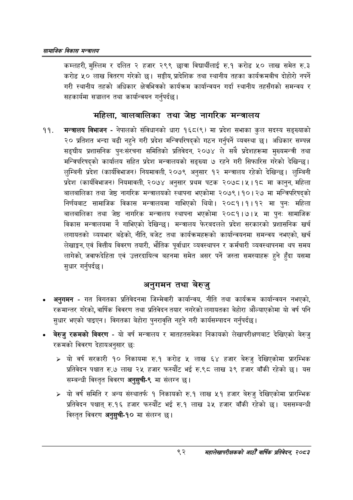

# Page 114 QA

## Rendered page


## Extracted text

```text
सायाजिक विकास सन्वालय
कम्लहरी, मुस्लिम र दलित २ हजार २९९ छात्रा विद्यार्थीलाई रु.१ करोड ५० लाख समेत रु.३ करोड ५० लाख वितरण गरेको छ। सङ्घीय, प्रादेशिक तथा स्थानीय तहका कार्यक्रमबीच दोहोरी नपर्ने गरी स्थानीय तहको अधिकार क्षेत्रभित्रको कार्यक्रम कार्यान्वयन गर्दा स्थानीय तहसँगको समन्वय र सहकार्यमा सञ्चालन तथा कार्यान्वयन गर्नुपर्दछ।
महिला, बालबालिका तथा जेष्ठ नागरिक मन्त्रालय
मन्त्रालय विभाजन -नेपालको संविधानको धारा १६८९) मा प्रदेश सभाका कुल सदस्य सङ्ख्याको २० प्रतिशत भन्दा बढी नहुने गरी प्रदेश मन्त्रिपरिषद्को गठन गर्नुपर्ने व्यवस्था छ। अधिकार सम्पन्न सङ्घीय प्रशासनिक पुनःसंरचना समितिको प्रतिवेदन, २०७४ ले सबै प्रदेशहरूमा मुख्यमन्त्री तथा मन्त्रिपरिषद्को कार्यालय सहित प्रदेश मन्त्रालयको सङ्ख्या ७ रहने गरी सिफारिस गरेको देखिन्छ। लुम्बिनी प्रदेश (कार्यविभाजन) नियमावली, २०७९ अनुसार १२ मन्त्रालय रहेको देखिन्छ। लुम्बिनी प्रदेश (कार्यविभाजन) नियमावली, २०७४ अनुसार प्रथम पटक २०७८।५।१८ मा कानुन, महिला बालबालिका तथा जेष्ठ नागरिक मन्त्रालयको स्थापना भएकोमा २०७९ | ९० | २७ मा मन्त्रिपरिषद्को निर्णयबाट सामाजिक विकास मन्त्रालयमा गाभिएको थियो। २०८१।१।१२ मा पुनः महिला बालबालिका तथा जेष्ठ नागरिक मन्त्रालय स्थापना भएकोमा २०८१।७।५ मा पुनः सामाजिक विकास मन्त्रालयमा नै गाभिएको देखिन्छ। मन्त्रालय फेरबदलले प्रदेश सरकारको प्रशासनिक खर्च लगायतको व्ययभार बढेको, नीति, बजेट तथा कार्यक्रमहरूको कार्यान्वयनमा समन्वय नभएको, खर्च लेखाङ्गन, एवं वित्तीय विवरण तयारी, भौतिक पूर्वाधार व्यवस्थापन र कर्मचारी व्यवस्थापनमा थप समय लागेको, जवाफदेहिता एवं उत्तरदायित्व बहनमा समेत असर पर्ने जस्ता समस्याहरू हुने हुँदा यसमा सुधार गर्नुपर्दछ |
अनुगमन तथा बेरुजु
अनुगमन -गत विगतका प्रतिवेदनमा जिम्मेवारी कार्यान्वय, नीति तथा कार्यक्रम कार्यान्वयन नभएको, रकमान्तर गरेको, वार्षिक विवरण तथा प्रतिवेदन तयार नगरेको लगायतका बेहोरा औंल्याएकोमा यो वर्ष पनि सुधार भएको पाइएन। विगतका बेहोरा पुनरावृत्ति नहुने गरी कार्यसम्पादन गर्नुपर्दछ |
बेरुजु रकमको विवरण -यो वर्ष मन्त्रालय र मातहतसमेका निकायको लेखापरीक्षणबाट देखिएको बेरुजु रकमको विवरण देहायअनुसार छः
» यो वर्ष सरकारी १० निकायमा रु.१ करोड ५ लाख ६४ हजार बेरुजु देखिएकोमा प्रारम्भिक प्रतिवेदन पश्चात रु.७ लाख २५ हजार फस्यौट भई रु.९८ लाख ३९ हजार बाँकी रहेको यस सम्बन्धी विस्तृत विवरण अनुसुची-९ मा संलग्न छ।
> यो वर्ष समिति र अन्य संस्थातर्फ १ निकायको रु.१ लाख ५१ हजार बेरुजु देखिएकोमा प्रारम्भिक प्रतिवेदन पश्चात्‌ रु.१६ हजार फस्यौट भई रु.१ लाख ३५ हजार बाँकी रहेको छ। यससम्बन्धी विस्तृत विवरण अनुसुची-१० मा संलग्न छ।
९२
सहालेखापरीक्षकको आठौँ वाषिकि प्रतिवेदन २०८२
```

## Flags
- None
