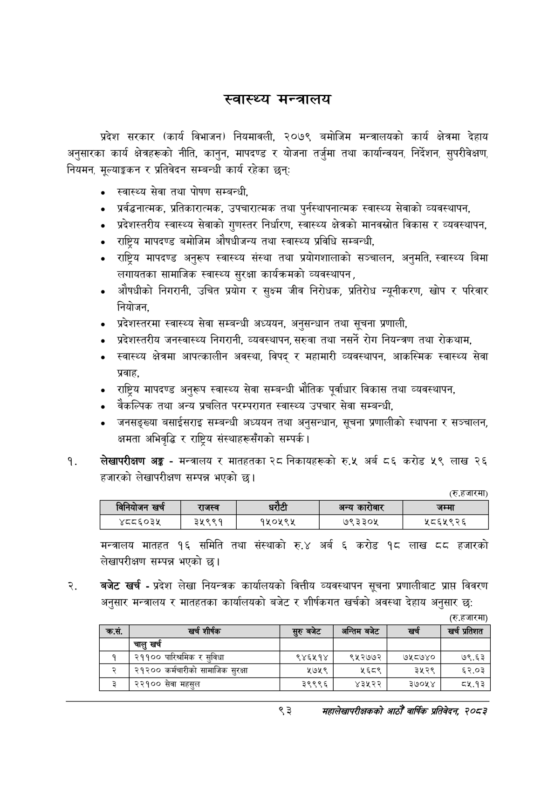

# Page 115 QA

## Rendered page


## Extracted text

```text
स्वास्थ्य मन्त्रालय
प्रदेश सरकार (कार्य विभाजन) नियमावली, २०७९ बमोजिम मन्त्रालयको कार्य क्षेत्रमा देहाय अनुसारका कार्य क्षेत्रहरूको नीति, कानुन, मापदण्ड र योजना तर्जुमा तथा कार्यान्वयन, निर्देशन, सुपरीवेक्षण, नियमन, मूल्याङ्कन र प्रतिवेदन सम्बन्धी कार्य रहेका छन्‌ः
स्वास्थ्य सेवा तथा पोषण सम्बन्धी,
प्रर्वद्धनात्मक, प्रतिकारात्मक, उपचारात्मक तथा पुर्नस्थापनात्मक स्वास्थ्य सेवाको व्यवस्थापन,
प्रदेशस्तरीय स्वास्थ्य सेवाको गुणस्तर निर्धारण, स्वास्थ्य क्षेत्रको मानवस्रोत विकास र व्यवस्थापन,
राष्ट्रिय मापदण्ड बमोजिम औषधीजन्य तथा स्वास्थ्य प्रविधि सम्बन्धी,
राष्ट्रिय मापदण्ड अनुरूप स्वास्थ्य संस्था तथा प्रयोगशालाको सञ्चालन, अनुमति, स्वास्थ्य बिमा लगायतका सामाजिक स्वास्थ्य सुरक्षा कार्यक्रमको व्यवस्थापन,
औषधीको निगरानी, उचित प्रयोग र सुक्ष्म जीव निरोधक, प्रतिरोध न्यूनीकरण, खोप र परिवार नियोजन,
प्रदेशस्तरमा स्वास्थ्य सेवा सम्बन्धी अध्ययन, अनुसन्धान तथा सूचना प्रणाली,
प्रदेशस्तरीय जनस्वास्थ्य निगरानी, व्यवस्थापन, सरुवा तथा नसर्ने रोग नियन्त्रण तथा रोकथाम,
स्वास्थ्य क्षेत्रमा आपत्कालीन अवस्था, विपद्‌ र महामारी व्यवस्थापन, आकस्मिक स्वास्थ्य सेवा प्रवाह,
राष्ट्रिय मापदण्ड अनुरूप स्वास्थ्य सेवा सम्बन्धी भौतिक पूर्वाधार विकास तथा व्यवस्थापन,
वैकल्पिक तथा अन्य प्रचलित परम्परागत स्वास्थ्य उपचार सेवा सम्बन्धी,
जनसङ्ख्या बसाईसराइ सम्बन्धी अध्ययन तथा अनुसन्धान, सूचना प्रणालीको स्थापना र सञ्चालन, क्षमता अभिवृद्धि र राष्ट्रिय संस्थाहरूसँगको सम्पर्क।
लेखापरीक्षण अङ्ग -मन्त्रालय र मातहतका २८ निकायहरूको रु.५ अर्ब ८६ करोड ५९ लाख २६ हजारको लेखापरीक्षण सम्पन्न भएको छ।
(रू. हजारमा)
मन्त्रालय मातहत १६ समिति तथा संस्थाको रु.४ अर्ब ६ करोड ९६ लाख हजारको लेखापरीक्षण सम्पन्न भएको छ।
बजेट खर्च -प्रदेश लेखा नियन्त्रक कार्यालयको वित्तीय व्यवस्थापन सूचना प्रणालीबाट प्राप्त विवरण अनुसार मन्त्रालय र मातहतका कार्यालयको बजेट र शीर्षकगत खर्चको अवस्था देहाय अनुसार छ:
(रु.हजारमा)
९३
सहालेखापरीक्षकको आठौँ वाषिकि प्रतिवेदन २०८२

| िनिबोजन खर्च | राजस्व |  |  | अन्य कारोबार | जम्मा |
| --- | --- | --- | --- | --- | --- |
| ४८८६०३४५ | ३५९९१ | १५०५९५ |  | ७९३३०४५ | ५८६५९२६ |

| कस. | खर्च शीर्षक | सुरुबबेट | अन्तिम बजेट | खर्च | खर्च प्रतिशत |
| --- | --- | --- | --- | --- | --- |
|  | चालु खर्च |  |  |  |  |
| १ | २११०० पारिन्रमिक र सुविधा | ९४६५१४ | ९५२७७२ | ७५८७४० | ७९.६३ |
| २ | २१२०० कर्मचारीको सामाजिक सुरक्षा | १७५९ | २६८९ | ३५२९ | ६२.०३ |
| ३ | २३९०० सेवा महसुल | ३९९९६ | ४३५२२ | ३७०५४ | ८५.१३ |
```

## Flags
- table_page
- medium_quality_table
