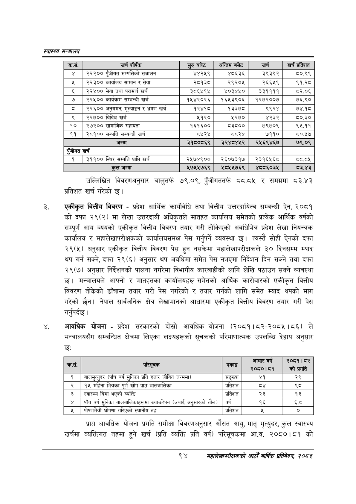

# Page 116 QA

## Rendered page


## Extracted text

```text
स्वास्थ्य मन्त्रालय
उल्लिखित विवरणअनुसार चालुतर्फ ७९.०९, पुँजीगततर्फ ८८.८५ र समग्रमा ८३.४३ प्रतिशत खर्च गरेको छ।
एकीकृत वित्तीय विवरण -प्रदेश आर्थिक कार्यविधि तथा वित्तीय उत्तरदायित्व सम्बन्धी ऐन, २०८१ को दफा २९(२) मा लेखा उत्तरदायी अधिकृतले मातहत कार्यालय समेतको प्रत्येक आर्थिक वर्षको सम्पूर्ण आय व्ययको एकीकृत वित्तीय विवरण तयार गरी तोकिएको अवधिभित्र प्रदेश लेखा नियन्त्रक कार्यालय र महालेखापरीक्षकको कार्यालयसमक्ष पेस गर्नुपर्ने व्यवस्था छ। त्यस्तै सोही ऐनको दफा २९(५) अनुसार एकीकृत वित्तीय विवरण पेस हुन नसकेमा महालेखापरीक्षकले ३० दिनसम्म म्याद थप गर्न सक्ने, दफा २९(६) अनुसार थप अवधिमा समेत पेस नभएमा निर्देशन दिन सक्ने तथा दफा २९(७) अनुसार निर्देशनको पालना नगरेमा विभागीय कारबाहीको लागि लेखि पठाउन सक्ने व्यवस्था छ। मन्त्रालयले आफ्नो र मातहतका कार्यालयहरू समेतको आर्थिक कारोबारको एकीकृत वित्तीय विवरण तोकेको ढाँचामा तयार गरी पेस नगरेको र तयार गर्नको लागि समेत म्याद थपको माग गरेको छैन। नेपाल सार्वजनिक क्षेत्र लेखामानको आधारमा एकीकृत वित्तीय विवरण तयार गरी पेस गर्नुपर्दछ |
आवधिक योजना -प्रदेश सरकारको दोस्रो आवधिक योजना (२०८१।८२-२०८५।८६) ले मन्त्रालयसँग सम्बन्धित क्षेत्रमा लिएका लक्ष्यहरूको सूचकको परिमाणात्मक उपलब्धि देहाय अनुसार छः
प्राप्त आवधिक योजना प्रगति समीक्षा विवरणअनुसार औसत आयु, मातृ मृत्युदर, कुल स्वास्थ्य खर्चमा व्यक्तिगत तहमा हुने खर्च (प्रति व्यक्ति प्रति वर्ष) परिसूचकमा आ.व. २०८०।८१ को
९४
सहालेखापरीक्षकको आठौँ वाषिकि प्रतिवेदन २०८२

| क्रस. | खर्च शीर्षक | सुरु बबेट | अन्तिम बजेट | खर्च | खर्च प्रतिशत |
| --- | --- | --- | --- | --- | --- |
| ४ | २२२०० पुँजीगत धन्पततिको सञ्चालन | ४४२५९ | ४८६३६ | ३९३९२ | ८०.९९ |
|  | २३३०० कार्यालय सामान र सेवा | २८१३८ | २९२०४५ | २६६५९ | ९१.२८ |
| ६ | २२४०० सेवा तथा परामर्श खर्च | ३८६५१४५ | ४०३४५० | ३३११११ | ८२.०६ |
| ७ | २२५०० कार्यक्रम सम्बन्धी खर्च | १५४२०२६ | १६५३९०६ | १२७२००७ | ७६.९० |
| छ | २२६०० अनुगमन, मूल्याङ्कन र भ्रमण खर्च | १२४१८ | १३३७८ | ९९२४ | ७४.१८ |
| ९ | २२७०० विविध खर्च | २१२० | ५२७० | ४२३२ | ८०.३० |
| १० | २७२०० सामाजिक सहायता | १६१६०० | ८३८०० | ७९७०९ | ९५.११ |
| ११ | २८१०० सम्पत्ति सम्बन्धी खर्च | ८५२४ | दद२४ | ७११० | ८०.५७ |
|  | जम्मा | २१८००८६९ | २२४८४५२ | र२१६९४६७ | ७९.०९ |
| एँजीगत | खर्च |  |  |  |  |
| १ | ३११०० स्थिर सम्पत्ति प्राप्ति खर्च | २५७४९०० | २६०७३१७ | २३१६५६८ | द्व.द५ |
|  | कुल जम्मा | २७५५७६९ | ४८०५५७६९ | ४८०६०३५ | ८३.४३ |

| क्रस. | एरा |  | २०८०।८१ | २०८१।५२ को प्रगति |
| --- | --- | --- | --- | --- |
| १ | जालमूत्युदर (पाँच वर्ष मुनिका प्रति हजार जीवित जन्ममा) | सङ्ख्या | ४१ | २९ |
| २ | १५ महिना भित्रका पूर्ण खोप प्राप्त बालबालिका | प्रतिशत |  | %५ |
| ३ | स्वास्थ्य बिमा भएको व्यक्ति | प्रतिशत | २३ | १३ |
| ४ | पाँच वर्ष मुनिका बालनालिकाहरूमा ख्वाउटेपन (उचाई अनुसारको तौल) | वर्ष | १६ | ६्द |
| ५ | पीोषणभैत्री घोषणा गरिएको स्थानीय तह | प्रतिशत | रू | ० |
```

## Flags
- table_page
- medium_quality_table
