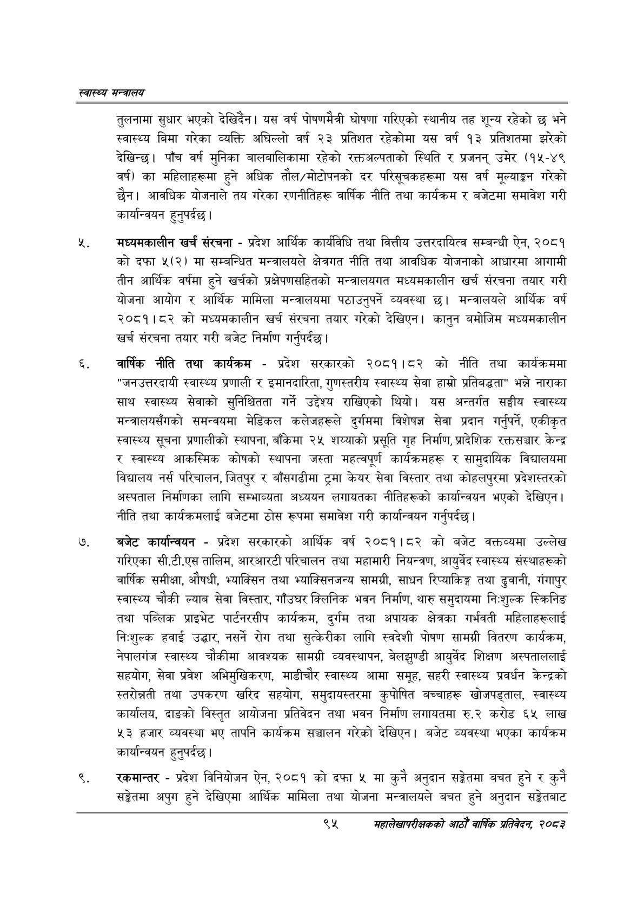

# Page 117 QA

## Rendered page


## Extracted text

```text
स्वास्थ्य मन्त्रालय
तुलनामा सुधार भएको २ | यस वर्ष पोषणमैत्री घोषणा गरिएको स्थानीय तह शून्य रहेको छ भने स्वास्थ्य बिमा गरेका व्यक्ति अघिल्लो वर्ष २३ प्रतिशत रहेकोमा यस वर्ष १३ प्रतिशतमा झरेको देखिन्छ। पाँच वर्ष मुनिका बालबालिकामा रहेको रक्तअल्पताको स्थिति र प्रजनन्‌ उमेर (१५-४९ वर्ष) का महिलाहरूमा हुने अधिक तौल/मोटोपनको दर परिसूचकहरूमा यस वर्ष मूल्याङ्कन गरेको छैन। आवधिक योजनाले तय गरेका रणनीतिहरू वार्षिक नीति तथा कार्यक्रम र बजेटमा समावेश गरी कार्यान्वयन हुनुपर्दछ |
मंध्यमकालीन खर्च संरचना -प्रदेश आर्थिक कार्यविधि तथा वित्तीय उत्तरदायित्व सम्बन्धी ऐन, २०८१ कोदफा ५(२) मा सम्बन्धित मन्त्रालयले क्षेत्रगत नीति तथा आवधिक योजनाको आधारमा आगामी तीन आर्थिक वर्षमा हुने खर्चको प्रक्षेपणसहितको मन्त्रालयगत मध्यमकालीन खर्च संरचना तयार गरी योजना आयोग र आर्थिक मामिला मन्त्रालयमा पठाउनुपर्ने व्यवस्था छ। मन्त्रालयले आर्थिक वर्ष २०८१।८२ को मध्यमकालीन खर्च संरचना तयार गरेको देखिएन। कानुन बमोजिम मध्यमकालीन खर्च संरचना तयार गरी बजेट निर्माण गर्नुपर्दछ |
वार्षिक नीति तथा कार्यक्रम -प्रदेश सरकारको २०८१।८२ को नीति तथा कार्यक्रममा "जनउत्तरदायी स्वास्थ्य प्रणाली र इमानदारिता, गुणस्तरीय स्वास्थ्य सेवा हाम्रो प्रतिबद्धता" भन्ने नाराका साथ स्वास्थ्य सेवाको सुनिश्चितता गर्ने उद्देश्य राखिएको थियो। यस अन्तर्गत सङ्घीय स्वास्थ्य मन्त्रालयसँगको समन्वयमा मेडिकल कलेजहरूले दुर्गममा विशेषज्ञ सेवा प्रदान गर्नुपर्ने, एकीकृत स्वास्थ्य सूचना प्रणालीको स्थापना, बाँकेमा २५ शय्याको प्रसूति गृह निर्माण, प्रादेशिक रक्तसञ्चार केन्द्र र स्वास्थ्य आकस्मिक कोषको स्थापना जस्ता महत्वपूर्ण कार्यक्रमहरू र सामुदायिक विद्यालयमा विद्यालय नर्स परिचालन, जितपुर र बाँसगढीमा ट्रमा केयर सेवा विस्तार तथा कोहलपुरमा प्रदेशस्तरको अस्पताल निर्माणका लागि सम्भाव्यता अध्ययन लगायतका नीतिहरूको कार्यान्वयन भएको देखिएन। नीति तथा कार्यक्रमलाई बजेटमा ठोस रूपमा समावेश गरी कार्यान्वयन गर्नुपर्दछ |
बजेट कार्यान्वयन -प्रदेश सरकारको आर्थिक वर्ष २०८१।८२ को बजेट वक्तव्यमा उल्लेख गरिएका सी.टी.एस तालिम, आरआरटी परिचालन तथा महामारी नियन्त्रण, आयुर्वेद स्वास्थ्य संस्थाहरूको वार्षिक समीक्षा, औषधी, भ्याक्सिन तथा भ्याक्सिनजन्य सामग्री, साधन रिप्याकिङ्ग तथा ढुवानी, गंगापुर स्वास्थ्य चौकी ल्याब सेवा विस्तार, गाँउघर क्लिनिक भवन निर्माण, थारु समुदायमा निःशुल्क स्क्रिनिङ तथा पब्लिक प्राइभेट पार्टनरसीप कार्यक्रम, दुर्गम तथा अपायक क्षेत्रका गर्भवती महिलाहरूलाई निःशुल्क हवाई उद्धार, नसर्ने रोग तथा सुत्केरीका लागि स्वदेशी पोषण सामग्री वितरण कार्यक्रम, नेपालगंज स्वास्थ्य चौकीमा आवश्यक सामग्री व्यवस्थापन, बेलझुण्डी आयुर्वेद शिक्षण अस्पताललाई सहयोग, सेवा प्रवेश अभिमुखिकरण, माडीचौर स्वास्थ्य आमा समूह, सहरी स्वास्थ्य प्रवर्धन केन्द्रको स्तरोन्नती तथा उपकरण खरिद सहयोग, समुदायस्तरमा कुपोषित बच्चाहरू खोजपड्ताल, स्वास्थ्य कार्यालय, दाङको विस्तृत आयोजना प्रतिवेदन तथा भवन निर्माण लगायतमा रु.२ करोड ६५ लाख ४३ हजार व्यवस्था भए तापनि कार्यक्रम सञ्चालन गरेको देखिएन। बजेट व्यवस्था भएका कार्यक्रम कार्यान्वयन हुनुपर्दछ |
रकमान्तर -प्रदेश विनियोजन ऐन, २०८१ को दफा ५ मा कुनै अनुदान सङ्गेतमा बचत हुने र कुनै सङ्गेतमा अपुग हुने देखिएमा आर्थिक मामिला तथा योजना मन्त्रालयले बचत हुने अनुदान सङ्गेतबाट
९५
सहालेखापरीक्षकको आठौँ वाषिकि प्रतिवेदन २०८२
```

## Flags
- None
