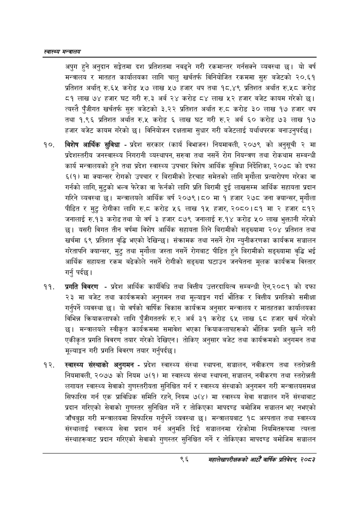

# Page 118 QA

## Rendered page


## Extracted text

```text
स्वास्थ्य मन्त्रालय
अपुग हुने अनुदान सङ्गेतमा दश प्रतिशतमा नबढ्ने गरी रकमान्तर गर्नसक्ने व्यवस्था छ। यो वर्ष मन्त्रालय र मातहत कार्यालयका लागि चालु खर्चतर्फ विनियोजित रकममा सुरु बजेटको २०.६१ प्रतिशत अर्थात्‌ रु.६५ करोड ५७ लाख ५७ हजार थप तथा १८.४९ प्रतिशत अर्थात रु.५८ करोड ८१ लाख ७४ हजार घट गरी रु.३ अर्ब २४ करोड ८४ लाख ५२ हजार बजेट कायम गरेको छ। त्यस्तै पुँजीगत खर्चतर्फ सुरु बजेटको ३.२२ प्रतिशत अर्थात रु.८ करोड ३० लाख १७ हजार थप तथा १.९६ प्रतिशत अर्थात रु.५« करोड ६ लाख घट गरी अर्ब ६० करोड ७३ लाख १७ हजार बजेट कायम गरेको | विनियोजन दक्षतामा सुधार गरी बजेटलाई यर्थाथपरक बनाउनुपर्दछ।
विशेष आर्थिक सुविधा -प्रदेश सरकार (कार्य विभाजन) नियमावली, २०७९ को अनुसूची २ मा प्रदेशस्तरीय जनस्वास्थ्य निगरानी व्यस्थापन, सरुवा तथा नसर्ने रोग नियन्त्रण तथा रोकथाम सम्बन्धी कार्य मन्त्रालयको हुने तथा प्रदेश स्वास्थ्य उपचार विशेष आर्थिक सुविधा निर्देशिका, २०७८ को दफा ६(१) मा क्यान्सर रोगको उपचार र बिरामीको हेरचाह समेतको लागि मृगौला प्रत्यारोपण गरेका वा गर्नको लागि, मुटुको भल्व फेरेका वा फेर्नको लागि प्रति बिरामी दुई लाखसम्म आर्थिक सहायता प्रदान गरिने व्यवस्था छ। मन्त्रालयले आर्थिक बर्ष २०७९।८० मा १ हजार २७८ जना क्यान्सर, मृगौला पीडित र मुटु रोगीका लागि रु.८ करोड ५६ लाख १५ हजार, २०८०।८१ मा २ हजार ८१२ जनालाई रु.१३ करोडतथा यो वर्ष ३ हजार ८७९ जनालाई रु.१४ करोड ५० लाख भुक्तानी गरेको छ। यसरी विगत तीन वर्षमा विशेष आर्थिक सहायता लिने बिरामीको सङ्ख्यामा २०४ प्रतिशत तथा खर्चमा ६९ प्रतिशत वृद्धि भएको देखिन्छ। संक्रामक तथा नसर्ने रोग न्युनीकरणका कार्यक्रम सञ्चालन गरेतापनि क्यान्सर, मुटु तथा मृगौला जस्ता नसर्ने रोगबाट पीडित हुने बिरामीको सङ्ख्यामा वृद्धि भई आर्थिक सहायता रकम बढेकोले नसर्ने रोगीको सङ्ख्या घटाउन जनचेतना मूलक कार्यक्रम विस्तार गर्नु पर्दछ।
प्रगति विवरण -प्रदेश आर्थिक कार्यविधि तथा वित्तीय उत्तरदायित्व सम्बन्धी ऐन,२०८१ को दफा २३ मा बजेट तथा कार्यक्रमको अनुगमन तथा मूल्याङ्कन गर्दा भौतिक र वित्तीय प्रगतिको समीक्षा गर्नुपर्ने व्यवस्था छ। यो वर्षको वार्षिक विकास कार्यक्रम अनुसार मन्त्रालय र मातहतका कार्यालयका विभिन्न क्रियाकलापको लागि पुँजीगततर्फ रु.२ अर्ब ३१ करोड ६५ लाख ६८ हजार खर्च गरेको छ। मन्त्रालयले स्वीकृत कार्यक्रममा समावेश भएका क्रियाकलापहरूको भौतिक प्रगति खुल्ने गरी एकीकृत प्रगति विवरण तयार गरेको देखिएन। तोकिए अनुसार बजेट तथा कार्यक्रमको अनुगमन तथा मूल्याङ्कन गरी प्रगति विवरण तयार गर्नुपर्दछ |
स्वास्थ्य संस्थाको अनुगमन -प्रदेश स्वास्थ्य संस्था स्थापना, सञ्चालन, नवीकरण तथा स्तरोन्नती नियमावली, २०७७ को नियम ७(१) मा स्वास्थ्य संस्था स्थापना, सञ्चालन, नवीकरण तथा स्तरोन्नती लगायत स्वास्थ्य सेवाको गुणस्तरीयता सुनिश्चित गर्न र स्वास्थ्य संस्थाको अनुगमन गरी मन्त्रालयसमक्ष सिफारिस गर्न एक प्राविधिक समिति रहने, नियम ७(४) मा स्वास्थ्य सेवा सञ्चालन गर्ने संस्थाबाट प्रदान गरिएको सेवाको गुणस्तर सुनिश्चित गर्ने र तोकिएका मापदण्ड बमोजिम सञ्चालन भए नभएको जाँचबुझ गरी मन्त्रालयमा सिफारिस गर्नुपर्ने व्यवस्था छ। मन्त्रालयबाट १८ अस्पताल तथा स्वास्थ्य संस्थालाई स्वास्थ्य सेवा प्रदान गर्न अनुमति दिई सञ्चालनमा रहेकोमा नियमितरूपमा त्यस्ता संस्थाहरूबाट प्रदान गरिएको सेवाको गुणस्तर सुनिश्चित गर्ने र तोकिएका मापदण्ड बमोजिम सञ्चालन
९६
सहालेखापरीक्षकको आठौँ वाषिकि प्रतिवेदन २०८२
```

## Flags
- None
