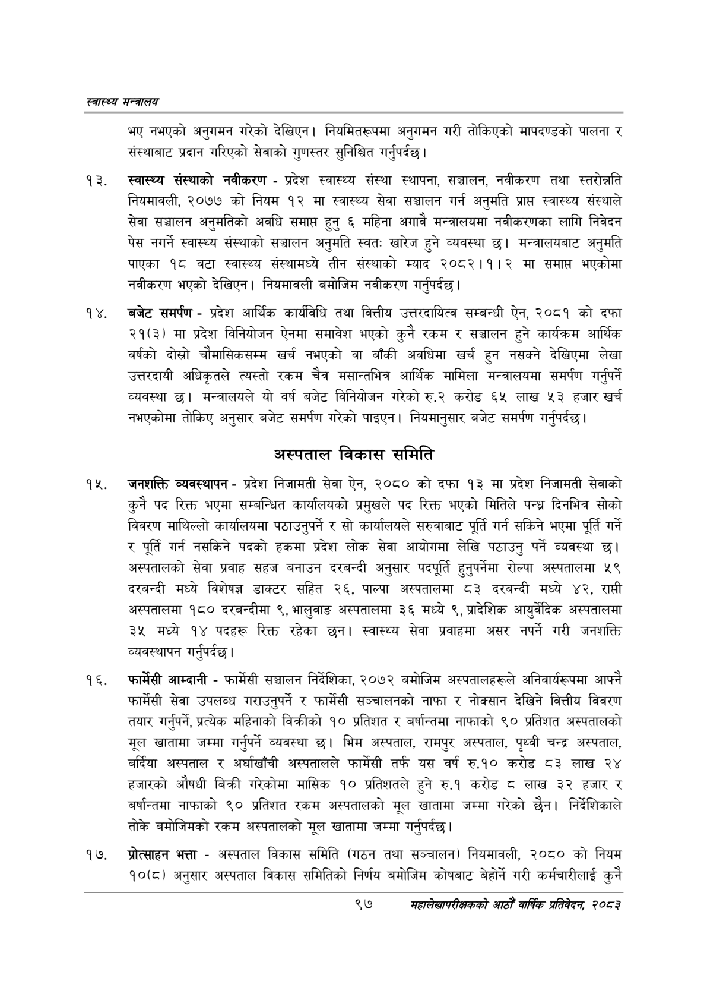

# Page 119 QA

## Rendered page


## Extracted text

```text
स्वास्थ्य मन्त्रालय
भए नभएको अनुगमन गरेको देखिएन। नियमितरूपमा अनुगमन गरी तोकिएको मापदण्डको पालना र संस्थाबाट प्रदान गरिएको सेवाको गुणस्तर सुनिश्चित गर्नुपर्दछ |
स्वास्थ्य संस्थाको नवीकरण -प्रदेश स्वास्थ्य संस्था स्थापना, सञ्चालन, नवीकरण तथा स्तरोन्नति नियमावली, २०७७ को नियम १२ मा स्वास्थ्य सेवा सञ्चालन गर्न अनुमति प्राप्त स्वास्थ्य संस्थाले सेवा सञ्चालन अनुमतिको अवधि समाप्त हुनु ६ महिना अगावै मन्त्रालयमा नवीकरणका लागि निवेदन पेस नगर्ने स्वास्थ्य संस्थाको सञ्चालन अनुमति स्वत: खारेज हुने व्यवस्था छ। मन्त्रालयबाट अनुमति पाएका १८ वटा स्वास्थ्य संस्थामध्ये तीन संस्थाको म्याद २०८२।१।२ मा समाप्त भएकोमा नवीकरण भएको देखिएन। नियमावली बमोजिम नवीकरण गर्नुपर्दछ |
बजेट समर्पण -प्रदेश आर्थिक कार्यविधि तथा वित्तीय उत्तरदायित्व सम्बन्धी ऐन, २०८१ को दफा २१(३) मा प्रदेश विनियोजन ऐनमा समावेश भएको कुनै रकम र सञ्चालन हुने कार्यक्रम आर्थिक वर्षको दोस्रो चौमासिकसम्म खर्च नभएको वा बाँकी अवधिमा खर्च हुन नसक्ने देखिएमा लेखा उत्तरदायी अधिकृतले त्यस्तो रकम चैत्र मसान्तभित्र आर्थिक मामिला मन्त्रालयमा समर्पण गर्नुपर्ने व्यवस्था | मन्त्रालयले यो वर्ष बजेट विनियोजन गरेको रु.२ करोड ६५ लाख ३ हजार खर्च नभएकोमा तोकिए अनुसार बजेट समर्पण गरेको पाइएन। नियमानुसार बजेट समर्पण गर्नुपर्दछ |
अस्पताल विकास समिति
जनशक्ति व्यवस्थापन -प्रदेश निजामती सेवा ऐन, २०८० को दफा १३ मा प्रदेश निजामती सेवाको कुनै पद रिक्त भएमा सम्बन्धित कार्यालयको प्रमुखले पद रिक्त भएको मितिले पन्ध्र दिनभित्र सोको विवरण माथिल्लो कार्यालयमा पठाउनुपर्ने र सो कार्यालयले सरुवाबाट पूर्ति गर्न सकिने भएमा पूर्ति गर्ने र पूर्ति गर्न नसकिने पदको हकमा प्रदेश लोक सेवा आयोगमा लेखि पठाउनु पर्ने व्यवस्था छ। अस्पतालको सेवा प्रवाह सहज बनाउन दरबन्दी अनुसार पदपूर्ति हुनुपर्नेमा रोल्पा अस्पतालमा ५९ दरबन्दी मध्ये विशेषज्ञ डाक्टर सहित २६, पाल्पा अस्पतालमा ८३ दरबन्दी मध्ये ४२, राप्ती अस्पतालमा १८० दरबन्दीमा ९, भालुवाङ अस्पतालमा ३६ मध्ये ९, प्रादेशिक आयुर्वेदिक अस्पतालमा ३५ मध्ये १४ पदहरू रिक्त रहेका छन। स्वास्थ्य सेवा प्रवाहमा असर नपर्ने गरी जनशक्ति व्यवस्थापन |
गर्नुपर्दछ
फार्मेसी आम्दानी -फार्मेसी सञ्चालन निर्देशिका, २०७२ बमोजिम अस्पतालहरूले अनिवार्यरूपमा आफ्नै फार्मेसी सेवा उपलव्ध गराउनुपर्ने र फार्मेसी सञ्चालनको नाफा र नोक्सान देखिने वित्तीय विवरण तयार गर्नुपर्ने, प्रत्यक महिनाको विक्रीको १० प्रतिशत र बर्षान्तमा नाफाको ९० प्रतिशत अस्पतालको मूल खातामा जम्मा गर्नुपर्ने व्यवस्था छ। भिम अस्पताल, रामपुर अस्पताल, पृथ्वी चन्द्र अस्पताल, बर्दिया अस्पताल र अर्घाखाँची अस्पतालले फार्मेसी तर्फ यस वर्ष रु.१० करोड ८३ लाख २४ हजारको औषधी बिक्री गरेकोमा मासिक १० प्रतिशतले हुने रु.१ करोड लाख ३२ हजार र बर्षान्तमा नाफाको ९० प्रतिशत रकम अस्पतालको मूल खातामा जम्मा गरेको छैन। निर्देशिकाले तोके बमोजिमको रकम अस्पतालको मूल खातामा जम्मा गर्नुपर्दछ।
प्रोत्साहन भत्ता -अस्पताल विकास समिति (गठन तथा सञ्चालन) नियमावली, २०८० को नियम १०६८) अनुसार अस्पताल विकास समितिको निर्णय बमोजिम कोषबाट बेहोर्ने गरी कर्मचारीलाई कुनै
९७
सहालेखापरीक्षकको आठौँ वाषिकि प्रतिवेदन २०८२
```

## Flags
- None
