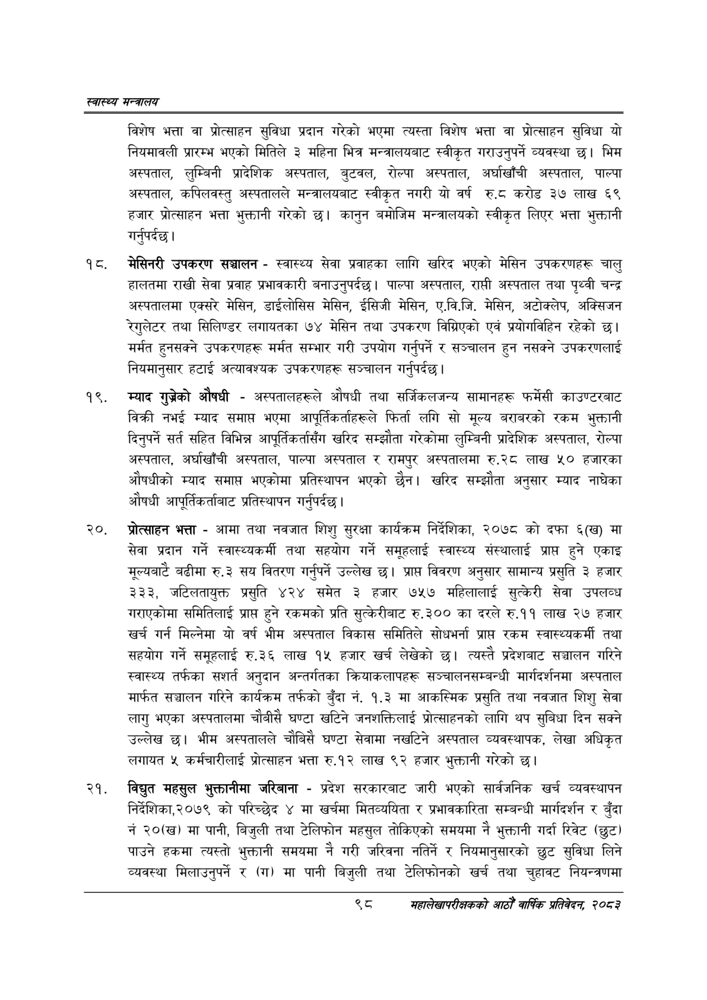

# Page 120 QA

## Rendered page


## Extracted text

```text
स्वास्थ्य मन्त्रालय
विशेष भत्ता वा प्रोत्साहन सुविधा प्रदान गरेको भएमा त्यस्ता विशेष भत्ता वा प्रोत्साहन सुविधा यो नियमावली प्रारम्भ भएको मितिले ३ महिना भित्र मन्त्रालयबाट स्वीकृत गराउनुपर्ने व्यवस्था छ। भिम अस्पताल, लुम्बिनी प्रादेशिक अस्पताल, बुटवल, रोल्पा अस्पताल, अर्घाखाँची अस्पताल, पाल्पा अस्पताल, कपिलवस्तु अस्पतालले मन्त्रालयबाट स्वीकृत नगरी यो वर्ष रु.८ठ करोड ३७ लाख ६९ हजार प्रोत्साहन भत्ता भुक्तानी गरेको छ। कानुन बमोजिम मन्त्रालयको स्वीकृत लिएर भत्ता भुक्तानी गर्नुपर्दछ |
मेसिनरी उपकरण सञ्चालन -स्वास्थ्य सेवा प्रवाहका लागि खरिद भएको मेसिन उपकरणहरू चालु हालतमा राखी सेवा प्रवाह प्रभावकारी बनाउनुपर्दछ। पाल्पा अस्पताल, राप्ती अस्पताल तथा पृथ्वी चन्द्र अस्पतालमा एक्सरै मेसिन, डाईलोसिस मेसिन, ईसिजी मेसिन, ए.वि.जि. मेसिन, अटोक्लेप, अक्सिजन रेगुलेटर तथा सिलिण्डर लगायतका १७४ मेसिन तथा उपकरण विग्रिएको एवं प्रयोगविहिन रहेको छ। मर्मत हुनसक्ने उपकरणहरू मर्मत सम्भार गरी उपयोग गर्नुपर्ने र सञ्चालन हुन नसक्ने उपकरणलाई नियमानुसार हटाई अत्यावश्यक उपकरणहरू सञ्चालन गर्नुपर्दछ |
म्याद गुञ्रेको औषधी -अस्पतालहरूले औषधी तथा सर्जिकलजन्य सामानहरू फर्मेसी काउण्टरबाट विक्री नभई म्याद समाप्त भएमा आपूर्तिकर्ताहरूले फिर्ता लगि सो मूल्य बराबरको रकम भुक्तानी दिनुपर्ने सर्त सहित विभिन्न आपूर्तिकर्तासँग खरिद सम्झौता गरेकोमा लुम्बिनी प्रादेशिक अस्पताल, रोल्पा अस्पताल, अर्घाखाँची अस्पताल, पाल्पा अस्पताल र रामपुर अस्पतालमा रु.२८ लाख ५० हजारका औषधीको म्याद समाप्त भएकोमा प्रतिस्थापन भएको छैन। खरिद सम्झौता अनुसार म्याद नाघेका औषधी आपूर्तिकर्ताबाट प्रतिस्थापन गर्नुपर्दछ |
प्रोत्साहन भत्ता -आमा तथा नवजात शिशु सुरक्षा कार्यक्रम निर्देशिका, २०७८ को दफा ६(ख) मा सेवा प्रदान गर्ने स्वास्थ्यकर्मी तथा सहयोग गर्ने समूहलाई स्वास्थ्य संस्थालाई प्राप्त हुने एकाइ मूल्यबाटे बढीमा रु.३ सय वितरण गर्नुपर्ने उल्लेख छ। प्राप्त विवरण अनुसार सामान्य प्रसुति ३ हजार ३३३, जटिलतायुक्त प्रसुति ४२४ समेत ३ हजार ७५७ महिलालाई सुत्केरी सेवा उपलव्ध गराएकोमा समितिलाई प्राप्त हुने रकमको प्रति सुत्केरीबाट रु.३०० का दरले रु.११ लाख २७ हजार खर्च गर्न मिल्नेमा यो वर्ष भीम अस्पताल विकास समितिले सोधभर्ना प्रापत रकम स्वास्थ्यकर्मी तथा सहयोग गर्ने समूहलाई रु.३६ लाख १५ हजार खर्च लेखेको छ। त्यस्तै प्रदेशबाट सञ्चालन गरिने स्वास्थ्य तर्फका अनुदान अन्तर्गतका क्रियाकलापहरू सञ्चालनसम्बन्धी मार्गदर्शनमा अस्पताल मार्फत सञ्चालन गरिने कार्यक्रम तर्फको बुँदा नं. १.३ मा आकस्मिक प्रसुति तथा नवजात शिशु सेवा लागु भएका अस्पतालमा चौबीसै घण्टा खटिने जनशक्तिलाई प्रोत्साहनको लागि थप सुबिधा दिन सक्ने उल्लेख छु। भीम अस्पतालले चौबिसै घण्टा सेवामा नखटिने अस्पताल व्यवस्थापक, लेखा अधिकृत लगायत ५ कर्मचारीलाई प्रोत्साहन भत्ता रु.१२ लाख ९२ हजार भुक्तानी गरेको छ।
विद्युत महसुल भुक्तानीमा जरिबाना -प्रदेश सरकारबाट जारी भएको सार्वजनिक खर्च व्यवस्थापन निर्देशिका,२०७९ को परिच्छेद ४ मा खर्चमा मितव्ययिता र प्रभावकारिता सम्बन्धी मार्गदर्शन र बुँदा नं २०(ख) मा पानी, बिजुली तथा टेलिफोन महसुल तोकिएको समयमा नै भुक्तानी गर्दा रिवेट (छुट) पाउने हकमा त्यस्तो भुक्तानी समयमा नै गरी जरिवना नतिर्ने र नियमानुसारको छुट सुविधा लिने व्यवस्था मिलाउनुपर्ने र (ग) मा पानी बिजुली तथा टेलिफोनको खर्च तथा चुहावट नियन्त्रणमा
सहालेखापरीक्षकको आठौँ वाषिकि प्रतिवेदन २०८२
```

## Flags
- None
