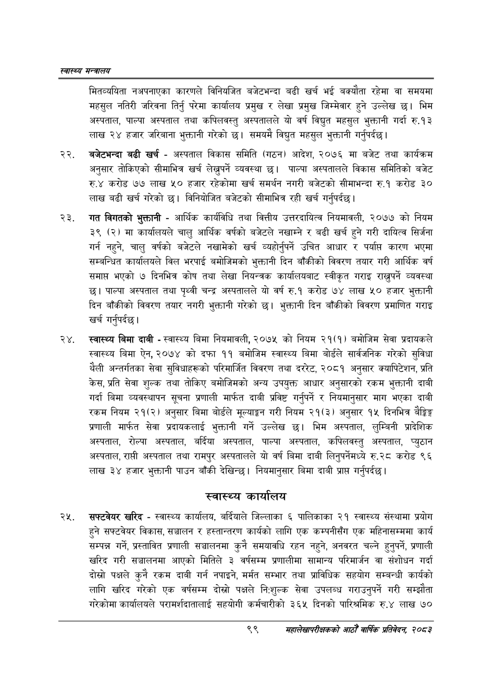

# Page 121 QA

## Rendered page


## Extracted text

```text
स्वास्थ्य मन्त्रालय
मितव्ययिता नअपनाएका कारणले विनियजित बजेटभन्दा बढी खर्च भई बक्यौता रहेमा वा समयमा महसुल नतिरी जरिवना तिर्नु परेमा कार्यालय प्रमुख र लेखा प्रमुख जिम्मेवार हुने उल्लेख छ। भिम अस्पताल, पाल्पा अस्पताल तथा कपिलवस्तु अस्पतालले यो वर्ष विद्युत महसुल भुक्तानी गर्दा रु.१३ लाख २४ हजार जरिबाना भुक्तानी गरेको | समयमै विद्युत महसुल भुक्तानी गर्नुपर्दछ |
बजेटभन्दा बढी खर्च -अस्पताल विकास समिति (गठन) आदेश, २०७६ मा बजेट तथा कार्यक्रम अनुसार तोकिएको सीमाभित्र खर्च लेख्नुपर्ने व्यवस्था छ। पाल्पा अस्पतालले विकास समितिको बजेट रु.४ करोड ७७ लाख ५० हजार रहेकोमा खर्च समर्थन नगरी बजेटको सीमाभन्दा रु.१ करोड ३० लाख बढी खर्च गरेको छ। विनियोजित बजेटको सीमाभित्र रही खर्च गर्नुपर्दछ |
गत विगतको भुक्तानी -आर्थिक कार्यविधि तथा वित्तीय उत्तरदायित्व नियमावली, २०७७ को नियम ३९ (२) मा कार्यालयले चालु आर्थिक वर्षको बजेटले नखाम्ने र बढी खर्च हुने गरी दायित्व सिर्जना गर्न नहुने, चालु वर्षको बजेटले नखामेको खर्च व्यहोर्नुपर्ने उचित आधार र पर्यास कारण भएमा सम्बन्धित कार्यालयले विल भरपाई बमोजिमको भुक्तानी दिन बाँकीको विवरण तयार गरी आर्थिक वर्ष समाप्त भएको ७ दिनभित्र कोष तथा लेखा नियन्त्रक कार्यालयबाट स्वीकृत गराइ राख्नुपर्ने व्यवस्था छ। पाल्पा अस्पताल तथा पृथ्वी चन्द्र अस्पतालले यो वर्ष रु.१ करोड ७४ लाख ५० हजार भुक्तानी दिन बाँकीको विवरण तयार नगरी भुक्तानी गरेको छ। भुक्तानी दिन बाँकीको विवरण प्रमाणित गराइ खर्च |
गर्नुपर्दछ
स्वास्थ्य बिमा दाबी -स्वास्थ्य बिमा नियमावली, २०७५ को नियम २१(१) बमोजिम सेवा प्रदायकले स्वास्थ्य बिमा ऐन, २०७४ को दफा ११ बमोजिम स्वास्थ्य बिमा बोर्डले सार्वजनिक गरेको सुविधा थैली अन्तर्गतका सेवा सुविधाहरूको परिमार्जित विवरण तथा दररेट, २०८१ अनुसार क्यापिटेशन, प्रति केस, प्रति सेवा शुल्क तथा तोकिए बमोजिमको अन्य उपयुक्त आधार अनुसारको रकम भुक्तानी दाबी गर्दा बिमा व्यवस्थापन सूचना प्रणाली मार्फत दाबी प्रविष्ट गर्नुपर्ने र नियमानुसार माग भएका दाबी रकम नियम २१(२) अनुसार बिमा बोर्डले मूल्याङ्ग गरी नियम २१(३) अनुसार १५ दिनभित्र बेङ्गिङ्ग प्रणाली मार्फत सेवा प्रदायकलाई भुक्तानी गर्ने उल्लेख छ। भिम अस्पताल, लुम्बिनी प्रादेशिक अस्पताल, रोल्पा अस्पताल, बर्दिया अस्पताल, पाल्पा अस्पताल, कपिलवस्तु अस्पताल, प्युठान अस्पताल, राप्ती अस्पताल तथा रामपुर अस्पतालले यो वर्ष बिमा दाबी लिनुपर्नेमध्ये रु.२८ करोड ९६ लाख ३४ हजार भुक्तानी पाउन बाँकी देखिन्छ। नियमानुसार बिमा दाबी प्राप्त गर्नुपर्दछ।
स्वास्थ्य कार्यालय
सफ्टवेयर खरिद -स्वास्थ्य कार्यालय, बर्दियाले जिल्लाका ६ पालिकाका २१ स्वास्थ्य संस्थामा प्रयोग हुने सफ्टवेयर विकास, सञ्चालन र हस्तान्तरण कार्यको लागि एक कम्पनीसँग एक महिनासम्ममा कार्य सम्पन्न गर्ने, प्रस्तावित प्रणाली सञ्चालनमा कुनै समयावधि रहन नहुने, अनवरत चल्ने हुनुपर्ने, प्रणाली खरिद गरी सञ्चालनमा आएको मितिले ३ वर्षसम्म प्रणालीमा सामान्य परिमार्जन वा संशोधन गर्दा दोस्रो पक्षले कुनै रकम दाबी गर्न नपाइने, मर्मत सम्भार तथा प्राविधिक सहयोग सम्बन्धी कार्यको लागि खरिद गरेको एक वर्षसम्म दोस्रो पक्षले निःशुल्क सेवा उपलब्ध गराउनुपर्ने गरी सम्झौता गरेकोमा कार्यालयले परामर्शदातालाई सहयोगी कर्मचारीको ३६५ दिनको पारिश्रमिक रु.४ लाख ७०
९९
सहालेखापरीक्षकको आठौँ वाषिकि प्रतिवेदन २०८२
```

## Flags
- None
