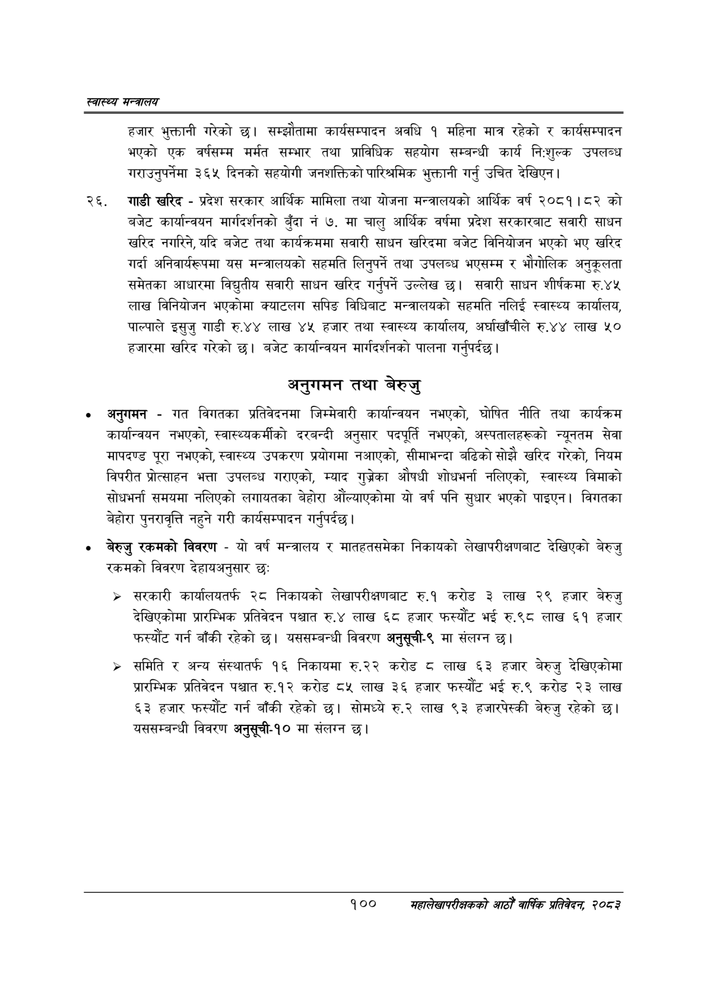

# Page 122 QA

## Rendered page


## Extracted text

```text
स्वास्थ्य मन्त्रालय
हजार भुक्तानी गरेको छ। सम्झौतामा कार्यसम्पादन अवधि १ महिना मात्र रहेको र कार्यसम्पादन भएको एक वर्षसम्म मर्मत सम्भार तथा प्राविधिक सहयोग सम्बन्धी कार्य नि:शुल्क उपलब्ध गराउनुपर्नेमा ३६५ दिनको सहयोगी जनशक्तिको पारिश्रमिक भुक्तानी गर्नु उचित देखिएन |
गाडी खरिद -प्रदेश सरकार आर्थिक मामिला तथा योजना मन्त्रालयको आर्थिक वर्ष २०८१।८२ को बजेट कार्यान्वयन मार्गदर्शनको बुँदा नं ७. मा चालु आर्थिक वर्षमा प्रदेश सरकारबाट सवारी साधन खरिद नगरिने, यदि बजेट तथा कार्यक्रममा सवारी साधन खरिदमा बजेट विनियोजन भएको भए खरिद गर्दा अनिवार्यरूपमा यस मन्त्रालयको सहमति लिनुपर्ने तथा उपलब्ध भएसम्म र भौगोलिक अनुकूलता समेतका आधारमा विद्युतीय सवारी साधन खरिद गर्नुपर्ने उल्लेख छ। सवारी साधन शीर्षकमा रु.४५ लाख विनियोजन भएकोमा क्याटलग सपिङ विधिबाट मन्त्रालयको सहमति नलिई स्वास्थ्य कार्यालय, पाल्पाले इसुजु गाडी रु.४४ लाख ४५ हजार तथा स्वास्थ्य कार्यालय, अर्घाखाँचीले रु.४४ लाख ५० हजारमा खरिद गरेको | बजेट कार्यान्वयन मार्गदर्शनको पालना गर्नुपर्दछ।
अनुगमन तथा बेरुजु
अनुगमन -गत विगतका प्रतिवेदनमा जिम्मेवारी कार्यान्वयन नभएको, घोषित नीति तथा कार्यक्रम कार्यान्वयन नभएको, स्वास्थ्यकर्मीको दरबन्दी अनुसार पदपूर्ति नभएको, अस्पतालहरूको न्यूनतम सेवा मापदण्ड प्रा नभएको, स्वास्थ्य उपकरण प्रयोगमा नआएको, सीमाभन्दा बढिको सोझै खरिद गरेको, नियम विपरीत प्रोत्साहन भत्ता उपलब्ध गराएको, म्याद गुज्रेका औषधी शोधभर्ना नलिएको, स्वास्थ्य विमाको सोधभर्ना समयमा नलिएको लगायतका बेहोरा औंल्याएकोमा यो वर्ष पनि सुधार भएको पाइएन। विगतका बेहोरा पुनरावृत्ति नहुने गरी कार्यसम्पादन गर्नुपर्दछ |
बेरुजु रकमको विवरण -यो वर्ष मन्त्रालय र मातहतसमेका निकायको लेखापरीक्षणबाट देखिएको बेरुजु रकमको विवरण देहायअनुसार छः
> सरकारी कार्यालयतर्फ २८ निकायको लेखापरीक्षणबाट रु.१ करोड ३ लाख २९ हजार बेरुजु देखिएकोमा प्रारम्भिक प्रतिवेदन पश्चात रु.४ लाख ६८ हजार फस्यौट भई रु.९८ लाख ६१ हजार फस्यौंट गर्न बाँकी रहेको छ। यससम्बन्धी विवरण अनुसूची-९ मा संलग्न छ।
> समिति र अन्य संस्थातर्फ १६ निकायमा रु.२२ करोड ८ लाख ६३ हजार बेरुजु देखिएकोमा प्रारम्भिक प्रतिवेदन पश्चात रु.१२ करोड ८५ लाख ३६ हजार फस्यौट भई रु.९ करोड २३ लाख ६३ हजार फस्यौट गर्न बाँकी रहेको छ। सोमध्ये रु.२ लाख ९३ हजारपेस्की बेरुजु रहेको छ। यससम्बन्धी विवरण अनुसूची-१० मा संलग्न छ।
१००
सहालेखापरीक्षकको आठौँ वाषिकि प्रतिवेदन २०८२
```

## Flags
- None
