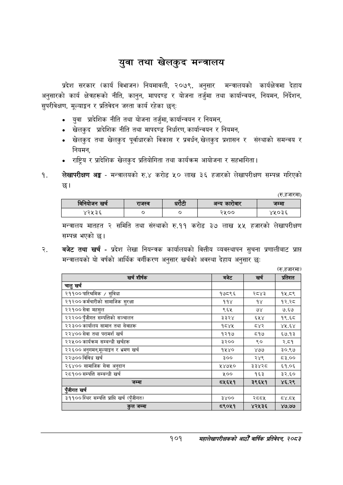

# Page 123 QA

## Rendered page


## Extracted text

```text
युवा तथा खेलकुद मन्त्रालय
प्रदेश सरकार (कार्य विभाजन) नियमावली, २०७९, अनुसार मन्त्रालयको कार्यक्षेत्रमा देहाय अनुसारको कार्य क्षेत्रहरूको नीति, कानुन, मापदण्ड र योजना तर्जुमा तथा कार्यान्वयन, नियमन, निर्देशन, सुपरीवेक्षण, मूल्याङ्कन र प्रतिवेदन जस्ता कार्य रहेका छन्‌ः
युवा प्रादेशिक नीति तथा योजना तर्जुमा, कार्यान्वयन र नियमन,
खेलकुद प्रादेशिक नीति तथा मापदण्ड निर्धारण, कार्यान्वयन र नियमन,
खेलकुद तथा खेलकुद पूर्वाधारको विकास र प्रवर्धन, खेलकुद प्रशासन र संस्थाको समन्वय र नियमन,
राष्ट्रिय र प्रादेशिक खेलकुद प्रतियोगिता तथा कार्यक्रम आयोजना र सहभागिता |
लेखापरीक्षण अङ्ग -मन्त्रालयको रु.४ करोड ५० लाख ३६ हजारको लेखापरीक्षण सम्पन्न गरिएको छ।
(रु.हजारमा)
मन्त्रालय मातहत २ समिति तथा संस्थाको रु.११ करोड ३७ लाख ५५ हजारको लेखापरीक्षण सम्पन्न भएको छ।
बजेट तथा खर्च -प्रदेश लेखा नियन्त्रक कार्यालयको वित्तीय व्यवस्थापन सुचना प्रणालीबाट प्राप्त मन्त्रालयको यो वर्षको आर्थिक वर्गीकरण अनुसार खर्चको अवस्था देहाय अनुसार छः
(रु.हजारमा)
१०१
सहालेखापरीक्षकको आठौँ वाषिकि प्रतिवेदन २०८२

|  |  | 'ननेवोजन खरी |  | राजस्व |  |  | अन्य कारोबार | जम्मा |
| --- | --- | --- | --- | --- | --- | --- | --- | --- |
|  |  | ४२५३६ |  | ० | ० |  | २५०० | ४५०३६ |

| खर्च शीर्षक | 'बजेट | खर्च | प्रतिशत |
| --- | --- | --- | --- |
| चालु खर्च |  |  |  |
| २११०० पारिश्रमिक / सुविधा | १७८९६ | २८४३ | १५.८९ |
| २१२०० कर्चारीको सामाजिक सुरक्षा | ११४ | १४ | १२.२८ |
| २२१०० सेवा महसुल | ९६५ | ७४ | ७.६७ |
| २२२०० पुँजीगत सन्पततिको सञ्चालन | ३३२४ | ६५४ | १९.६८ |
| २२३०० कार्यालय सामान तथा सेवाहरू | १८४४ |  | ४५.६४ |
| २२४०० सेवा तथा परामर्श खर्च | १२१७ | ८१७ | ५७.१३ |
| २२४५०० कार्यकम सम्बन्धी खर्चहरू | ३२०० | ९० | २.८१ |
| २२६०० अनुगमन,भूलयाङ्क र भ्रमण खर्च | १५४० | ४७७ | ३०.९७ |
| २२७०० विविध खर्च | ३०० | २४९ | ८३.०० |
| २६४०० सामाजिक सेवा अनुदान |  | ३३४२८ | ६१.०६ |
| २८१०० सम्पत्ति सम्बन्धी खर्च | ५०० | १६३ | ३२.६० |
| जम्मा | ८२५६५१ | ३९६५१ | ४६.२९ |
| एंजीगत खर्च |  |  |  |
| २९९०० स्थिर सम्पत्ति प्राप्ति खर्च (पुँजीगत) | ३४०० | स्व्व्श | द्४.दश |
| कुल जम्मा | ८९०५१ | ४२५३६ | ४७.७७ |
```

## Flags
- table_page
- medium_quality_table
