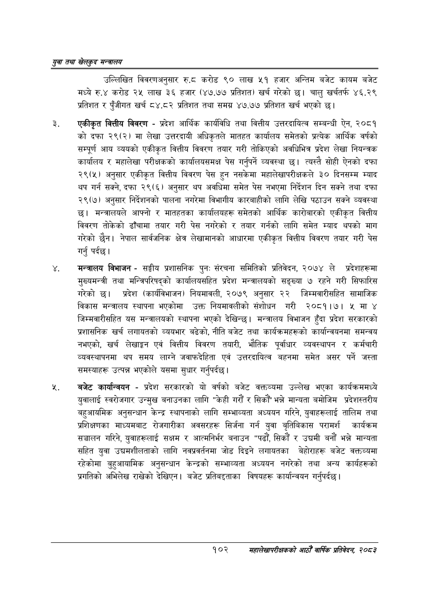

# Page 124 QA

## Rendered page


## Extracted text

```text
युवा तथा खेलकुद सन्चालय
उल्लिखित विवरणअनुसार.६ करोड ९० लाख ५१ हजार अन्तिम बजेट कायम बजेट मध्ये रु.४ करोड २५ लाख ३६ हजार (४७.७७ प्रतिशत) खर्च गरेको चालु खर्चतर्फ ४६.२९ प्रतिशत र पुँजीगत खर्च ८४.८२ प्रतिशत तथा समग्र ४७.७७ प्रतिशत खर्च भएको |
एकीकृत वित्तीय विवरण -प्रदेश आर्थिक कार्यविधि तथा वित्तीय उत्तरदायित्व सम्बन्धी ऐन, २०८१ को दफा २९(२) मा लेखा उत्तरदायी अधिकृतले मातहत कार्यालय समेतको प्रत्येक आर्थिक वर्षको सम्पूर्ण आय व्ययको एकीकृत वित्तीय विवरण तयार गरी तोकिएको अवधिभित्र प्रदेश लेखा नियन्त्रक कार्यालय र महालेखा परीक्षकको कार्यालयसमक्ष पेस गर्नुपर्ने व्यवस्था | त्यस्तै सोही ऐनको दफा २९(५) अनुसार एकीकृत वित्तीय विवरण पेस हुन नसकेमा महालेखापरीक्षकले ३० दिनसम्म म्याद थप गर्न सक्ने, दफा २९(६) अनुसार थप अवधिमा समेत पेस नभएमा निर्देशन दिन सक्ने तथा दफा २९(७) अनुसार निर्देशनको पालना नगरेमा विभागीय कारबाहीको लागि लेखि पठाउन सक्ने व्यवस्था छ। मन्त्रालयले आफ्नो र मातहतका कार्यालयहरू समेतको आर्थिक कारोबारको एकीकृत वित्तीय विवरण तोकेको ढाँचामा तयार गरी पेस नगरेको र तयार गर्नको लागि समेत म्याद थपको माग गरेको छैन। नेपाल सार्वजनिक क्षेत्र लेखामानको आधारमा एकीकृत वित्तीय विवरण तयार गरी पेस गर्नु पर्दछ।
मन्त्रालय विभाजन -सङ्गीय प्रशासनिक पुन: संरचना समितिको प्रतिवेदन, २०७४ ले प्रदेशहरूमा मुख्यमन्त्री तथा मन्त्रिपरिषद्को कार्यालयसहित प्रदेश मन्त्रालयको सङ्ख्या ७ रहने गरी सिफारिस गरेको छ। प्रदेश (कार्यविभाजन) नियमावली, २०७९ अनुसार २२ जिम्मवारीसहित सामाजिक विकास मन्त्रालय स्थापना भएकोमा उक्त नियमावलीको संशोधन गरी २०८१।७। मा ४ जिम्मवारीसहित यस मन्त्रालयको स्थापना भएको देखिन्छ। मन्त्रालय विभाजन हुँदा प्रदेश सरकारको प्रशासनिक खर्च लगायतको व्ययभार बढेको, नीति बजेट तथा कार्यक्रमहरूको कार्यान्वयनमा समन्वय नभएको, खर्च लेखाङ्गन एवं वित्तीय विवरण तयारी, भौतिक पूर्वाधार व्यवस्थापन र कर्मचारी व्यवस्थापनमा थप समय लाग्ने जवाफदेहिता एवं उत्तरदायित्व बहनमा समेत असर पर्ने जस्ता समस्याहरू उत्पन्न भएकोले यसमा सुधार गर्नुपर्दछ।
बजेट कार्यान्वयन -प्रदेश सरकारको यो वर्षको बजेट वक्तव्यमा उल्लेख भएका कार्यक्रममध्ये युवालाई स्वरोजगार उन्मुख बनाउनका लागि "केही गरौं र सिकौं" भन्ने मान्यता बमोजिम प्रदेशस्तरीय बहुआयमिक अनुसन्धान केन्द्र स्थापनाको लागि सम्भाव्यता अध्ययन गरिने, युवाहरूलाई तालिम तथा प्रशिक्षणका माध्यमबाट रोजगारीका अवसरहरू सिर्जना गर्न युवा बृतिबिकास परामर्श कार्यक्रम सञ्चालन गरिने, युवाहरूलाई सक्षम र आत्मनिर्भर बनाउन "पढौं, सिकौं र उद्यमी बनौं भन्ने मान्यता सहित युवा उद्यमशीलताको लागि नवप्रवर्ततमा जोड दिइने लगायतका बेहोराहरू बजेट वक्तव्यमा रहेकोमा बुहुआयामिक अनुसन्धान केन्द्रको सम्भाव्यता अध्ययन नगरेको तथा अन्य कार्यहरूको प्रगतिको अभिलेख राखेको देखिएन। बजेट प्रतिबद्ताका विषयहरू कार्यान्वयन गर्नुपर्दछ |
१०२
सहालेखापरीक्षकको आठौँ वाषिकि प्रतिवेदन २०८२
```

## Flags
- None
