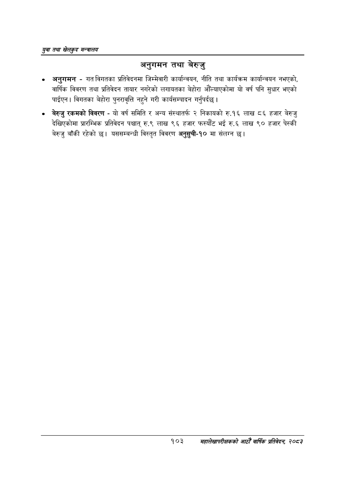

# Page 125 QA

## Rendered page


## Extracted text

```text
युवा तथा खेलकुद सन्चालय
अनुगमन तथा बेरुजु
अनुगमन -गत विगतका प्रतिवेदनमा जिम्मेवारी कार्यान्वयन, नीति तथा कार्यक्रम कार्यान्वयन नभएको, वार्षिक विवरण तथा प्रतिवेदन तायार नगरेको लगायतका बेहोरा औँल्याएकोमा यो वर्ष पनि सुधार भएको पाईएन | विगतका बेहोरा पुनरावृत्ति नहुने गरी कार्यसम्पादन गर्नुपर्दछ |
बेरुजु रकमको विवरण -यो वर्ष समिति र अन्य संस्थातर्फ २ निकायको रु.१६ लाख ८६ हजार बेरुजु देखिएकोमा प्रारम्भिक प्रतिवेदन पश्चात्‌ रु.९ लाख ९६ हजार फस्यौट भई रु.६ लाख ९० हजार पेस्की बेरुजु बाँकी रहेको छ। यससम्बन्धी विस्तृत विवरण अनुसुची-१० मा संलग्न छ।
१०३
सहालेखापरीक्षकको आठौँ वाषिकि प्रतिवेदन २०८२
```

## Flags
- None
