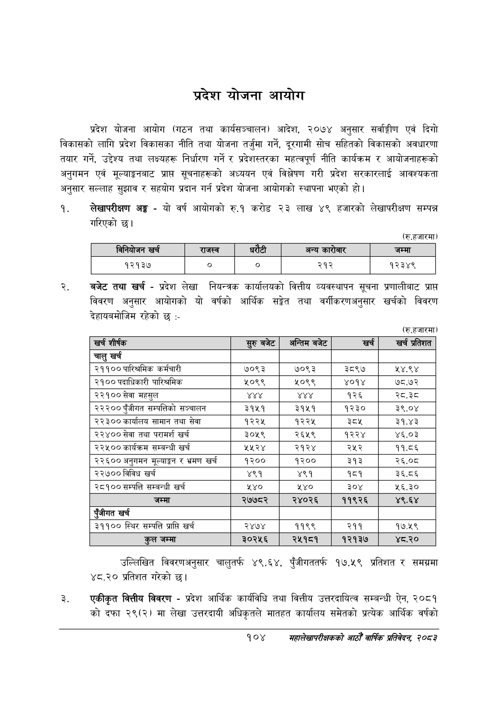

# Page 126 QA

## Rendered page


## Extracted text

```text
प्रदेश योजना आयोग
प्रदेश योजना आयोग (गठन तथा कार्यसञ्चालन) आदेश, २०७४ अनुसार सर्वाङ्गीण एवं दिगो विकासको लागि प्रदेश विकासका नीति तथा योजना तर्जुमा गर्ने, दूरगामी सोच सहितको विकासको अवधारणा तयार गर्ने, उद्देश्य तथा लक्ष्यहरू निर्धारण गर्ने र प्रदेशस्तरका महत्वपूर्ण नीति कार्यक्रम र आयोजनाहरूको अनुगमन एवं मूल्याङ्कनबाट प्राप्त सूचनाहरूको अध्ययन एवं विश्लेषण गरी प्रदेश सरकारलाई आवश्यकता अनुसार सल्लाह सुझाव र सहयोग प्रदान गर्न प्रदेश योजना आयोगको स्थापना भएको हो।
लेखापरीक्षण अङ्ग -यो वर्ष आयोगको रु.१ करोड २३ लाख ४९ हजारको लेखापरीक्षण सम्पन्न गरिएको |
(७
बजेट तथा खर्च -प्रदेश लेखा नियन्त्रक कार्यालयको वित्तीय व्यवस्थापन सूचना प्रणालीबाट प्राप्त विवरण अनुसार आयोगको यो वर्षको आर्थिक सङ्ेत तथा वर्गीकरणअनुसार खर्चको विवरण देहायबमोजिम रहेको छ:-
(रु.हजारमा)
उल्लिखित विवरणअनुसार चालुतर्फ ४९.६४, पुँजीगततर्फ १७.५९ प्रतिशत र समग्रमा ४८.२० प्रतिशत गरेको छ।
एकीकृत वित्तीय विवरण -प्रदेश आर्थिक कार्यविधि तथा वित्तीय उत्तरदायित्व सम्बन्धी ऐन, २०८१ को दफा २९(२) मा लेखा उत्तरदायी अधिकृतले मातहत कार्यालय समेतको प्रत्येक आर्थिक वर्षको
१०४
सहालेखापरीक्षकको आठौँ वाषिकि प्रतिवेदन २०८२

|  |  | ननेवोजन खरी |  | राजस्व |  | रेटी | अन्य कारोबार | जम्मा |
| --- | --- | --- | --- | --- | --- | --- | --- | --- |
|  |  | १२१३७ |  |  |  |  | २१२ | १२३४९ |

| खर्च शीर्षक | सुरु बबेट | अन्तिम बजेट | खर्च | खर्च प्रतिशत |
| --- | --- | --- | --- | --- |
| चालु खर्च |  |  |  |  |
| २११०० पारिश्रमिक कर्मचारी | ७०९३ | ७०९३ | ३८९७ | ५४.९४ |
| २१०० पदाधिकारी पारिश्रमिक | ५०९९ | २०९९ | ४०१४ | ७८.७२ |
| २२१०० सेवा महसुल | १ | १८४१ | १२६ | २८.३८ |
| २२२०० पुँजीगत सम्पतिको सञ्चालन | ३१५१ | ३१५१ | १२३० | ३९.०४ |
| २२३०० कार्यालय सामान तथा सेवा | १२२५ | १२२५ | ३ | ३१.४३ |
| २२४०० सेवा तथा परामर्श खर्च | ३०५९ | २६५९ | १२२४ | ४६.०३ |
| २२५०० कार्यक्रम सम्बन्धी खर्च | २५२४ | २१२४ | २५२ | ११.८६ |
| २२६०० अनुगमन र भ्रमण खर्च | १२०० | १२०० | ३१३ | २६.०८ |
| २२७०० विविध खर्च | ४९१ | ४९१ | १८१ | ३६.८६ |
| २८१०० सम्पत्ति सम्बन्धी खर्च | ५४० | ५४० | ३०४ | ५६.३० |
| जम्मा | २७७८२ | २४०२६ | ११९२६ | ४९.६४ |
| एंजीगत खर्च |  |  |  |  |
| ३११०० स्थिर सम्पत्ति प्राप्ति खर्च | २४७४ | ११९९ | २११ | १७.१९ |
| तल जम्मा | ३०२५६ | २५१८१ | १२१३७ | .० |
```

## Flags
- table_page
- medium_quality_table
