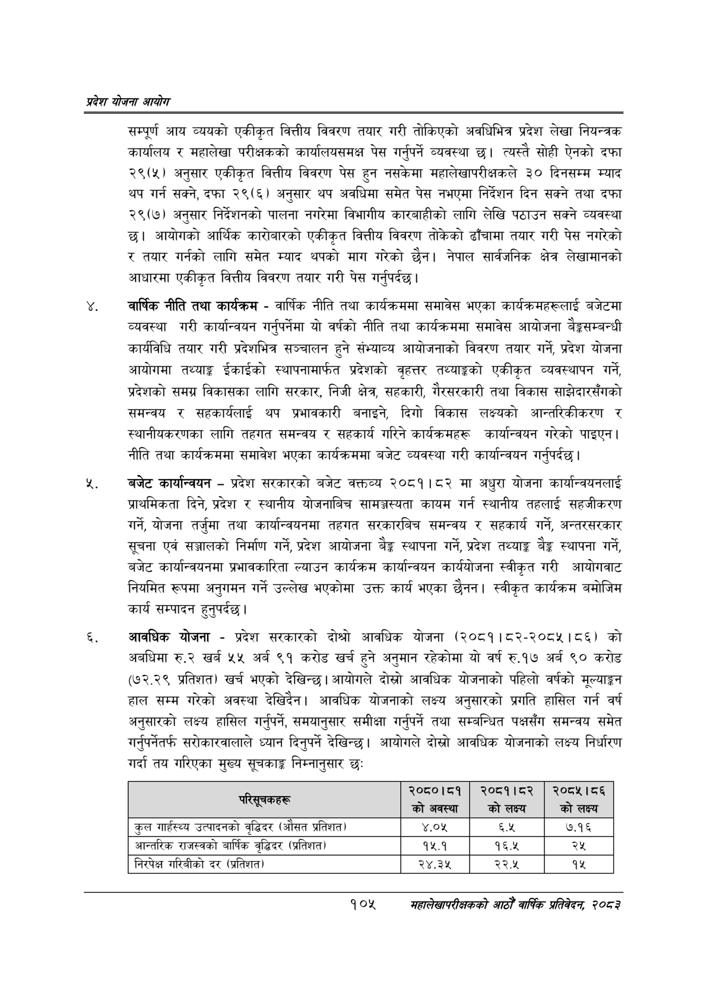

# Page 127 QA

## Rendered page


## Extracted text

```text
प्रदेश योजना आयोग
सम्पूर्ण आय व्ययको एकीकृत वित्तीय विवरण तयार गरी तोकिएको अवधिभित्र प्रदेश लेखा नियन्त्रक कार्यालय र महालेखा परीक्षकको कार्यालयसमक्ष पेस गर्नुपर्ने व्यवस्था | त्यस्तै सोही ऐनको दफा २९(५) अनुसार एकीकृत वित्तीय विवरण पेस हुन नसकेमा महालेखापरीक्षकले ३० दिनसम्म म्याद थप गर्न सक्ने, दफा २९(६) अनुसार थप अवधिमा समेत पेस नभएमा निर्देशन दिन सक्ने तथा दफा २९(७) अनुसार निर्देशनको पालना नगरेमा विभागीय कारबाहीको लागि लेखि पठाउन सक्ने व्यवस्था छ। आयोगको आर्थिक कारोबारको एकीकृत वित्तीय विवरण तोकेको ढाँचामा तयार गरी पेस नगरेको र तयार गर्नको लागि समेत म्याद थपको माग गरेको छैन। नेपाल सार्वजनिक क्षेत्र लेखामानको आधारमा एकीकृत वित्तीय विवरण तयार गरी पेस गर्नुपर्दछ।
वार्षिक नीति तथा कार्यक्रम -वार्षिक नीति तथा कार्यक्रममा समावेस भएका कार्यक्रमहरूलाई बजेटमा व्यवस्था गरी कार्यान्वयन गर्नुपर्नेमा यो वर्षको नीति तथा कार्यक्रममा समावेस आयोजना बैङ्कसम्बन्धी कार्यविधि तयार गरी प्रदेशभित्र सञ्चालन हुने संभ्याव्य आयोजनाको विवरण तयार गर्ने, प्रदेश योजना आयोगमा तथ्याङ्क ईकाईको स्थापनामार्फत प्रदेशको वृहत्तर तथ्याङ्कको एकीकृत व्यवस्थापन गर्ने, प्रदेशको समग्र विकासका लागि सरकार, निजी क्षेत्र, सहकारी, गैरसरकारी तथा विकास साझेदारसँगको समन्वय र सहकार्यलाई थप प्रभावकारी बनाइने, दिगो विकास लक्ष्यको आन्तरिकीकरण र स्थानीयकरणका लागि तहगत समन्वय र सहकार्य गरिने कार्यक्रमहरू कार्यान्वयन गरेको पाइएन | नीति तथा कार्यक्रममा समावेश भएका कार्यक्रममा बजेट व्यवस्था गरी कार्यान्वयन गर्नुपर्दछ |
बजेट कार्यान्वयन -प्रदेश सरकारको बजेट वक्तव्य २०८१।८२ मा अधुरा योजना कार्यान्वयनलाई प्राथमिकता दिने, प्रदेश र स्थानीय योजनाबिच सामज्जस्यता कायम गर्न स्थानीय तहलाई सहजीकरण गर्ने, योजना तर्जुमा तथा कार्यान्वयनमा तहगत सरकारबिच समन्वय र सहकार्य गर्ने, अन्तरसरकार सूचना एवं सञ्जालको निर्माण गर्ने, प्रदेश आयोजना बैङ्क स्थापना गर्ने, प्रदेश तथ्याङ्क बैङ्क स्थापना गर्ने, बजेट कार्यान्वयनमा प्रभावकारिता ल्याउन कार्यक्रम कार्यान्वयन कार्ययोजना स्वीकृत गरी आयोगवाट नियमित रूपमा अनुगमन गर्ने उल्लेख भएकोमा उक्त कार्य भएका छैनन। स्वीकृत कार्यक्रम बमोजिम कार्य सम्पादन हुनुपर्दछ |
आवधिक योजना -प्रदेश सरकारको दोश्रो आवधिक योजना (२०८१।८२-२०८५।८६) को अबधिमा रु.२ खर्ब ५५ अर्ब ९१ करोड खर्च हुने अनुमान रहेकोमा यो वर्ष रु.१७ अर्ब ९० करोड (७२.२९ प्रतिशत) खर्च भएको देखिन्छ। आयोगले दोस्रो आवधिक योजनाको पहिलो वर्षको मूल्याङ्कन हाल सम्म गरेको अवस्था देखिदिन। आवधिक योजनाको लक्ष्य अनुसारको प्रगति हासिल गर्न वर्ष अनुसारको लक्ष्य हासिल गर्नुपर्ने, समयानुसार समीक्षा गर्नुपर्ने तथा सम्बन्धित पक्षसँग समन्वय समेत गर्नुपर्नेतर्फ सरोकारवालाले ध्यान दिनुपर्ने देखिन्छ। आयोगले दोस्रो आवधिक योजनाको लक्ष्य निर्धारण गर्दा तय गरिएका मुख्य सूचकाङ्क निम्नानुसार छः
१०५
सहालेखापरीक्षकको आठौँ वाषिकि प्रतिवेदन २०८२

| ~ सन | २०८०।८१ को अवस्था | २०८१।८०८२ को लक्ष्य | २०८१५।८६ को लक्ष्य |
| --- | --- | --- | --- |
| कुल ना्हस्थ्य उत्पादनको वृद्धिदर (औसत प्रतिशत) | ४.०५ | ६.१ | ७.१६ |
| आन्तरिक राजस्वको वार्षिक वृद्धिदर (प्रतिशत) | १५.१ | १६.५ | २५ |
| निरपेक्ष भारेबीको दर (प्रतिशत) | २४.३४५ | २२.५ | १५ |
```

## Flags
- table_page
- medium_quality_table
