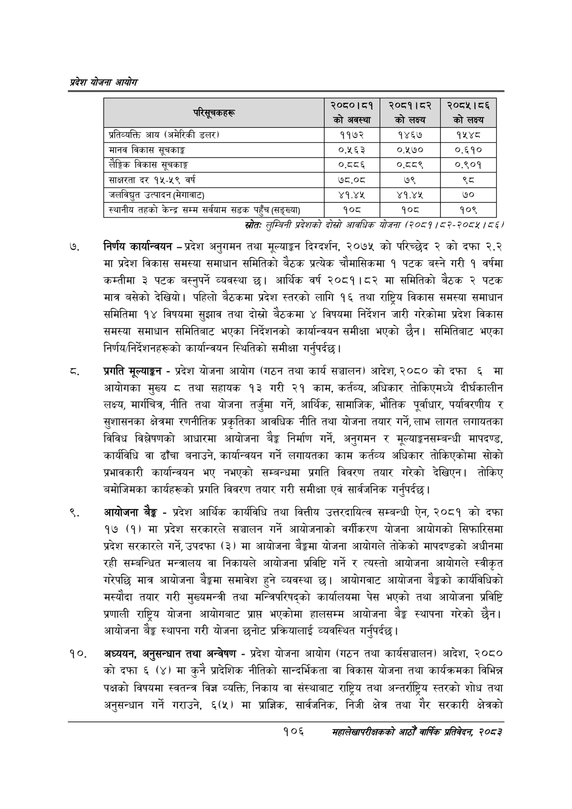

# Page 128 QA

## Rendered page


## Extracted text

```text
प्रदेश योजना आयोग
स्रोतः लुम्विनी प्रदेशको दोस्रो आवधिक योजना (२०८१/८२-२०८४/८६/
निर्णय कार्यान्वयन -प्रदेश अनुगमन तथा मूल्याङ्कन दिग्दर्शन, २०७५ को परिच्छेद २ को दफा २.२ मा प्रदेश विकास समस्या समाधान समितिको बैठक प्रत्येक चौमासिकमा १ पटक बस्ने गरी १ वर्षमा कम्तीमा ३ पटक बस्नुपर्ने व्यवस्था छ। आर्थिक वर्ष २०८१।८२ मा समितिको बैठक २ पटक मात्र बसेको देखियो। पहिलो बैठकमा प्रदेश स्तरको लागि १६ तथा राष्ट्रिय विकास समस्या समाधान समितिमा १४ विषयमा सुझाव तथा दोस्रो बैठकमा ४ विषयमा निर्देशन जारी गरेकोमा प्रदेश विकास समस्या समाधान समितिबाट भएका निर्देशनको कार्यान्वयन समीक्षा भएको छैन। समितिबाट भएका निर्णय/निर्देशनहरूको कार्यान्वयन स्थितिको समीक्षा गर्नुपर्दछ |
प्रगति मूल्याङ्कन -प्रदेश योजना आयोग (गठन तथा कार्य सञ्चालन) आदेश, २०८० को दफा ६ मा आयोगका मुख्य ८ तथा सहायक ९३ गरी २१ काम, कर्तव्य, अधिकार तोकिएमध्ये दीर्घकालीन लक्ष्य, मार्गचित्र, नीति तथा योजना तर्जुमा गर्ने, आर्थिक, सामाजिक, भौतिक पूर्वाधार, पर्यावरणीय र सुशासनका क्षेत्रमा रणनीतिक प्रकृतिका आवधिक नीति तथा योजना तयार गर्ने, लाभ लागत लगायतका विविध विश्लेषणको आधारमा आयोजना बेङ्ग निर्माण गर्ने, अनुगमन र मूल्याङ्कनसम्बन्धी मापदण्ड, कार्यविधि वा ढाँचा बनाउने, कार्यान्वयन गर्ने लगायतका काम कर्तव्य अधिकार तोकिएकोमा सोको प्रभावकारी कार्यान्वयन भए नभएको सम्बन्धमा प्रगति विवरण तयार गरेको देखिएन। तोकिए बमोजिमका कार्यहरूको प्रगति विवरण तयार गरी समीक्षा एवं सार्वजनिक गर्नुपर्दछ।
आयोजना बैङ्क -प्रदेश आर्थिक कार्यविधि तथा वित्तीय उत्तरदायित्व सम्बन्धी ऐन, २०८१ को दफा १७ (१) मा प्रदेश सरकारले सञ्चालन गर्ने आयोजनाको वर्गीकरण योजना आयोगको सिफारिसमा प्रदेश सरकारले गर्ने, उपदफा (३) मा आयोजना योजना आयोगले तोकेको मापदण्डको अधीनमा रही सम्बन्धित मन्त्रालय वा निकायले आयोजना प्रविष्टि गर्ने र त्यस्तो आयोजना आयोगले स्वीकृत गरेपछि मात्र आयोजना बैङ्कमा समावेश हुने व्यवस्था छु। आयोगवाट आयोजना बैङ्कको कार्यविधिको मस्यौदा तयार गरी मुख्यमन्त्री तथा मन्त्रिपरिषद्को कार्यालयमा पेस भएको तथा आयोजना प्रविष्टि प्रणाली राष्ट्रिय योजना आयोगबाट प्रापत भएकोमा हालसम्म आयोजना बेङ्ग स्थापना गरेको | आयोजना बैङ्क स्थापना गरी योजना छनोट प्रक्रियालाई व्यवस्थित गर्नुपर्दछ |
अध्ययन, अनुसन्धान तथा अन्वेषण -प्रदेश योजना आयोग (गठन तथा कार्यसञ्चालन) आदेश, २०८० को दफा ६ (४) मा कुनै प्रादेशिक नीतिको सान्दर्भिकता वा विकास योजना तथा कार्यक्रमका विभिन्न पक्षको विषयमा स्वतन्त्र विज्ञ व्यक्ति, निकाय वा संस्थाबाट राष्ट्रिय तथा अन्तर्राष्ट्रिय स्तरको शोध तथा अनुसन्धान गर्ने गराउने, ६(५) मा प्राज्ञिक, सार्वजनिक, निजी क्षेत्र तथा गैर सरकारी क्षेत्रको
१०६
सहालेखापरीक्षकको आठौँ वाषिकि प्रतिवेदन २०८२

| ~ रि | २०८०।८१ को अवस्था | २०८१।८२ कोलक्य | २०८५।८६ को लक्ष्य |
| --- | --- | --- | --- |
| ्रतिव्वत्ति आय (अमेरिकी डलर। | ११७२ | १४६७ | १५४८ |
| मानव विकास सूचकाङ्क | ०.५६३ | ०.१७० | ०.६१० |
| लैङ्गिक विकास थूचकाङ्ग | ०.८८६ | ०५५ | ०.९०१ |
| साक्षरता दर १५-५९ वर्ष | ७८.०८ | ७९ |  |
| जलविद्युत उत्पादन (मेगावाट) | ४१.४५ | ४१,४४५ | ७० |
| स्थानीय तहको केन्द्र सम्म सर्वयाम सडक पहुँच (८७४) | १०८ | १०८ | १०९ |
```

## Flags
- table_page
- medium_quality_table
