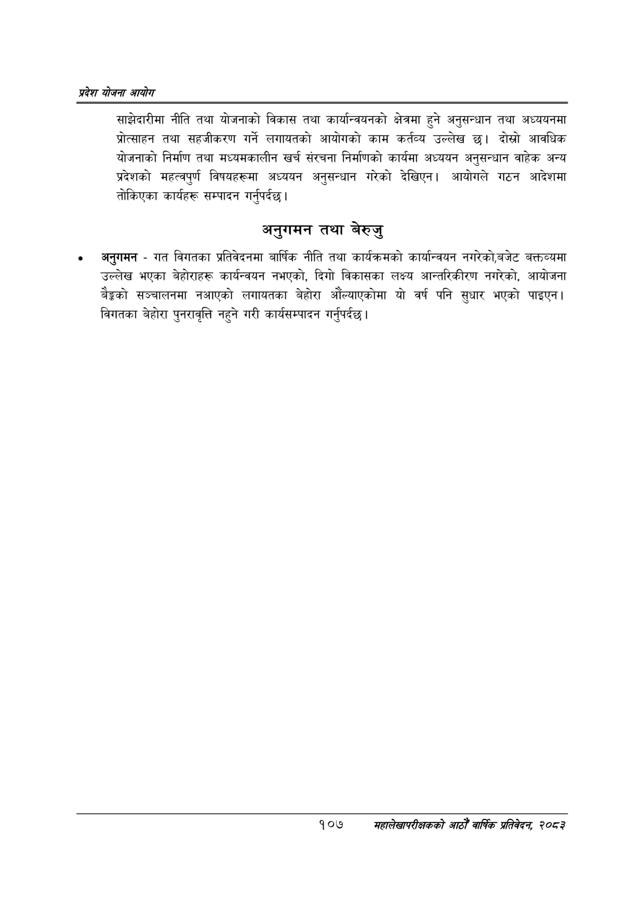

# Page 129 QA

## Rendered page


## Extracted text

```text
प्रदेश योजना आयोग
साझेदारीमा नीति तथा योजनाको विकास तथा कार्यान्वयनको क्षेत्रमा हुने अनुसन्धान तथा अध्ययनमा प्रोत्साहन तथा सहजीकरण गर्ने लगायतको आयोगको काम कर्तव्य उल्लेख छ। दोस्रो आवधिक योजनाको निर्माण तथा मध्यमकालीन खर्च संरचना निर्माणको कार्यमा अध्ययन अनुसन्धान वाहेक अन्य प्रदेशको महत्वपुर्ण विषयहरूमा अध्ययन अनुसन्धान गरेको देखिएन। आयोगले गठन आदेशमा तोकिएका कार्यहरू सम्पादन गर्नुपर्दछ।
अनुगमन तथा बेरुजु
अनुगमन -गत विगतका प्रतिवेदनमा बार्षिक नीति तथा कार्यक्रमको कार्यान्वयन नगरेको,बजेट बक्तव्यमा उल्लेख भएका बेहोराहरू कार्यन्वयन नभएको, दिगो विकासका लक्ष्य आन्तरिकीरण नगरेको, आयोजना बैङ्कको सञ्चालनमा नआएको लगायतका बेहोरा औंल्याएकोमा यो वर्ष पनि सुधार भएको पाइएन। विगतका बेहोरा पुनरावृत्ति नहुने गरी कार्यसम्पादन गर्नुपर्दछ |
१०७
सहालेखापरीक्षकको आठौँ वाषिकि प्रतिवेदन २०८२
```

## Flags
- None
