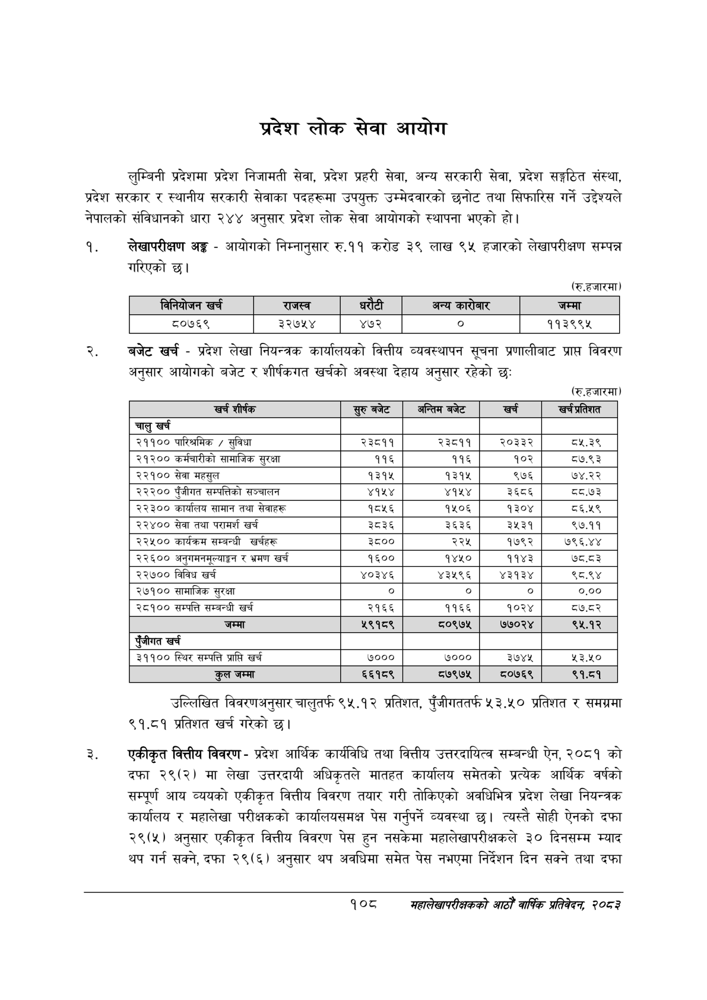

# Page 130 QA

## Rendered page


## Extracted text

```text
प्रदेश लोक सेवा आयोग
लुम्बिनी प्रदेशमा प्रदेश निजामती सेवा, प्रदेश प्रहरी सेवा, अन्य सरकारी सेवा, प्रदेश सङ्गठित संस्था, प्रदेश सरकार र स्थानीय सरकारी सेवाका पदहरूमा उपयुक्त उम्मेदवारको छनोट तथा सिफारिस गर्ने उद्देश्यले नेपालको संविधानको धारा २४४ अनुसार प्रदेश लोक सेवा आयोगको स्थापना भएको हो।
लेखापरीक्षण अङ्ग -आयोगको निम्नानुसार रु.११ करोड ३ लाख ९५ हजारको लेखापरीक्षण सम्पन्न गरिएको छ।
(रु.हजारमा)
बजेट खर्च -प्रदेश लेखा नियन्त्रक कार्यालयको वित्तीय व्यवस्थापन सूचना प्रणालीबाट प्राप्त विवरण अनुसार आयोगको बजेट र शीर्षकगत खर्चको अवस्था देहाय अनुसार रहेको छः
(रु.हजारमा)
उल्लिखित विवरणअनुसार चालुतर्फ ९५.१२ प्रतिशत, पुँजीगततर्फ ५३.५० प्रतिशत र समग्रमा ९१.८१ प्रतिशत खर्च गरेको छ।
एकीकृत वित्तीय विवरण -प्रदेश आर्थिक कार्यविधि तथा वित्तीय उत्तरदायित्व सम्बन्धी ऐन, २०८१ को दफा २९(२) मा लेखा उत्तरदायी अधिकृतले मातहत कार्यालय समेतको प्रत्येक आर्थिक वर्षको सम्पूर्ण आय व्ययको एकीकृत वित्तीय विवरण तयार गरी तोकिएको अवधिभित्र प्रदेश लेखा नियन्त्रक कार्यालय र महालेखा परीक्षकको कार्यालयसमक्ष पेस गर्नुपर्ने व्यवस्था छ। त्यस्तै सोही ऐनको दफा २९(५) अनुसार एकीकृत वित्तीय विवरण पेस हुन नसकेमा महालेखापरीक्षकले ३० दिनसम्म म्याद थप गर्न सक्ने, दफा २९(६) अनुसार थप अवधिमा समेत पेस नभएमा निर्देशन दिन सक्ने तथा दफा
१०८
सहालेखापरीक्षकको आठौँ वाषिकि प्रतिवेदन २०८२

|  | निनिवोणन खर्च | राजस्व | धरेटी |  | अन्य बररेजार | जम्मा |
| --- | --- | --- | --- | --- | --- | --- |
|  | ८०७६९ | ३२७५४ | ४७२ |  | ० | ११३९९५ |

| खर्च शीर्षक | सुरु बबेट | अन्तिम बजेट | खर्च | खर्च अतिरात |
| --- | --- | --- | --- | --- |
| चालु खर्च |  |  |  |  |
| २११०० पारित्रमिक / सुविधा | २३८११ | २३८११ | २०३३२ | ८५.३९ |
| २१२०० कर्मचारीको सामाजिक सुरक्षा | ११६ | ११६ | १०२ | ८७.९३ |
| २२१०० सेवा महसुल | १३१५ | १३१५ | ९७६ | ७४.२२ |
| २२२०० पुँजीगत सम्पत्तिको सञ्चालन | ४१५४ | ४१५४ | ३६८६ | द८.७३ |
| २२३०० कार्यालब सामान तथा सेवाहरू | १८५६ | १५०६ | १३०४ | ८६.५९ |
| २२४०० सेवा तथा परामर्श खर्च | ३८३६ | ३६३६ | ३५३१ | ९७.११ |
| २२५०० कार्यक्रम सम्बन्धी खर्चहरू | ३८०० | २२५ | १७९२ | ७९६.४४ |
| २२६०० अनुतभनसूल्याङ्गन र भ्रमण खर्च | १६०० | १४५० | ११४३ |  |
| २२७०० विविध खर्च | ४०३४६ | ४३५९६ | ४३१३४ | ९८.९४ |
| २७१०० सामाजिक सुरक्षा | ० | ० | ० | ०.०० |
| २८१०० सम्पत्ति सम्बन्धी खर्च | २१६६ | ११६६ | १०२४ | ८७.८२ |
| जम्मा | २९१८९ | ८०९७४५ | ७७०२४ | ९५.१२ |
| रंजीगत खर्च |  |  |  |  |
| ३११०० स्थिर सम्पत्ति प्राप्ति खर्च | ७००० | ७००० | ३७४४ | ५३.४० |
| जम्मा | ६६१८९ | ७९७५ | ०७६९ | ९१.८१ |
```

## Flags
- table_page
- medium_quality_table
