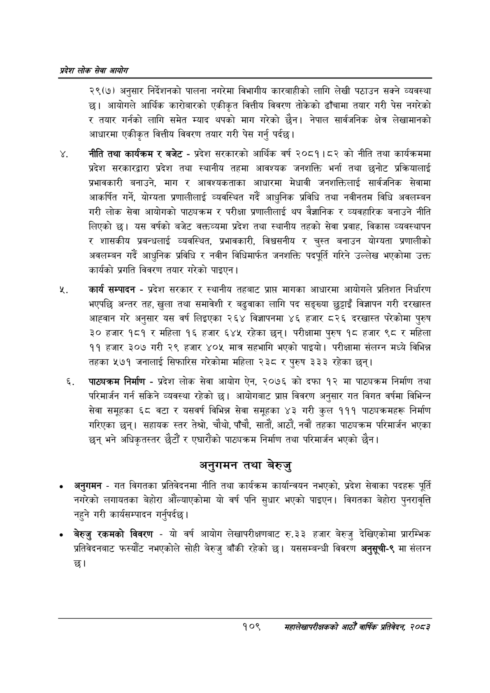

# Page 131 QA

## Rendered page


## Extracted text

```text
प्रदेश लोक सेवा आयोग
२९(७) अनुसार निर्देशनको पालना नगरेमा विभागीय कारबाहीको लागि लेखी पठाउन सक्ने व्यवस्था छ। आयोगले आर्थिक कारोबारको एकीकृत वित्तीय विवरण तोकेको ढाँचामा तयार गरी पेस नगरेको र तयार गर्नको लागि समेत म्याद थपको माग गरेको छैन। नेपाल सार्वजनिक क्षेत्र लेखामानको आधारमा एकीकृत वित्तीय विवरण तयार गरी पेस गर्नु पर्दछ।
नीति तथा कार्यक्रम र बजेट -प्रदेश सरकारको आर्थिक वर्ष २०८१।८२ को नीति तथा कार्यक्रममा प्रदेश सरकारद्वारा प्रदेश तथा स्थानीय तहमा आवश्यक जनशक्ति भर्ना तथा छनोट प्रक्रियालाई प्रभावकारी बनाउने, माग र आवश्यकताका आधारमा मेधावी जनशक्तिलाई सार्वजनिक सेवामा आकर्षित गर्ने, योग्यता प्रणालीलाई व्यवस्थित गर्दै आधुनिक प्रविधि तथा नवीनतम विधि अवलम्बन गरी लोक सेवा आयोगको पाठ्यक्रम र परीक्षा प्रणालीलाई थप वैज्ञानिक र व्यवहारिक बनाउने नीति लिएको छ। यस वर्षको बजेट वक्तव्यमा प्रदेश तथा स्थानीय तहको सेवा प्रवाह, विकास व्यवस्थापन र शासकीय प्रबन्धलाई व्यवस्थित, प्रभावकारी, विश्वसनीय र चुस्त बनाउन योग्यता प्रणालीको अवलम्बन गर्दै आधुनिक प्रविधि र नवीन विधिमार्फत जनशक्ति पदपूर्ति गरिने उल्लेख भएकोमा उक्त कार्यको प्रगति विवरण तयार गरेको पाइएन |
कार्य सम्पादन -प्रदेश सरकार र स्थानीय तहबाट प्राप्त मागका आधारमा आयोगले प्रतिशत निर्धारण भएपछि अन्तर तह, खुला तथा समावेशी र बढुवाका लागि पद सङ्ख्या छुट्टाइँ विज्ञापन गरी दरखास्त आह्वान गरे अनुसार यस वर्ष लिइएका २६४ विज्ञापनमा ४६ हजार ८२६ दरखास्त परेकोमा पुरुष ३० हजार १८१ र महिला १६ हजार ६४५ रहेका छन्‌। परीक्षामा पुरुष १८ हजार ९८ र महिला ११ हजार ३०७ गरी २९ हजार ४०५ मात्र सहभागि भएको पाइयो। परीक्षामा संलग्न मध्ये विभिन्न तहका ५७१ जनालाई सिफारिस गरेकोमा महिला २३८ र पुरुष ३३३ रहेका छन्‌।
पा््यक्रम निर्माण -प्रदेश लोक सेवा आयोग ऐन, २०७६ को दफा १२ मा पाठ्यक्रम निर्माण तथा परिमार्जन गर्न सकिने व्यवस्था रहेको छ। आयोगबाट प्राप्त विवरण अनुसार गत विगत वर्षमा विभिन्न सेवा समूहका ६८ वटा र यसवर्ष विभिन्न सेवा समूहका ४३ गरी कुल १११ पाठ्यक्रमहरू निर्माण गरिएका छन्‌। सहायक स्तर तेश्रो, चौथो, पाँचौ, सातौं, आठौं, नवौं तहका पाठ्यक्रम परिमार्जन भएका छन्‌ भने अधिकृतस्तर छैटौं र एघारौंको पाठ्यक्रम निर्माण तथा परिमार्जन भएको छैन।
अनुगमन तथा बेरुजु
अनुगमन -गत विगतका प्रतिवेदनमा नीति तथा कार्यक्रम कार्यान्वयन नभएको, प्रदेश सेवाका पदहरू पूर्ति नगरेको लगायतका बेहोरा औंल्याएकोमा यो वर्ष पनि सुधार भएको पाइएन। विगतका बेहोरा पुनरावृत्ति नहुने गरी कार्यसम्पादन गर्नुपर्दछ |
बेरुजु रकमको विवरण -यो वर्ष आयोग लेखापरीक्षणबाट रु.३३ हजार बेरुजु देखिएकोमा प्रारम्भिक प्रतिवेदनबाट फस्यौट नभएकोले सोही बेरुजु बाँकी रहेको छ। यससम्बन्धी विवरण अनुसूची-९ मा संलग्न छ।
१०९
सहालेखापरीक्षकको आठौँ वाषिकि प्रतिवेदन २०८२
```

## Flags
- None
