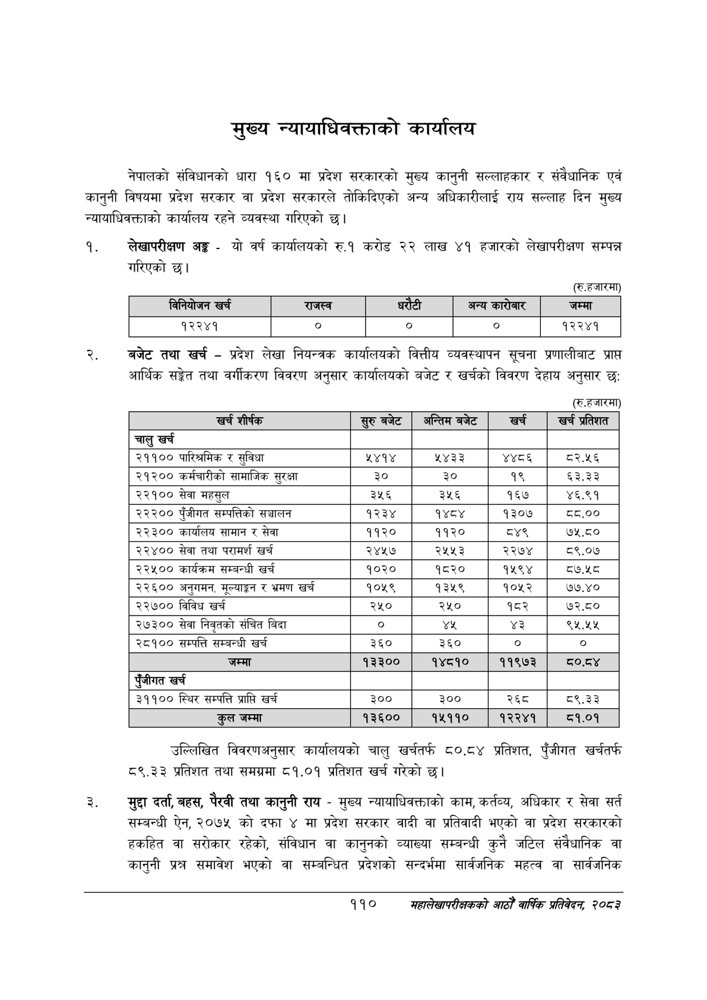

# Page 132 QA

## Rendered page


## Extracted text

```text
मुख्य न्यायाधिवक्ताको कार्यालय
नेपालको संविधानको धारा १६० मा प्रदेश सरकारको मुख्य कानुनी सल्लाहकार र संवैधानिक एवं कानुनी विषयमा प्रदेश सरकार वा प्रदेश सरकारले तोकिदिएको अन्य अधिकारीलाई राय सल्लाह दिन मुख्य न्यायाधिवक्ताको कार्यालय रहने व्यवस्था गरिएको छ।
लेखापरीक्षण अङ्ग -यो वर्ष कार्यालयको रु.१ करोड २२ लाख ४१ हजारको लेखापरीक्षण सम्पन्न गरिएको |
(रु.हजारमा)
बजेट तथा खर्च -प्रदेश लेखा नियन्त्रक कार्यालयको वित्तीय व्यवस्थापन सूचना प्रणालीबाट प्राप्त आर्थिक सङ्गेत तथा वर्गीकरण विवरण अनुसार कार्यालयको बजेट र खर्चको विवरण देहाय अनुसार छ:
(रु.हजारमा)
उल्लिखित विवरणअनुसार कार्यालयको चालु खर्चतर्फ ८०.८४ प्रतिशत, पुँजीगत खर्चतर्फ ८९.३३ प्रतिशत तथा समग्रमा ८१.०१ प्रतिशत खर्च गरेको छ।
मुद्दा दर्ता, बहस, पैरवी तथा कानुनी राय -मुख्य न्यायाधिवक्ताको काम, कर्तव्य, अधिकार र सेवा सर्त सम्बन्धी ऐन, २०७५ को दफा ४ मा प्रदेश सरकार वादी वा प्रतिवादी भएको वा प्रदेश सरकारको हकहित वा सरोकार रहेको, संविधान वा कानुनको व्याख्या सम्बन्धी कुनै जटिल संवैधानिक वा कानुनी प्रश्न समावेश भएको वा सम्बन्धित प्रदेशको सन्दर्भमा सार्वजनिक महत्व वा सार्वजनिक
११०
सहालेखापरीक्षकको आठौँ वाषिकि प्रतिवेदन २०८२

|  |  | 'ननपोजन खची |  | राजस्व | धरेटी |  | अन्य कारोबार | जम्मा |
| --- | --- | --- | --- | --- | --- | --- | --- | --- |

| खर्च शीर्षक | सुरु बबेट | अन्तिम बजेट | खर्च | खर्च प्रतेशत |
| --- | --- | --- | --- | --- |
| चालु खर्च |  |  |  |  |
| २११०० पारिश्रमिक र सुविधा | ५४१४ | ५४३३ | ४४८६ | ८२.५६ |
| २१२०० कर्मचारीको सामाजिक सुरक्षा | ३० | ३० | १९ | ६३.३३ |
| २२१०० सेवा महसुल | ३५६ | ३५६ | १६७ | ४६.९१ |
| २२२०० पुँजीगत सम्पत्तिको सञ्चालन | १२३४ | १४८४ | १३०७ | द.०० |
| २२३०० कार्यालष सामान र सेवा | ११२० | ११२० | '८ | ७५.८० |
| २२४०० सेवा तथा परामर्श खर्च | २४५७ | २५५३ | २२७४ | ८९.०७ |
| २२५०० कार्यक्रम सम्बन्धी खर्च | १०२० | १८२० | १५९४ | ८७.५८ |
| २२६०० अनुगमन, २०४ाङ१ र भ्रमण खर्च | १०५९ | १३५९ | १०५२ | ७७.४० |
| २२७०० विविध खर्च | २५० | २५० | १८२ | ७२.८० |
| २७३०० सेवा निवृतको संचित बिदा | ० | ४ | ४३ | ९५.५५ |
| २८१०० सम्पत्ति सम्बन्धी खर्च | ३६० | ३६० |  | ० |
| जम्मा | १३३०० | १४८१० | ११९७३ |  |
| खर्च |  |  |  |  |
| ३९९०० स्थिर सम्पत्ति प्राप्ति खर्च | ३०० | ३०० | २६८ | ८९.३३ |
| कुल जम्मा | १३६०० | १५११० | १२२४१ | ©.०९ |
```

## Flags
- table_page
- medium_quality_table
