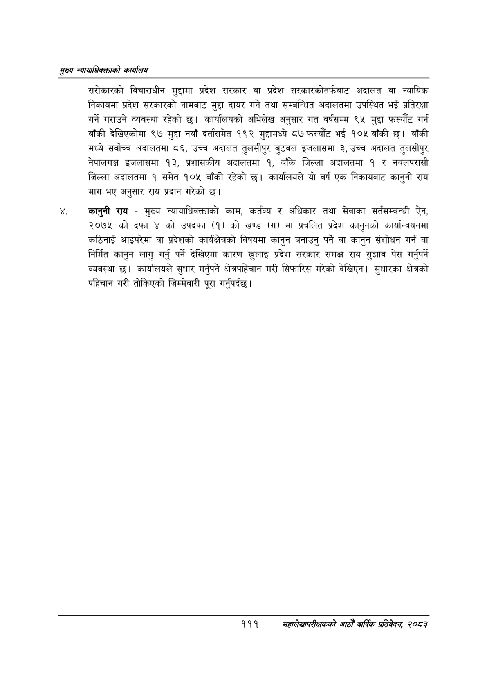

# Page 133 QA

## Rendered page


## Extracted text

```text
सृख्य न्यायाधिकक्ताको कायलिय
सरोकारको विचाराधीन मुद्दामा प्रदेश सरकार वा प्रदेश सरकारकोतर्फबाट अदालत वा न्यायिक निकायमा प्रदेश सरकारको नामबाट मुद्दा दायर गर्ने तथा सम्बन्धित अदालतमा उपस्थित भई प्रतिरक्षा गर्ने गराउने व्यवस्था रहेको छ। कार्यालयको अभिलेख अनुसार गत वर्षसम्म ९५ मुद्दा फस्यौट गर्न बाँकी देखिएकोमा ९७ मुद्दा नयाँ दर्तासमेत १९२ मुद्दामघ्ये ८७ फस्यौट भई १०५ बाँकी छ। बाँकी मध्ये सर्वोच्च अदालतमा ८६, उच्च अदालत तुलसीपुर बुटवल इजलासमा ३, उच्च अदालत तुलसीपुर नेपालगञ्ज इजलासमा १३, प्रशासकीय अदालतमा १, बाँके जिल्ला अदालतमा १ र नवलपरासी जिल्ला अदालतमा १ समेत १०५ बाँकी रहेको छ। कार्यालयले यो वर्ष एक निकायबाट कानुनी राय माग भए अनुसार राय प्रदान गरेको छ।
कानुनी राय -मुख्य न्यायाधिवक्ताको काम, कर्तव्य र अधिकार तथा सेवाका सर्तसम्बन्धी ऐन, २०७५ को दफा ४ को उपदफा (१) को खण्ड (ग) मा प्रचलित प्रदेश कानुनको कार्यान्वयनमा कठिनाई आइपरेमा वा प्रदेशको कार्यक्षेत्रको विषयमा कानुन बनाउनु पर्ने वा कानुन संशोधन गर्न वा निर्मित कानुन लागु गर्नु पर्ने देखिएमा कारण खुलाइ प्रदेश सरकार समक्ष राय सुझाव पेस गर्नुपर्ने व्यवस्था छ। कार्यालयले सुधार गर्नुपर्ने क्षेत्रपहिचान गरी सिफारिस गरेको देखिएन। सुधारका क्षेत्रको पहिचान गरी तोकिएको जिम्मेवारी पूरा गर्नुपर्दछ |
१११
सहालेखापरीक्षकको आठौँ वाषिकि प्रतिवेदन २०८२
```

## Flags
- None
