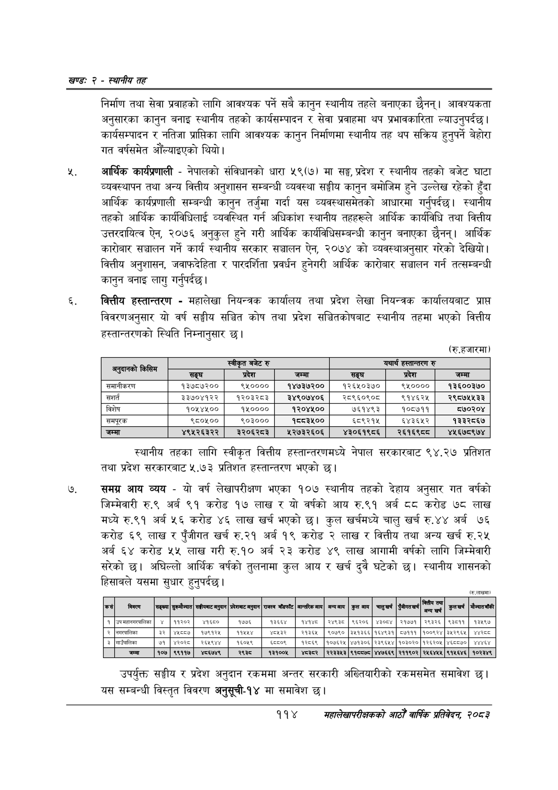

# Page 138 QA

## Rendered page


## Extracted text

```text
खण्ड: २ -स्थानीय तह
निर्माण तथा सेवा प्रवाहको लागि आवश्यक पर्ने सबै कानुन स्थानीय तहले बनाएका छैनन्‌। आवश्यकता अनुसारका कानुन बनाइ स्थानीय तहको कार्यसम्पादन र सेवा प्रवाहमा थप प्रभावकारिता ल्याउनुपर्दछ। कार्यसम्पादन र नतिजा प्राप्तिका लागि आवश्यक कानुन निर्माणमा स्थानीय तह थप सक्रिय हुनुपर्ने बेहोरा गत वर्षसमेत औँल्याइएको थियो।
आर्थिक कार्यप्रणाली -नेपालको संविधानको धारा ५९(७) मा सङ्घ, प्रदेश र स्थानीय तहको बजेट घाटा व्यवस्थापन तथा अन्य वित्तीय अनुशासन सम्बन्धी व्यवस्था सङ्घीय कानुन बमोजिम हुने उल्लेख रहेको हुँदा आर्थिक कार्यप्रणाली सम्बन्धी कानुन तर्जुमा गर्दा यस व्यवस्थासमेतको आधारमा गर्नुपर्दछ। स्थानीय तहको आर्थिक कार्यविधिलाई व्यवस्थित गर्न अधिकांश स्थानीय तहहरूले आर्थिक कार्यविधि तथा वित्तीय उत्तरदायित्व ऐन, २०७६ अनुकुल हुने गरी आर्थिक कार्यविधिसम्बन्धी कानुन बनाएका छैनन्‌। आर्थिक कारोबार सञ्चालन गर्ने कार्य स्थानीय सरकार सञ्चालन ऐन, २०७४ को व्यवस्थाअनुसार गरेको देखियो। वित्तीय अनुशासन, जवाफदेहिता र पारदर्शिता प्रवर्धन हुनेगरी आर्थिक कारोबार सञ्चालन गर्न तत्सम्बन्धी कानुन बनाइ लागु गर्नुपर्दछ |
वित्तीय हस्तान्तरण -महालेखा नियन्त्रक कार्यालय तथा प्रदेश लेखा नियन्त्रक कार्यालयबाट प्राप्त विवरणअनुसार यो वर्ष सङ्घीय सञ्चित कोष तथा प्रदेश सञ्चितकोषबाट स्थानीय तहमा भएको वित्तीय हस्तान्तरणको स्थिति निम्नानुसार छ।
(रु.हजारमा
स्थानीय तहका लागि स्वीकृत वित्तीय हस्तान्तरणमध्ये नेपाल सरकारबाट ९४.२७ प्रतिशत तथा प्रदेश सरकारबाट ५.७३ प्रतिशत हस्तान्तरण भएको छ।
समग्र आय व्यय -यो वर्ष लेखापरीक्षण भएका १०७ स्थानीय तहको देहाय अनुसार गत वर्षको जिम्मेवारी रु.९ अर्ब ९१ करोड १७ लाख र यो वर्षको आय रु.९१ अर्ब करोड ७८ लाख मध्ये रु.९१ अर्ब ५६ करोड ४६ लाख खर्च भएको | कुल खर्चमध्ये चालु खर्च रु.४४ अर्ब ७६ करोड ६९ लाख र पुँजीगत खर्च रु.२१ अर्ब १९ करोड २ लाख र वित्तीय तथा अन्य खर्च रु.२५ अर्ब ६४ करोड ५५ लाख गरी रु.१० अर्ब २३ करोड ४९ लाख आगामी वर्षको लागि जिम्मेवारी सरेको छ। अघिल्लो आर्थिक वर्षको तुलनामा कुल आय र खर्च दुवै घटेको छ। स्थानीय शासनको हिसाबले यसमा सुधार हुनुपर्दछ |
(रु.लाखमा)
उपर्युक्त सङ्घीय र प्रदेश अनुदान रकममा अन्तर सरकारी अख्तियारीको रकमसमेत समावेश | यस सम्बन्धी विस्तृत विवरण अनुसूची-१४ मा समावेश छ।
११४
सहालेखापरीक्षकको आठौँ वाषिकि प्रतिवेदन २०८२

| ला |  | स्वीकृत बजेट रु |  |  | यथार्थ हस्तान्तरण रु |  |
| --- | --- | --- | --- | --- | --- | --- |
| १३५०) | सङ्घ | प्रदेश | जम्मा | सङ्घ | प्रदेश | जम्मा |
| समानीकरण | १३७८७२०० | ९५०००० | १४७३७२०० | १२६५०३७० | ४४०००० | १३६००३७० |
| 'सशर्त | ३३७०४१२२ | १२०३२८३ | इे४९०७४०६ | २८९६०९०८ | ९१४६२५ | २९८७५५३३ |
| विशेष | १०१४५०० | १५०००० | १२०४५०० | ७६१४९३ | १०८७११ | ८७०२०४ |
| 'समपूरक | ९८०१०० | ९०३००० | ९५५३८०० | ६८९२१५ | ६४३६५२ | १३३२८६७ |
| जम्मा | ४९५२६३२२ | ३२०६२८३ | १२७३२६०६ | ४३०६१९८६ | २६१६९८८ | ४५६७८९७४ |

| कसै | बिक्ला |  |  |  |  | बाँफाट | - लान्जरिक नाल | अन्याय | कुल आय | चातुखर्ष |  | वित्तीय तथा | कुलबर्ष | मेन्चण याको |
| --- | --- | --- | --- | --- | --- | --- | --- | --- | --- | --- | --- | --- | --- | --- |
| १ | उपनहानमर्कलिका | ४ | ११२०२ | ४१६८० | १७७६ | १३६६४ | १४१४ | २४९३८ | ९६२०६ | ४३०८४ | २१७७१ | २९३२६ | ९३८११ | १३५९७ |
|  | नगरपालिका | ३ | ४ | ७९२५ | पक |  | २१३६ | ९०७९० | ३४१३६६ | १६४९३१ | ५१११ | १००९२४ | ३५२९६५ | ४२०८ |
| ३ | गाउँपालिका | ७१ | ४०२ | २४९४ | ६०४९ | । ६००९ \| | १२०६९ | क०७६२५ | ४७१३०६ | २३९६४४ | १०३०२० | १२६२०५ | ४६००७० | ४४४६४ |
|  | जम्मा | १०७ | ९९११७ | ४८६७४९ | २९३८ | १३१००४५ | ४३ेर | २२३३५३ | ९१८०७८ | ४४७६६९ | २११९०२ | २४५६४५४५ | ९१५६४६ | १०२३४९ |
```

## Flags
- table_page
- medium_quality_table
