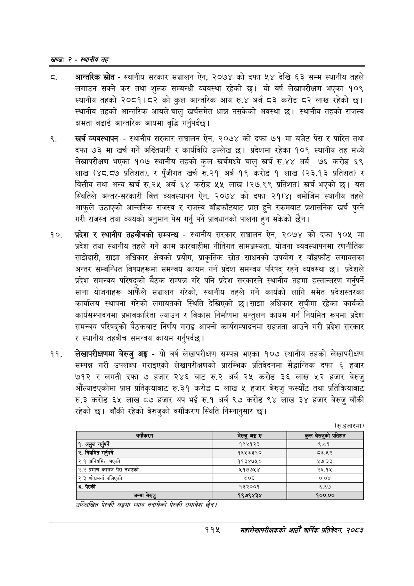

# Page 139 QA

## Rendered page


## Extracted text

```text
खण्ड: २ -स्थानीय तह
आन्तरिक स्रोत -स्थानीय सरकार सञ्चालन ऐन, २०७४ को दफा ५४ देखि ६३ सम्म स्थानीय तहले लगाउन सक्ने कर तथा शुल्क सम्बन्धी व्यवस्था रहेको छ। यो वर्ष लेखापरीक्षण भएका १०९ स्थानीय तहको २०८१।८२ को कुल आन्तरिक आय रु.४ अर्ब ८३ करोड ८२ लाख रहेको छ। स्थानीय तहको आन्तरिक आयले चालु खर्चसमेत धान्न नसकेको अवस्था | स्थानीय तहको राजस्व क्षमता बढाई आन्तरिक आयमा बुद्धि गर्नुपर्दछ।
खर्च व्यवस्थापन -स्थानीय सरकार सञ्चालन ऐन, २०७४ को दफा ७१ मा बजेट पेस र पारित तथा दफा ७३ मा खर्च गर्ने अख्तियारी र कार्यविधि उल्लेख छ। प्रदेशमा रहेका १०९ स्थानीय तह मध्ये लेखापरीक्षण भएका १०७ स्थानीय तहको कुल खर्चमध्ये चालु खर्च रु.४४ अर्ब ७६ करोड ६९ लाख (४८.८७ प्रतिशत), र पुँजीगत खर्च रु.२१ अर्ब १९ करोड १ लाख (२३.१३ प्रतिशत) र वित्तीय तथा अन्य खर्च रु.२५ अर्ब ६४ करोड ५५ लाख (२७.९९ प्रतिशत) खर्च भएको यस स्थितिले अन्तर-सरकारी वित्त व्यवस्थापन ऐन, २०७४ को दफा २१८४) बमोजिम स्थानीय तहले आफूले उठाएको आन्तरिक राजस्व र राजस्व बाँडफाँटबाट प्राप्त हुने रकमबाट प्रशासनिक खर्च पुग्ने गरी राजस्व तथा व्ययको अनुमान पेस गर्नु पर्ने प्रावधानको पालना हुन सकेको छैन।
प्रदेश र स्थानीय तहबीचको सम्बन्ध -स्थानीय सरकार सञ्चालन ऐन, २०७४ को दफा १०५ मा प्रदेश तथा स्थानीय तहले गर्ने काम कारबाहीमा नीतिगत सामञ्जस्यता, योजना व्यवस्थापनमा रणनीतिक साझेदारी, साझा अधिकार क्षेत्रको प्रयोग, प्राकृतिक स्रोत साधनको उपयोग र बाँडफाँट लगायतका अन्तर सम्बन्धित विषयहरूमा समन्वय कायम गर्न प्रदेश समन्वय परिषद्‌ रहने व्यवस्था छ। प्रदेशले प्रदेश समन्वय परिषद्को बैठक सम्पन्न गरे पनि प्रदेश सरकारले स्थानीय तहमा हस्तान्तरण गर्नुपर्ने साना योजनाहरू आफैंले सञ्चालन गरेको, स्थानीय तहले गर्ने कार्यको लागि समेत प्रदेशस्तरका कार्यालय स्थापना गरेको लगायतको स्थिति देखिएको छ। साझा अधिकार सूचीमा रहेका कार्यको कार्यसम्पादनमा प्रभावकारिता ल्याउन र विकास निर्माणमा सन्तुलन कायम गर्न नियमित रूपमा प्रदेश समन्वय परिषद्को बैठकबाट निर्णय गराइ आफ्नो कार्यसम्पादनमा सहजता आउने गरी प्रदेश सरकार र स्थानीय तहबीच समन्वय कायम गर्नुपर्दछ।
लेखापरीक्षणमा बेरुजु अङ्ग -यो वर्ष लेखापरीक्षण सम्पन्न भएका १०७ स्थानीय तहको लेखापरीक्षण सम्पन्न गरी उपलब्ध गराइएको लेखापरीक्षणको प्रारम्भिक प्रतिवेदनमा सैद्धान्तिक दफा ६ हजार ७१२ र लगती दफा ७ हजार २४६ बाट रु.२ अर्ब २५ करोड ३६ लाख ५२ हजार बेरुजु औंल्याइएकोमा प्राप्त प्रतिकृयाबाट रु.३१ करोड लाख ५ हजार बेरुजु फस्यौट तथा प्रतिक्रियाबाट रु.३ करोड ६५ लाख ८७ हजार थप भई रु.१ अर्ब ९७ करोड ९४ लाख ३४ हजार बेरुजु बाँकी रहेको | बाँकी रहेको बेरुजुको वर्गीकरण स्थिति निम्नानुसार छ।
(रु.हजारमा)
उल्लिखित पेटकी अङ्कमा स्याद ननाघेको पेटकी समावेश छुन।
११५
सहालेखापरीक्षकको आठौँ वाषिकि प्रतिवेदन २०८२

| वर्गीकरण | बेरुजु अङ्ग रु |
| --- | --- |
| १. असुल गर्र्ने | १९४१२३ |
| २. नियमित गन्पर्ने | १६५३३१० |
| २.१ अनियमित भएको | ११३४७५० |
| २.२ प्रमाण कागज पेस नभएको | २१७७५४ |
| २.३ शोधभर्ना नलिएको | ८०६ |
| ३. पेस्की | १३२००१ |
| जम्मा बेरुजु | १९७९४३४ |
```

## Flags
- table_page
- medium_quality_table
