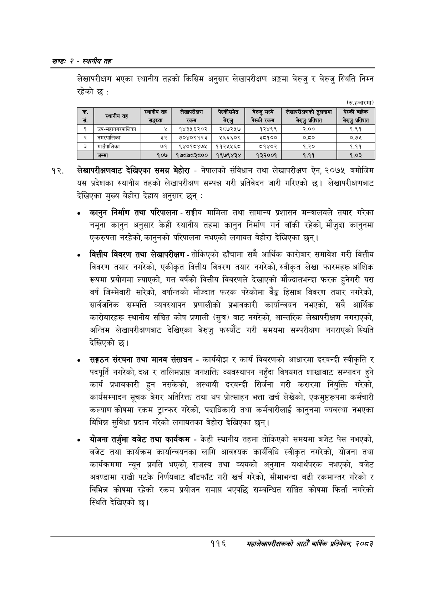

# Page 140 QA

## Rendered page


## Extracted text

```text
खण्ड: २ -स्थानीय तह
लेखापरीक्षण भएका स्थानीय तहको किसिम अनुसार लेखापरीक्षण अङ्गमा बेरुजु र बेरुजु स्थिति निम्न
(रु.हजारमा)
लेखापरीक्षणबाट देखिएका समग्र बेहोरा -नेपालको संविधान तथा लेखापरीक्षण ऐन, २०७५ बमोजिम यस प्रदेशका स्थानीय तहको लेखापरीक्षण सम्पन्न गरी प्रतिवेदन जारी गरिएको छ। लेखापरीक्षणबाट देखिएका मुख्य बेहोरा देहाय अनुसार छन्‌:
कानुन निर्माण तथा परिपालना -सङ्घीय मामिला तथा सामान्य प्रशासन मन्त्रालयले तयार गरेका नमूना कानुन अनुसार केही स्थानीय तहमा कानुन निर्माण गर्न बाँकी रहेको, मौजुदा कानुनमा एकरुपता नरहेको, कानुनको परिपालना नभएको लगायत बेहोरा देखिएका छन्‌।
वित्तीय विवरण तथा लेखापरीक्षण -तोकिएको ढाँचामा सबै आर्थिक कारोबार समावेश गरी वित्तीय विवरण तयार नगरेको, एकीकृत वित्तीय विवरण तयार नगरेको, स्वीकृत लेखा फारमहरू आंशिक रूपमा प्रयोगमा ल्याएको, गत वर्षको वित्तीय विवरणले देखाएको मौज्दातभन्दा फरक हुनेगरी यस वर्ष जिम्मेवारी सारेको, वर्षान्तको मौज्दात फरक परेकोमा बेङ्ग हिसाब विवरण तयार नगरेको, सार्वजनिक सम्पत्ति व्यवस्थापन प्रणालीको प्रभावकारी कार्यान्वयन नभएको, सबै आर्थिक कारोबारहरू स्थानीय सञ्चित कोष प्रणाली (सुत्र) बाट नगरेको, आन्तरिक लेखापरीक्षण नगराएको, अन्तिम लेखापरीक्षणबाट देखिएका बेरुजु फस्यौट गरी समयमा सम्परीक्षण नगराएको स्थिति देखिएको छ।
सङ्गठन संरचना तथा मानव संसाधन -कार्यबोझ र कार्य विवरणको आधारमा दरबन्दी स्वीकृति र पदपूर्ति नगरेको, दक्ष र तालिमप्राप्त जनशक्ति व्यवस्थापन नहुँदा विषयगत शाखाबाट सम्पादन हुने कार्य प्रभावकारी हुन नसकेको, अस्थायी दरबन्दी सिर्जना गरी करारमा नियुक्ति गरेको, कार्यसम्पादन सूचक बेगर अतिरिक्त तथा थप प्रोत्साहन भत्ता खर्च लेखेको, एकमुष्टरूपमा कर्मचारी कल्याण कोषमा रकम ट्रान्फर गरेको, पदाधिकारी तथा कर्मचारीलाई कानुनमा व्यवस्था नभएका बिभिन्न सुविधा प्रदान गरेको लगायतका बेहोरा देखिएका छन्‌।
योजना तर्जुमा बजेट तथा कार्यक्रम -केही स्थानीय तहमा तोकिएको समयमा बजेट पेस नभएको, बजेट तथा कार्यक्रम कार्यान्वयनका लागि आवश्यक कार्यविधि स्वीकृत नगरेको, योजना तथा कार्यक्रममा न्यून प्रगति भएको, राजस्व तथा व्ययको अनुमान यथार्थपरक नभएको, बजेट अवण्डामा राखी पटके निर्णयबाट बाँडफाँट गरी खर्च गरेको, सीमाभन्दा बढी रकमान्तर गरेको र विभिन्न कोषमा रहेको रकम प्रयोजन समाप्त भएपछि सम्बन्धित सञ्चित कोषमा फिर्ता नगरेको स्थिति देखिएको छ।
११६
सहालेखापरीक्षकको आठौँ वाषिकि प्रतिवेदन २०८२

| क. सं. | दता | स्थानीय त सङ्ख्या | लेखापरीजण 'रकम | भेल्कोसमत बेरुजु | बेरुजुमध्ये पेस्की रकम | लेखापरीकणको तुलनामा बेरुजु प्रतिशत |
| --- | --- | --- | --- | --- | --- | --- |
| १ | उप-बहाननर्कालिका | ४ | १४३५६२०२ | २८७२५७ | १२४९९ | २.०० |
| २ | नभर्वालिका | ३२ | ७०४०९१२३ | १६६६०९ | ३८१०० | ०.६० |
| ३ | गाउँपालिका | ७१ | ९४०१८४७५ | ११२५५६८ | ८१४०२ | १.२० |
| ४ | जम्मा | १०७ | १७८७८३८०० | १९७९४३४ | १३२००१ | १.११ |
```

## Flags
- table_page
- medium_quality_table
