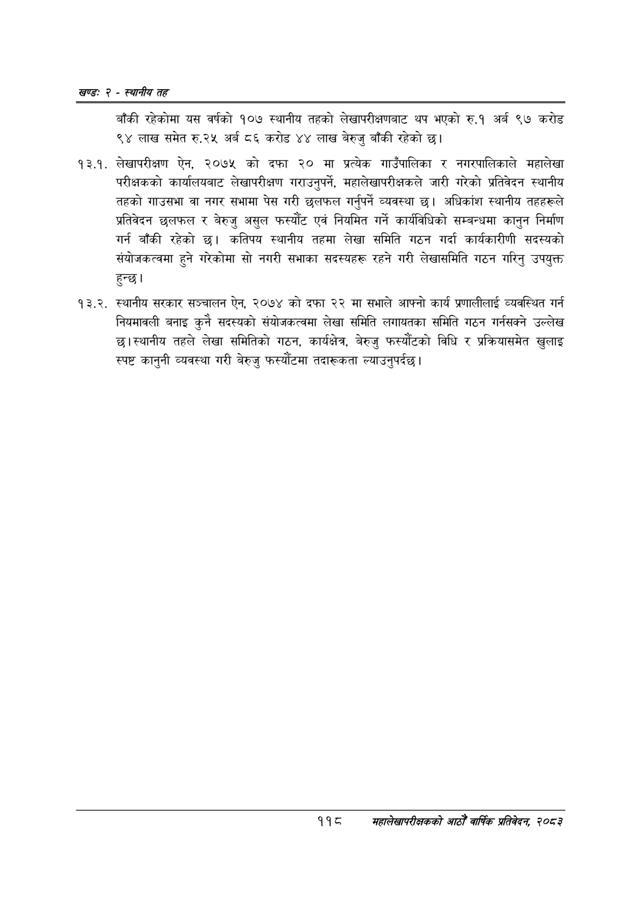

# Page 142 QA

## Rendered page


## Extracted text

```text
खण्ड: २ -स्थानीय तह
बाँकी रहेकोमा यस वर्षको १०७ स्थानीय तहको लेखापरीक्षणबाट थप भएको रु.१ अर्ब ९७ करोड ९४ लाख समेत रु.२५ अर्ब ८६ करोड ४४ लाख बेरुजु बाँकी रहेको छ।
१३.१. लेखापरीक्षण ऐन, २०७५ को दफा २० मा प्रत्येक गाउँपालिका र नगरपालिकाले महालेखा परीक्षकको कार्यालयबाट लेखापरीक्षण गराउनुपर्ने, महालेखापरीक्षकले जारी गरेको प्रतिवेदन स्थानीय तहको गाउसभा वा नगर सभामा पेस गरी छलफल गर्नुपर्ने व्यवस्था | अधिकांश स्थानीय तहहरूले प्रतिवेदन छलफल र बेरुजु असुल फस्यौंट एवं नियमित गर्ने कार्यविधिको सम्बन्धमा कानुन निर्माण गर्न बाँकी रहेको छ। कतिपय स्थानीय तहमा लेखा समिति गठन गर्दा कार्यकारीणी सदस्यको संयोजकत्वमा हुने गरेकोमा सो नगरी सभाका सदस्यहरू रहने गरी लेखासमिति गठन गरिनु उपयुक्त हुन्छ।
१३.२. स्थानीय सरकार सञ्चालन ऐन, २०७४ को दफा २२ मा सभाले आफ्नो कार्य प्रणालीलाई व्यवस्थित गर्न नियमावली बनाइ कुनै सदस्यको संयोजकत्वमा लेखा समिति लगायतका समिति गठन गर्नसक्ने उल्लेख छु। स्थानीय तहले लेखा समितिको गठन, कार्यक्षेत्र, बेरुजु फस्यौटको विधि र प्रक्रियासमेत खुलाइ स्पष्ट कानुनी व्यवस्था गरी बेरुजु फस्यौटमा तदारूकता ल्याउनुपर्दछ।
११८
सहालेखापरीक्षकको आठौँ वाषिकि प्रतिवेदन २०८२
```

## Flags
- None
