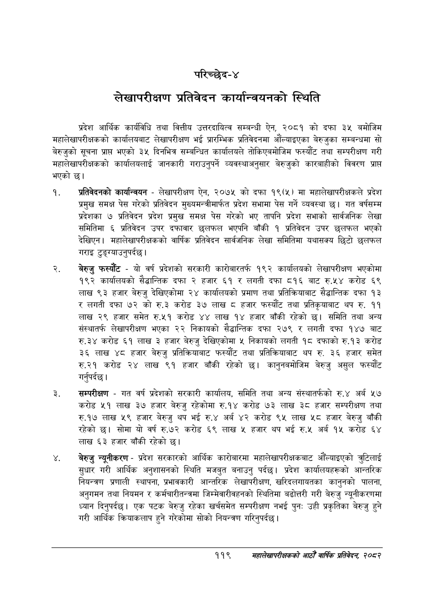

# Page 145 QA

## Rendered page


## Extracted text

```text
परिच्छेद-४
लेखापरीक्षण प्रतिवेदन कार्यान्वयनको स्थिति
प्रदेश आर्थिक कार्यविधि तथा वित्तीय उत्तरदायित्व सम्बन्धी ऐन, २०८१ को दफा ३५ बमोजिम महालेखापरीक्षकको कार्यालयबाट लेखापरीक्षण भई प्रारम्भिक प्रतिवेदनमा औंल्याइएका बेरुजुका सम्बन्धमा सो बेरुजुको सूचना प्रापत भएको ३५ दिनभित्र सम्बन्धित कार्यालयले तोकिएबमोजिम फस्यौंट तथा सम्परीक्षण गरी महालेखापरीक्षकको कार्यालयलाई जानकारी गराउनुपर्ने व्यवस्थाअनुसार बेरुजुको कारबाहीको विवरण प्राप्त भएको छ।
प्रतिवेदनको कार्यान्वयन -लेखापरीक्षण ऐन, २०७५ को दफा १९(५) मा महालेखापरीक्षकले प्रदेश प्रमुख समक्ष पेस गरेको प्रतिवेदन मुख्यमन्त्रीमार्फत प्रदेश सभामा पेस गर्ने व्यवस्था छ। गत वर्षसम्म प्रदेशका ७ प्रतिवेदन प्रदेश प्रमुख समक्ष पेस गरेको भए तापनि प्रदेश सभाको सार्वजनिक लेखा समितिमा ६ प्रतिवेदन उपर दफावार छलफल भएपनि बाँकी १ प्रतिवेदन उपर छलफल भएको देखिएन। महालेखापरीक्षकको वार्षिक प्रतिवेदन सार्वजनिक लेखा समितिमा यथासक्य छिटो छलफल गराइ टुङ्ग्याउनुपर्दछ।
बेरुजु फस्यौट -यो वर्ष प्रदेशको सरकारी कारोबारतर्फ १९२ कार्यालयको लेखापरीक्षण भएकोमा १९२ कार्यालयको सैद्धान्तिक दफा २ हजार ६१ र लगती दफा ८१६ बाट रु.५४ करोड ६९ लाख ९३ हजार बेरुजु देखिएकोमा २४ कार्यालयको प्रमाण तथा प्रतिक्रियाबाट सेद्धान्तिक दफा १३ र लगती दफा ७२ को रु.३ करोड ३७ लाख ८ हजार फस्यौंट तथा प्रतिकृयाबाट थप रु. ९९ लाख २९ हजार समेत रु.५१ करोड ४४ लाख १४ हजार बाँकी रहेको समिति तथा अन्य संस्थातर्फ लेखापरीक्षण भएका २२ निकायको सैद्धान्तिक दफा २७९ र लगती दफा १४७ बाट रु.३४ करोड ६१ लाख ३ हजार बेरुजु देखिएकोमा ५ निकायको लगती १८ दफाको रु.१३ करोड ३६ लाख ४८ हजार बेरुजु प्रतिक्रियाबाट फस्यौंट तथा प्रतिक्रियाबाट थप रु. ३६ हजार समेत रु.२१ करोड लाख ९१ हजार बाँकी रहेको छ। कानुनबमोजिम बेरुजु असुल फस्यौट गर्नुपर्दछ |
सम्परीक्षण -गत वर्ष प्रदेशको सरकारी कार्यालय, समिति तथा अन्य संस्थातर्फको रु.४ अर्ब ५७ करोड ५१ लाख ३७ हजार बेरुजु रहेकोमा रु.१४ करोड ७३ लाख ३८ हजार सम्परीक्षण तथा रु.१७ लाख ५९ हजार बेरुजु थप भई रु.४ अर्ब ४२ करोड ९५ लाख ५८ हजार बेरुजु बाँकी रहेको छ। सोमा यो वर्ष रु.७२ करोड ६९ लाख ५ हजार थप भई रु.५ अर्ब १५ करोड लाख ६३ हजार बाँकी रहेको छ।
बेरुजु न्यूनीकरण -प्रदेश सरकारको आर्थिक कारोबारमा महालेखापरीक्षकबाट औँल्याइएको तुटिलाई सुधार गरी आर्थिक अनुशासनको स्थिति मजबुत बनाउनु पर्दछ। प्रदेश कार्यालयहरूको आन्तरिक नियन्त्रण प्रणाली स्थापना, प्रभावकारी आन्तरिक लेखापरीक्षण, खरिदलगायतका कानुनको पालना, अनुगमन तथा नियमन र कर्मचारीतन्त्रमा जिम्मेवारीवहनको स्थितिमा बढोत्तरी गरी बेरुजु न्यूनीकरणमा ध्यान दिनुपर्दछ। एक पटक बेरुजु रहेका खर्चसमेत सम्परीक्षण नभई पुनः उही प्रकृतिका बेरुजु हुने गरी आर्थिक क्रियाकलाप हुने गरेकोमा सोको नियन्त्रण गरिनुपर्दछ |
११९
महालेखापरीक्षकको आठौँ वार्षिक प्रतिवेदन २०८२
```

## Flags
- None
