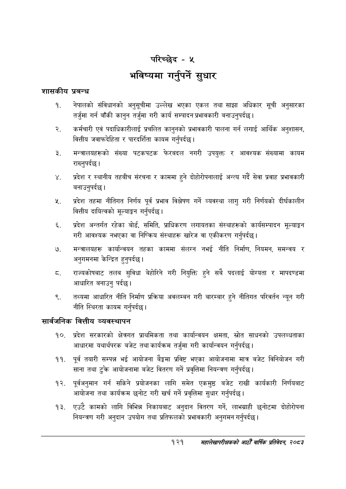

# Page 149 QA

## Rendered page


## Extracted text

```text
शासकीय
प्रबन्ध
नेपालको संविधानको अनुसूचीमा उल्लेख भएका एकल तथा साझा अधिकार सूची अनुसारका तर्जुमा गर्न बाँकी कानुन तर्जुमा गरी कार्य सम्पादन प्रभावकारी बनाउनुपर्दछ |
कर्मचारी एवं पदाधिकारीलाई प्रचलित कानुनको प्रभावकारी पालना गर्न लगाई आर्थिक अनुशासन, वित्तीय जवाफदेहिता र पारदर्शिता कायम गर्नुपर्दछ |
मन्त्रालयहरूको संख्या पटकपटक फेरबदल नगरी उपयुक्त र आवश्यक संख्यामा कायम राख्नुपर्दछ |
प्रदेश र स्थानीय तहवीच संरचना र काममा हुने दोहोरोपनालाई अन्त्य गर्दै सेवा प्रवाह प्रभावकारी बनाउनुपर्दछ।
प्रदेश तहमा नीतिगत निर्णय पूर्व प्रभाव विश्लेषण गर्ने व्यवस्था लागु गरी निर्णयको दीर्घकालीन वित्तीय दायित्वको मूल्याङ्कन गर्नुपर्दछ |
प्रदेश अन्तर्गत रहेका बोर्ड, समिति, प्राधिकरण लगायतका संस्थाहरूको कार्यसम्पादन मूल्याङ्कन गरी आवश्यक नभएका वा निष्क्रिय संस्थाहरू खारेज वा एकीकरण गर्नुपर्दछ।
मन्त्रालयहरू कार्यान्वयन तहका काममा संलग्न नभई नीति निर्माण, नियमन, समन्वय र अनुगमनमा केन्द्रित हुनुपर्दछ |
राज्यकोषबाट तलब सुविधा बेहोरिने गरी नियुक्ति हुने सबै पदलाई योग्यता र मापदण्डमा आधारित बनाउनु पर्दछ।
तथ्यमा आधारित नीति निर्माण प्रक्रिया अवलम्बन गरी बारम्बार हुने नीतिगत परिवर्तन न्यून गरी नीति स्थिरता कायम गर्नुपर्दछ |
सार्वजनिक वित्तीय व्यवस्थापन
प्रदेश सरकारको क्षेत्रगत प्राथमिकता तथा कार्यान्वयन क्षमता, स्रोत साधनको उपलब्धताका आधारमा यथार्थपरक बजेट तथा कार्यक्रम तर्जुमा गरी कार्यान्वयन गर्नुपर्दछ |
पूर्व तयारी सम्पन्न भई आयोजना बैङ्कमा प्रविष्ट भएका आयोजनामा मात्र बजेट विनियोजन गरी साना तथा टुक्रे आयोजनामा बजेट वितरण गर्ने प्रवृत्तिमा नियन्त्रण गर्नुपर्दछ |
पूर्वअनुमान गर्न सकिने प्रयोजनका लागि समेत एकमुष्ठ बजेट राखी कार्यकारी निर्णयबाट आयोजना तथा कार्यक्रम छनोट गरी खर्च गर्ने प्रवृत्तिमा सुधार गर्नुपर्दछ |
एउटै कामको लागि विभिन्न निकायबाट अनुदान वितरण गर्ने, लाभग्राही छनोटमा दोहोरोपना नियन्त्रण गरी अनुदान उपयोग तथा प्रतिफलको प्रभावकारी अनुगमन गर्नुपर्दछ |
परिच्छेद -५
भविष्यमा गर्नुपर्ने सुधार
१२१
महालेखापरीक्षकको आठौँ वार्षिक प्रतिवेदन २०८२
```

## Flags
- None
