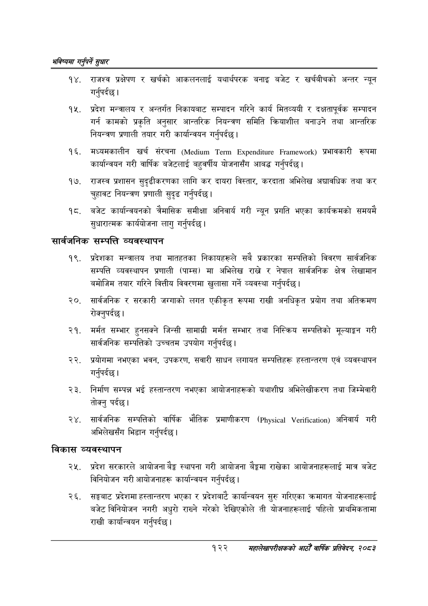

# Page 150 QA

## Rendered page


## Extracted text

```text
भविष्यमा गर्नुपर्ने सुक्षार
राजश्व प्रक्षेपण र खर्चको आकलनलाई यथार्थपरक बनाइ बजेट र खर्चबीचको अन्तर न्यून गर्नुपर्दछ |
प्रदेश मन्त्रालय र अन्तर्गत निकायबाट सम्पादन गरिने कार्य मितव्ययी र दक्षतापूर्वक सम्पादन गर्न कामको प्रकृति अनुसार आन्तरिक नियन्त्रण समिति क्रियाशील बनाउने तथा आन्तरिक नियन्त्रण प्रणाली तयार गरी कार्यान्वयन गर्नुपर्दछ |
मध्यमकालीन खर्च संरचना ( ) प्रभावकारी रूपमा कार्यान्वयन गरी वार्षिक बजेटलाई बहुवर्षीय योजनासँग आबद्ध गर्नुपर्दछ |
राजस्व प्रशासन सुदृढीकरणका लागि कर दायरा विस्तार, करदाता अभिलेख अद्यावधिक तथा कर चुहावट नियन्त्रण प्रणाली सुदृढ गर्नुपर्दछ |
पट. बजेट कार्यान्वयनको त्रैमासिक समीक्षा अनिवार्य गरी न्यून प्रगति भएका कार्यक्रमको समयमै सुधारात्मक कार्ययोजना लागु गर्नुपर्दछ |
सार्वजनिक सम्पत्ति व्यवस्थापन
प्रदेशका मन्त्रालय तथा मातहतका निकायहरूले सबै प्रकारका सम्पत्तिको विवरण सार्वजनिक सम्पत्ति व्यवस्थापन प्रणाली (पाम्स) मा अभिलेख राख्ने र नेपाल सार्वजनिक क्षेत्र लेखामान बमोजिम तयार गरिने वित्तीय विवरणमा खुलासा गर्ने व्यवस्था गर्नुपर्दछ |
सार्वजनिक र सरकारी जग्गाको लगत एकीकृत रूपमा राखी अनधिकृत प्रयोग तथा अतिक्रमण रोक्नुपर्दछ।
मर्मत सम्भार हुनसक्ने जिन्सी सामाग्री मर्मत सम्भार तथा निस्क्रिय सम्पत्तिको मूल्याङ्कन गरी सार्वजनिक सम्पत्तिको उच्चतम उपयोग गर्नुपर्दछ।
प्रयोगमा नभएका भवन, उपकरण, सवारी साधन लगायत सम्पत्तिहरू हस्तान्तरण एवं व्यवस्थापन गर्नुपर्दछ |
निर्माण सम्पन्न भई हस्तान्तरण नभएका आयोजनाहरूको यथाशीघ्र अभिलेखीकरण तथा जिम्मेवारी तोक्नु पर्दछ।
सार्वजनिक सम्पत्तिको वार्षिक भौतिक प्रमाणीकरण ( ) अनिवार्य गरी अभिलेखसँग भिडान गर्नुपर्दछ |
विकास व्यवस्थापन
प्रदेश सरकारले आयोजना बेङ्ग स्थापना गरी आयोजना बैङ्कमा राखेका आयोजनाहरूलाई मात्र बजेट विनियोजन गरी आयोजनाहरू कार्यान्वयन गर्नुपर्दछ।
सङ्घबाट प्रदेशमा हस्तान्तरण भएका प्रदेशबाटै कार्यान्वयन सुरु गरिएका क्रमागत योजनाहरूलाई बजेट विनियोजन नगरी अधुरो राख्ने गरेको देखिएकोले ती योजनाहरूलाई पहिलो प्राथमिकतामा राखी कार्यान्वयन गर्नुपर्दछ |
१२२
महालेखापरीक्षकको आठौँ वार्षिक प्रतिवेदन २०८२
```

## Flags
- None
