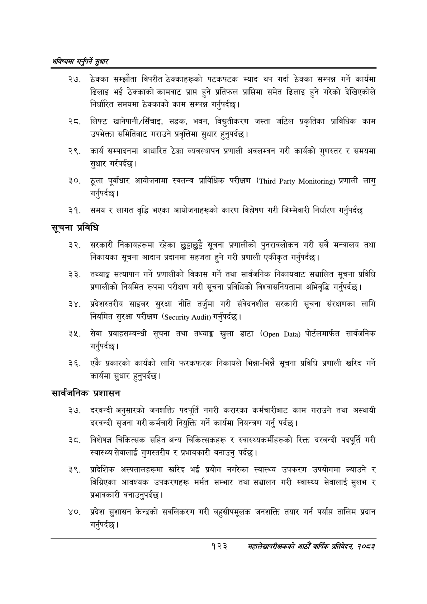

# Page 151 QA

## Rendered page


## Extracted text

```text
भविष्यमा गर्नुपर्ने सुक्षार
ठेक्का सम्झौता विपरीत ठेक्काहरूको पटकपटक म्याद थप गर्दा ठेक्का सम्पन्न गर्ने कार्यमा ढिलाइ भई ठेक्काको कामबाट प्राप्त हुने प्रतिफल प्राप्तिमा समेत ढिलाइ हुने गरेको देखिएकोले निर्धारित समयमा ठेक्काको काम सम्पन्न गर्नुपर्दछ |
लिफ्ट खानेपानी/सिँचाइ, सडक, भवन, विद्युतीकरण जस्ता जटिल प्रकृतिका प्राविधिक काम उपभेक्ता समितिबाट गराउने प्रवृत्तिमा सुधार हुनुपर्दछ |
कार्य सम्पादनमा आधारित ठेक्का व्यवस्थापन प्रणाली अवलम्वन गरी कार्यको गुणस्तर र समयमा सुधार गर्यपर्दछ।
ठूला पूर्वाधार आयोजनामा स्वतन्त्र प्राविधिक परीक्षण ( ) प्रणाली लागु गर्नुपर्दछ |
समय र लागत वृद्धि भएका आयोजनाहरूको कारण विश्लेषण गरी जिम्मेवारी निर्धारण गर्नुपर्दछ
सूचना प्रविधि
सरकारी निकायहरूमा रहेका छुट्टाछुट्टै सूचना प्रणालीको पुनरावलोकन गरी सबै मन्त्रालय तथा निकायका सूचना आदान प्रदानमा सहजता हुने गरी प्रणाली एकीकृत गर्नुपर्दछ |
तथ्याङ्क सत्यापान गर्ने प्रणालीको विकास गर्ने तथा सार्वजनिक निकायबाट सञ्चालित सूचना प्रविधि प्रणालीको नियमित रूपमा परीक्षण गरी सूचना प्रविधिको विश्वासनियतामा अभिवृद्धि गर्नुपर्दछ |
प्रदेशस्तरीय साइबर सुरक्षा नीति तर्जुमा गरी संवेदनशील सरकारी सूचना संरक्षणका लागि नियमित सुरक्षा परीक्षण ( ८००० गर्नुपर्दछ |
सेवा प्रवाहसम्बन्धी सूचना तथा तथ्याङ्ग खुला डाटा ( ) पीर्टलमार्फत सार्वजनिक गर्नुपर्दछ |
एकै प्रकारको कार्यको लागि फरकफरक निकायले भिन्ना-भिन्नै सूचना प्रविधि प्रणाली खरिद गर्ने कार्यमा सुधार हुनुपर्दछ |
सार्वजनिक प्रशासन
दरवन्दी अनुसारको जनशक्ति पदपूर्ति नगरी करारका कर्मचारीबाट काम गराउने तथा अस्थायी दरवन्दी सृजना गरी कर्मचारी नियुक्ति गर्ने कार्यमा नियन्त्रण गर्नु पर्दछ।
३ेट. विशेषज्ञ चिकित्सक सहित अन्य चिकित्सकहरू र स्वास्थ्यकर्मीहरूको रिक्त दरवन्दी पदपूर्ति गरी स्वास्थ्य सेवालाई गुणस्तरीय र प्रभावकारी वनाउनु पर्दछ।
प्रादेशिक अस्पतालहरूमा खरिद भई प्रयोग नगरेका स्वास्थ्य उपकरण उपयोगमा ल्याउने र बिग्रिएका आवश्यक उपकरणहरू मर्मत सम्भार तथा सञ्चालन गरी स्वास्थ्य सेवालाई सुलभ र प्रभावकारी वनाउनुपर्दछ।
प्रदेश सुशासन केन्द्रको सवलिकरण गरी बहुसीपमूलक जनशक्ति तयार गर्न पर्याप्त तालिम प्रदान गर्नुपर्दछ |
१२३
महालेखापरीक्षकको आठौँ वार्षिक प्रतिवेदन २०८२
```

## Flags
- None
