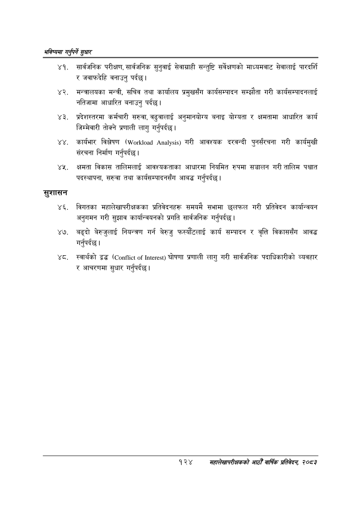

# Page 152 QA

## Rendered page


## Extracted text

```text
भविष्यमा गर्नुपर्ने सुक्षार
सार्वजनिक परीक्षण, सार्वजनिक सुनुवाई सेवाग्राही सन्तुष्टि सर्वेक्षणको माध्यमवाट सेवालाई पारदर्शि र जवाफदेहि वनाउनु पर्दछ।
मन्त्रालयका मन्त्री, सचिव तथा कार्यालय प्रमुखसँग कार्यसम्पादन सम्झौता गरी कार्यसम्पादनलाई नतिजामा आधारित बनाउनु पर्दछ।
प्रदेशस्तरमा कर्मचारी सरुवा, वढुवालाई अनुमानयोग्य बनाइ योग्यता र क्षमतामा आधारित कार्य जिम्मेवारी तोक्ने प्रणाली लागु गर्नुपर्दछ |
कार्यमार विश्लेषण ( ) गरी आवश्यक दरवन्दी पुनर्संरचना गरी कार्यमुखी संरचना निर्माण गर्नुपर्दछ |
क्षमता विकास तालिमलाई आवश्यकताका आधारमा नियमित रुपमा सञ्चालन गरी तालिम पश्चात पदस्थापना, सरुवा तथा कार्यसम्पादनसँग आबद्ध गर्नुपर्दछ |
सुशासन
विगतका महालेखापरीक्षकका प्रतिवेदनहरू समयमै सभामा छलफल गरी प्रतिवेदन कार्यान्वयन अनुगमन गरी सुझाव कार्यान्वयनको प्रगति सार्वजनिक गर्नुपर्दछ |
बढ्दो बेरुजुलाई नियन्त्रण गर्न बेरुजु फस्यौटलाई कार्य सम्पादन र वृत्ति विकाससँग आवद्ध गर्नुपर्दछ |
. स्वार्थको ३४ ( ) घोषणा प्रणाली लागु गरी सार्वजनिक पदाधिकारीको व्यवहार र आचरणमा सुधार गर्नुपर्दछ।
१२४
महालेखापरीक्षकको आठौँ वार्षिक प्रतिवेदन २०८२
```

## Flags
- None
