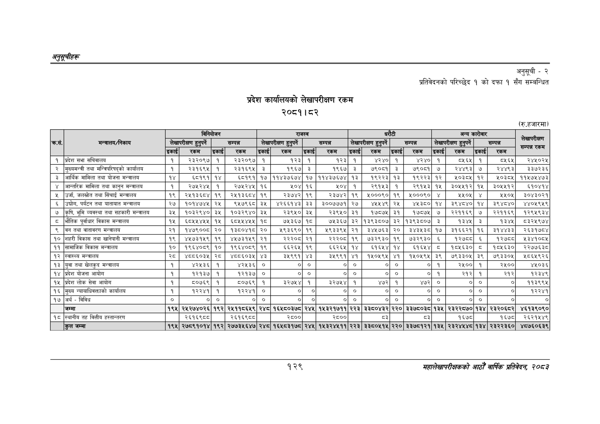

# Page 159 QA

## Rendered page


## Extracted text

```text
अनुतूचीहरू
प्रदेश कार्यालयको लेखापरीक्षण रकम २०८१।८२
अनुसूची -२
प्रतिवेदनको परिच्छेद १ को दफा १ सँग सम्बन्धित
(रु.हजारमा)
१२९
सहालेखापरीक्षकको आठौँ वाषिकि प्रतिवेदन २०८२

|  |  |  |  | विनियोजन |  |  | राजस्व |  |  |  |  | घरौटी |  |  | अन्य | कारोवार |  | सेखापरीक्षण |
| --- | --- | --- | --- | --- | --- | --- | --- | --- | --- | --- | --- | --- | --- | --- | --- | --- | --- | --- |
| कसे. | 'मन्त्रालय/निकाय |  | लेखापरीक्षण हुनुपर्ने |  | सम्पन्न |  | लेखापरीक्षण हुनुपर्ने |  | सम्पन्न |  | लेखापरीक्षण हुनुपर्ने |  | सम्पन्न |  | लेखापरीक्षण हुनुपर्ने |  | सम्पन्न |  |
|  |  | इकाई | रकम | इकाई | रकम | इकाई | रकम | इकाई | रकम | इकाई | रकम | इकाई | रकम | इकाई | रकम | इकाई | रकम | का |
| १ | प्रदेश सभा सचिवालय | १ | २३२०९७ | १ | २३२०९७ | १ | १२३ | १ | १२३ | १ | ४२४० | १ | ४२४० | १ | ८५६५ | १ | ८५६५ | र२४५०२५ |
| २ | मुख्यमन्त्री तथा मन्त्रिपरिषद्को कार्यालय | १ | २३१६९५ | १ | २३१६९५ | ३ | १९६७ | ३ | १९६७ | ३ | ७९०८१ | ३ | ७९०८१ | ७ | २४४९३ | ७ | २४४९३ | ३३७२३६ |
| ३ | आर्थिक मामिला तथा योजना मन्त्रालय | १४ | ६८१९१ | १४ | ६८१९१ | १७ | ११४३७६७४ | १७ | ११४३७६७४ | १३ | १९२२३ | १३ | १९२२३ | १२ | ०३८५ | १२ | १०३८५ | ११५७५४७३ |
| ४ | आन्तरिक मामिला तथा कानुन मन्त्रालय | १ | र२७१२४५ | १ | र२७५२४५ | १६ |  | १६ | २०४ | १ | र२९१५३ | १ | २९१५३ | १५ | ३०५५१२ | १५ | ३०५५१२ | ६१०४१४ |
| ५ | उर्जा, जलस्रोत तथा सिँचाई मन्त्रालय | १९ | २५१३६८४ | १९ | २५१३६८४ | १९ | २३७४२ | १९ | २३७४२ | १९ | ४०००%० | १९ | १०००९० | ४ | ५५०५ | ४ | १५०५ | ३०४३०२१ |
| ६ | उच्चोग, पर्यटन तथा यातायात मन्त्रालय | २७ | १०१४७४५ |  | ९५७९६८ | ३५ | ४२६६१४३ | ३३ | ३००७७७१ | २७ | ५५४९ | २५४ | ४३८० | १४ | ३९४८४० | १४ | ३९४८४० | ४४०५९५९ |
| ७ | कृषि, भूमि व्यवस्था तथा सहकारी मन्त्रालय | ३५ | १०३२९४० | ३५ | १०३२९४० | ३४५ | २३९५० | ३५ | २३९५० | ३१ | १७८७५ | ३१ | १७८७५ | ७ | २२११६९ | ७ | २२११६९ | १२९५९३४ |
| ८ | भौतिक पूर्वाधार विकास मन्त्रालय | १५ | ६८५५४५५ | १५ | ६८५५४५५ | १८ | ७५३६७ | १८ | ७५३६७ | ३२ | १३९३८०७ | ३२ | १३९३८०७ | ३ | १३४५ | ३ | १३४५ | ८३२५९७४ |
| ९ | बन तथा वातावरण मन्त्रालय | २१ | १४७९००८ | २० | १३८०४१८ | २० | १९३६९० | १९ | ९३३९५ | २१ | ३४५७६३ | २० | ३४३५३८ | १७ | ३१६६२१ | १६ | ३१४४३३ | २६३१७८४ |
| १० | शहरी विकास तथा खानेपानी मन्त्रालय | १९ | ४५७३१५९ | १९ | ४५७३१५९ | २१ | २२२०८ | २१ | २२२०८ | १९ | ७३२९३० | १९ | ७३२९३० | ६ | १२७८८ | ६ | १२७८८ | २५३४१०८५ |
| ११ | सामाजिक विकास मन्त्रालय | १० | १९६४०८९ | १० | १९६४०८९ | १९ | ६६२६५ | १९ | ६६२६५ | १४ | ६१६५४ | १४ | १६५४ | ८ | १८५६३० | ८ | १८५६३० | २२७७६३८ |
| १२ | स्वास्थ्य मन्त्रालय | २८ | ४८८६०३५ | २८ | ४८८६०३५ | ४३ | ३५९९१ | ४३ | ३५९९१ | ४१ | १५०५९५ | ४१ | १५०५९५ | ३९ | ७९३३०५ | ३९ | ७९३३०५ | १८६५९२६ |
| १३ | युवा तथा खेलकुद मन्त्रालय | १ | ४२५३६ | १ | ४२५३६ | ० | ० | ० | ० | ० | ० | ० | ० | १ | २५०० | १ | २५०० | ४५०३६ |
| १४ | प्रदेश योजना आयोग | १ | १२१३७ | १ | १२१३७ | ० | ० | ० | ० | ० | ० | ० | ० | १ | २१२ | १ | २१२ | १२३४९ |
| १५ | प्रदेश लोक सेवा आयोग | १ | ५०७६९ | १ | ८०७६९ | १ | ३२७५४ | १ | ३२७५४ | १ | ४७२ | १ | ४७२ | ० | ० |  | ० | ११३६९५ |
| १६ | मुख्य न्यायाधिवक्ताको कार्यालय | १ | १२२४१ | १ | १२२४१ | ० | ० | ० | ० | ० | ० | ० | ० | ० | ० | ० | ० | १२२४१ |
| १७ | अर्थ - विविध | ० | ० | ० | ० | ० | ० | ० | ० | ० | ० | ० | ० | ० | ० | ० | ० | ० |
|  | जम्मा | १९५ | २४५२७४०२६ | १९२ | २४५११८६५९ | २४८ | १६४५८०३७८ | २४५ | १५३२१७११ | २२३ | ३३८०४३२ | २२० | ३३७८०३८ | १३५ | २३२२८७० | १३४ | २३२०६८२ | ४६१३९०९० |
| १८ | स्थानीय तह वित्तीय हस्तान्तरण |  | २६१६९८८ |  | २६१६९८८ |  | २८०० |  | २८०० |  | ३ |  | ५३ |  | १६७८ |  | १६७८ | २६२१५४९ |
```

## Flags
- table_page
- medium_quality_table
