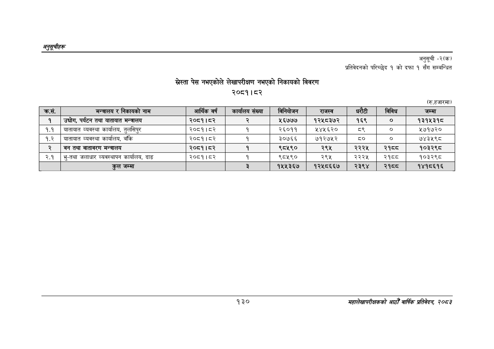

# Page 160 QA

## Rendered page


## Extracted text

```text
अनुतूचीहरू
खेस्ता पेस नभएकोले लेखापरीक्षण नभएको निकायको विवरण २०८१।८२
अनुसूची -२(क)
प्रतिवेदनको परिच्छेद १ को दफा १ सँग सम्बन्धित
(रु.हजारमा)
१३०
सहालेखापरीक्षकको आठौँ वाषिकि प्रतिवेदन २०८२

| क्रस. | मन्त्रालय र निकायको नाम | आर्थिक वर्ष | कार्यालय संख्या | विनियोजन | राजस्व | धरटी | विविध | जम्मा |
| --- | --- | --- | --- | --- | --- | --- | --- | --- |
| १ | उद्योग, पर्यटन तथा यातायात मन्त्रालय | २०८१।८२ |  | ५६७७७ | १२५८३७२ | १६९ |  | १३९४३९५ |
| ९.९ | यातायात व्यवस्था कार्यालय, तुलसिपुर | २०८१।८२ | १ | २६०११ | २४५६२० | ३ | ० | १७१७२० |
| १.२ | यातायात व्यवस्था कार्यालय, बाँके | २०८१। ८२ | १ | ३०७६६ | ७१२७५२ |  |  | ७४३५९८ |
| २ | वन तथा वातावरण मन्त्रालय | २०८१।८२ | १ | ९८५९० | २९५ | २२२५ | २१८८ | १०३२९८ |
| २.१ | भु-तथा जलाधार व्यवस्थापन कार्यालय, दाङ | २०८१।८२ | १ | ९८५९० | २९५ | २२२५ | २१८८ | १०३२९८ |
|  | कुल जम्मा |  | ३ | १५५३६७ | १२५८६६७ | २३९४ | २१ठठ | १४१८६१६ |
```

## Flags
- table_page
- medium_quality_table
