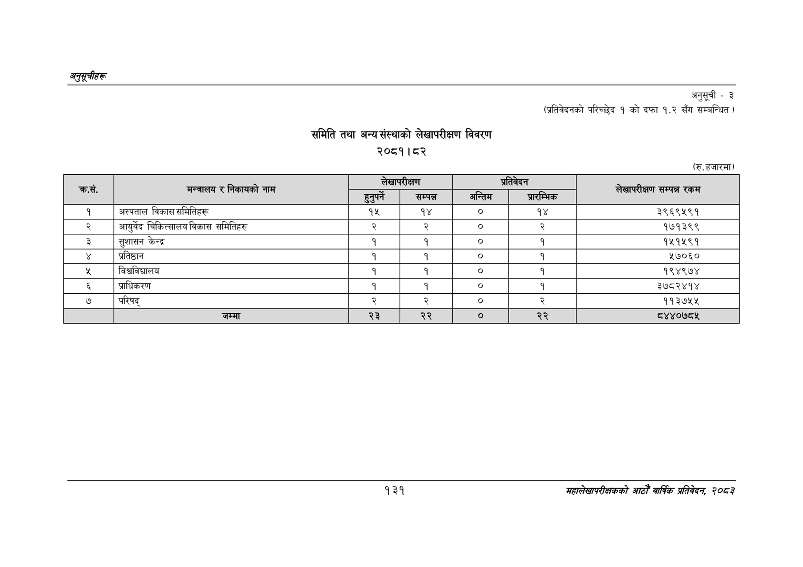

# Page 161 QA

## Rendered page


## Extracted text

```text
अनुतूचीहरू
समिति तथा अन्य संस्थाको लेखापरीक्षण विवरण २०८१।८२
अनुसूची - ३
(प्रतिवेदनको परिच्छेद १ को दफा १.२
सँग सम्बन्धित )
(रु. हजारमा)
१३१
सहालेखापरीक्षकको आठौँ वाषिकि प्रतिवेदन २०८२

| सं क्रस. | मन्त्रालय र निकायको नाम | हुन्पर्ने | लेखापरीक्षण सम्पन्न | - अन्तिम | प्रतिवेदन प्रार म्भक | सम्पन्न रकम |
| --- | --- | --- | --- | --- | --- | --- |
| १ | अस्पताल विकास समितिहरू | १५ | १४ | ० | १४ | ३९६९५९१ |
| २ | आयुर्वेद चिकित्सालय विकास समितिहरु | २ | २ | ० |  | १७१३९९ |
| ३ | सुशासन केन्द्र | १ | १ | ० | १ | १५१५९१ |
| ४ | प्रतिष्ठान | १ | १ |  | १ | १७०६० |
| ५ | विश्वविद्यालय | १ | १ | ० | १ | १९४९७४ |
| ६ | प्राधिकरण | १ | १ | ० | १ | ३७८२४१४ |
| ७ | परिषद्‌ | २ | २ |  |  | ११३७५५ |
```

## Flags
- table_page
- medium_quality_table
