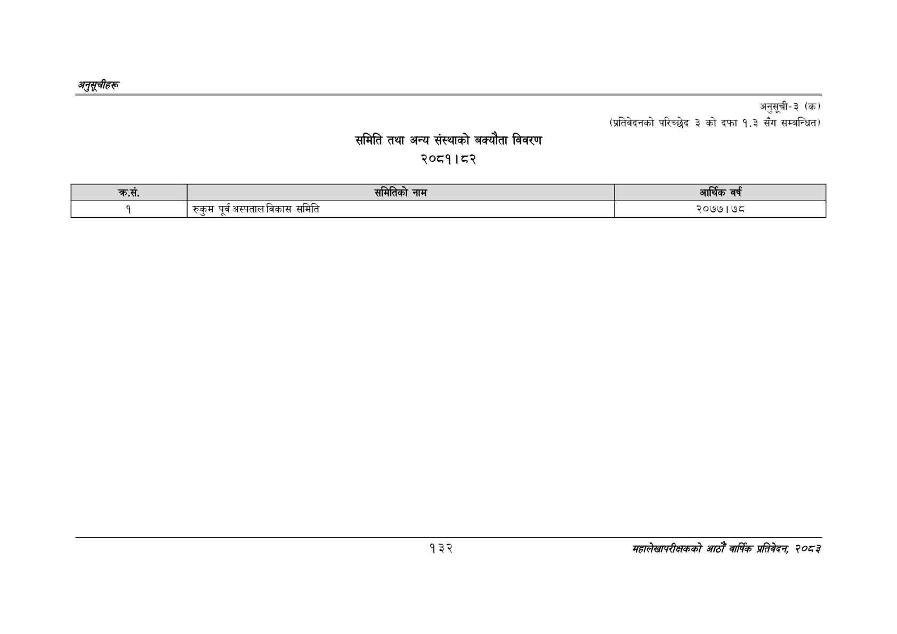

# Page 162 QA

## Rendered page


## Extracted text

```text
अनुतूचीहरू
समिति तथा अन्य संस्थाको बक्यौता विवरण २०८१।८२
अनुसूची-३ (क)
(प्रतिवेदनको परिच्छेद ३ को दफा १.३ सँग सम्बन्धित)
१३२
सहालेखापरीक्षकको आठौँ वाषिकि प्रतिवेदन २०८२

| क्रस. |  | समितिको नाम |  | आर्क | वर्ष |
| --- | --- | --- | --- | --- | --- |
```

## Flags
- table_page
- medium_quality_table
