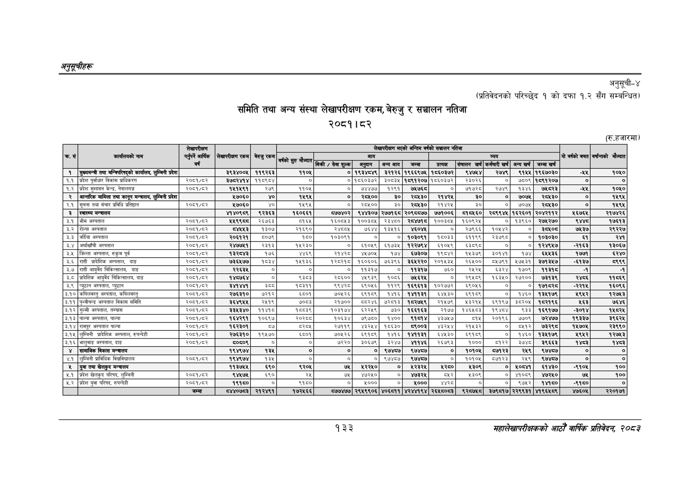

# Page 163 QA

## Rendered page


## Extracted text

```text
अनुतूचीहरू
समिति तथा अन्य संस्था लेखापरीक्षण रकम, बेरुजु र सञ्चालन नतिजा २००८१। ८२
अनुसूची-४
अनुसूची-४
(प्रतिवेदनको परिच्छेद १ को दफा १.२ सँग सम्बन्धित)
(रु.हजारमा)
१३३
सहालेखापरीक्षकको आठौँ वाषिकि प्रतिवेदन २०८२

|  |  | लेखापरीक्षण |  |  |  |  |  | लेखापरीक्षण | भएको अन्तिम वर्षको | सञ्चालन | नतिजा |  |  |  |  |  |
| --- | --- | --- | --- | --- | --- | --- | --- | --- | --- | --- | --- | --- | --- | --- | --- | --- |
|  | कार्यालयको नाम | बार्षिक | लेखापरीक्षण रकम | बेरुजु रकम | उको सुरु मैज्यात |  | आय |  |  |  |  | व्यय |  |  | यो वर्षको बचत | वर्षान्तको मौज्दात |
|  |  | बर्ष |  |  | चुर मौज्दात | बिक्री / सेवा शुल्क | बनुदान | बन्य आय | जम्मा | प्रत्यक | संचालन खर्च | कर्मचारी खर्च | अन्य खर्च | जम्मा खर्च |  |  |
| १ | मुख्यमन्त्री तथा मन्त्रिपरिषद्को कार्यालय, लुम्बिनी प्रदेश |  | ३९३४००५ | ११९२६३ | ११०४ | ० | १९३४८४९ | ३२१२६ | १९६६९७५ | १८६०३७२ | ९४७४ | २७४९ | ९१५५ | १९६७०३० |  | १०५० |
| १.१ | प्रदेश पूर्वाधार विकास प्राधिकरण | २०६१/६२ |  | ११०९०४ | ० | ० | १८६०३७२ | ०३ | १८९१२०७ | १८६०३७२ | २३०२६ | ० | ७८०९ | १८९१२०७ |  | ० |
| १.२ | प्रदेश सुशासन केन्द्र, नेपालगन्ज | २००८१/६२ |  | २५९ | ११०४ | ० | ७४४७७ | १२९१ | ७५७६ | ० | ७७२८ | २७४९ | १३४६ | ७४८र३ |  | १०५० |
| २ | अन्तरिक मामिला तथा कानून मन्त्रालय, लुम्बिनी प्रदेश |  | १७०६० | ४० |  | ० | २८४०० | ३० | २८४३० | २१४२५ | ३० | ० | ७०७५ | २८५३० | ० | १५९४ |
| २.१ | सूचना तथा संचार प्रविधि प्रतिष्ठान | २०८१/६२ | १७०६० | ४० | १५९४ | ० | २००० | ३० | २६४३० | २१४२५ | ३० | ० | ७०७६ | २८४३० |  | १४९४ |
| ३ | स्वास्थ्य मन्त्रालय |  | ४१४०९८९ | ९२३६३ | १६०६६१ | ८७७४०२ | ९४४३०७ | २७७१६८ | २०९८८७७ | ७७१००६ | ब१०४६० | २८९९४५ | १६२६०१ | २०४२११२ | ४६७६ | र२१७४२६ |
| इ.१ | भीम अस्पताल | २००८१/६२ | ४४९९६४ | २६७६३ | ०१६४ | १६००४३ | १००३०५ | २३४८० |  | १००३०५ | १६०९२४ | ० | १३९६० | २७१२७० | दश | १७६१३ |
| ३.२ | रोल्पा अस्पताल | २०६१/६२ |  | १३०७ | २१६९० | २४८५ | ७६४४ | १३५१६ |  | ० | २७९६६ | १०१४२ | ० | ङइष०् | ७५३७ | २९२२७ |
| ३.३ | बर्दिया अस्पताल | २०८१/६२ | २०६१२१ | ००७९ | १६० | १०३०९१ | ० | ० | १०३०९१ | १००३३ | ११९९ | २३७९८ | ० | १०३०३० | ६१ |  |
| ३.४ | अर्घाखाँची अस्पताल | २००८१/६२ | २४७७४१ | २३१३ | १५२३० | ० | ६१०५९ | १७३५ | १२२७९४ | १०५९ | ६३९८ | ० | ० |  | -२१६३ | १३०६७ |
| इ.५ | जिल्ला अस्पताल, रुकुम पूर्व | २००१/६२ |  | १७६ | ४४६९ | सर्ट | ४७०४ | १७४ | ६७३०७ | १९०४२ | ४३७९ | ३०१४ | १७४ | ६५३६ | १७७ | ६२४० |
| इ.६ | प्रादेशिक अस्पताल, दाङ | २००८१/६२ | ७३६४७७ | १५३४ | १५१३६ |  | १६०६०६। | ७६३९६ | ३६४२२० | २०१४३५ | २६४०० | ०७९१ | ४७८३१ | ३७१३८७ | न-६१३७ | ३ |
| ३.७ | आयुर्वेद चिकित्सालय, दाङ | २०८१/६२ | २२६३४५ | ० | ० | ० | ११३१७ | ० | ब१३१७ | ७६० | २५२६ | ३२४ | १७०९ | १३१५ |  | त |
| इ.८ | प्रदिशिक आयुर्वेद चिकित्सालय, दाङ | २००१/६२ | १४८७६४ | ० | ३ | २८६०० |  | १००६ |  | ० | २९४५९ | १६३४० | २७२०० | ७३१३९ |  | ११६९ |
| ३.९ | प्युठान अस्पताल, प्युठान | २०६१/६२ |  |  | १८३११ | द९्शर्ट | ६९०४६ | ११२९ | १६९६१३ | १०२७७२ | ६९०५६ | ० | ० | बदर | -२२१४ | १६०९६ |
| ३.१० | कपिलवस्तु अस्पताल, कपिलवस्तु | २००८१/६२ | २७६३१० | ७२१२ | ६५०१ | ७०२६ | ६९१९ | १४१६ | बे | ६४४३० | ६९१८९ | ० | १४६० | १३४१७९ | १९१२ | १२७४३ |
| ३.११ | अस्पताल विकास समिति | २०८१/६२ | ३६४९५४५ | २५१९ | ७००३ | २१७०० | ८द२४६ | ७२०१३ | १६२७४९ | २१५७९ | ३२१५ | ६९१९७ | ३८२०५ | १६२१९६ | २६३ | ७६४६ |
| ३.१२ | गुल्मी अस्पताल, तम्घास | २०८१/६२ | ३३४३४० | ११४१८ |  | १०३१७४ | इ२२५९ | ७३० | १६६१६३ | २१७७ | १४६४०३ | १९४४ | ९३३ | १६९१७७ | ज३०१४ | १४८२४ |
| ३.१३ | पाल्पा अस्पताल, पाल्पा | २०६१/६२ | १६४२९१ | १०६९७ | र०्स्घ्ट | १०६३४ | ७९७५० | १४०० |  | ४३७८ | ५१५ | २०१९६ | ७७०९ | ७२४७७ | १९३३७ | ३९६२४ |
| ३.१४ | रामपुर अस्पताल पाल्पा | २०६१/६२ | १६२३०१ | ८७ | ८२८५ | २७११९ | ४३२४४\| | १८६३० | ६९००३ | ४३२४४ | २१४३२ | ० | ७१२ | ७इरइद | १४५७०४ | २३९१० |
| ३.१५ | लुम्बिनी प्रादेशिक अस्पताल, रुपन्देही | २००८१/६२ | २७६३१० | १९४५७० | ६८०१ | ०४२६ | ६९१९ | १७१६ |  | ब४५३० | ९१०९ | ० | १४६० | १३४१७९ | १९४२ | १२७४३ |
| ३.१६ | भालुवाङ अस्पताल, दाङ | २०८१/६२ | ५०६०९ | ० | ० | ७२२० | ३०६७९ | ३२४७ | भक | २६७९३ | १००० | ब१२२ | इ७४८ | ३९६६३ | १४८३ | ०१ |
| ४ | सामाजिक विकास मन्त्रालय |  | १९४९७४ | १३४५ | ० | ० | ० | ९७४८७ | ९७४७ | ० | १०१०५ | ७१२३ | र
```

## Flags
- table_page
- medium_quality_table
