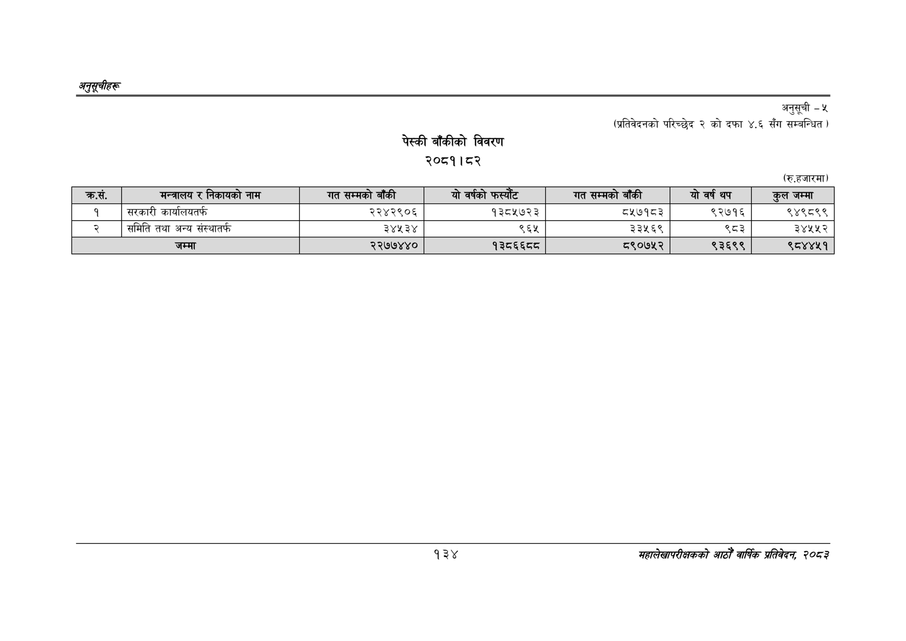

# Page 164 QA

## Rendered page


## Extracted text

```text
अनुतूचीहरू
पेस्की बाँकीको
विवरण २०८१।८२
अनुसूची -५
(प्रतिवेदनको परिच्छेद २ को दफा ४.६ सँग सम्बन्धित )
(रु.हजारमा)
१३४
सहालेखापरीक्षकको आठौँ वाषिकि प्रतिवेदन २०८२

| _ का, | मन्त्रालय र निकायको नाम | गत सम्मको बाँकी | यो वर्षको | गत सम्मको बाँकी | यो वर्ष थप | कुल जम्मा |
| --- | --- | --- | --- | --- | --- | --- |
| १ | सरकारी कार्यालयतर्फ | २२४२९०६ | १३८५७२३ | ८५७१८३ | ९२७१६ | ९४९८९९ |
| २ | समिति तथा अन्य संस्थातर्फ | ३४५३४ | ९६४५ | ३३५६९ | ९८३ | ३४५४५२ |
|  | जम्मा | २२७७४४० | १३८६६०८ | ८९०७५२ | ९३६९९ | ९८४४५१ |
```

## Flags
- table_page
- medium_quality_table
