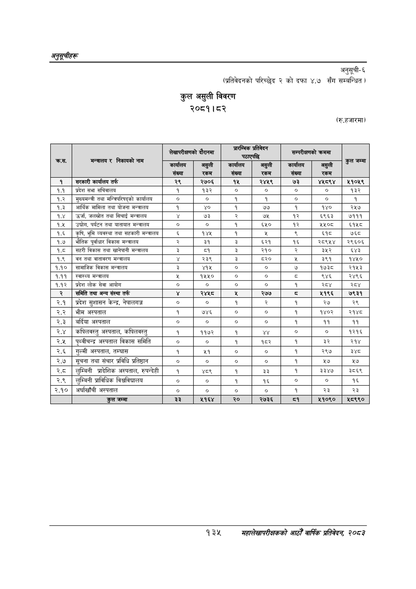

# Page 165 QA

## Rendered page


## Extracted text

```text
अनुतूचीहरू
अनुसूची६
(प्रतिवेदनको परिच्छेद २ को दफा ४.७ सँग सम्बन्धित )
कुल असुली विवरण २०८१।८२
(रु.हजारमा)
१३५
महालेखापरीक्षकको आठौँ वार्षिक प्रतिवेकक २०८२

|  | निकायको | 'लेखापरीक्षनको | दौरानमा | न्यु |  |  | कममा |  |
| --- | --- | --- | --- | --- | --- | --- | --- | --- |
| कःस. | मन्त्रालय र नाम | — संख्या | रकम | —_— संख्या | 'रकम | स्तन संख्या | = 'रकम | कुल जम्मा |
| १ | सरकारी कार्यालय तर्फ | २९ | २७०६ | १५ | २४५९ | ७३ | ४५८९४ | ११०५९ |
| १.१ | प्रदेश सभा सचिवालय | १ | १३२ | ० | ० | ० | ० | १३२ |
| १.२ | मुख्यमन्त्री तथा कार्यालय |  | ० | १ | १ | ० | ० |  |
| १.३ | अआर्थिक मामिला तथा योजना मन्त्रालय | १ | ४० | १ | ७७ | १ | १४० | २५७ |
| १.४ | उर्जा, जलस्रोत तथा सिचाई मन्त्रालय |  | ७३ |  | ७५ | १२ | ६९६३ | ७१११ |
| १.५ | उद्चोग, पर्यटन तथा यातायात मन्त्रालय | ० | ० | १ | ६५० | १२ | २५०८ | ६१५८ |
| १.६ | कृषि, भूमि व्यवस्था तथा सहकारी मन्त्रालय |  | १४५ | १ | शर | ९ | ६१८ | ७६८ |
| १.७ | भौतिक पूर्वाधार विकास मन्त्रालय | २ | ३१ | ३ | ५२१ | १६ | २८९५४ | २९६०६ |
| १.८ | सहरी विकास तथा खानेपानी मन्त्रालय | ३ | ५१ | ३ | २१० |  | ३५२ | ६४३ |
| १.९ | वन तथा वातावरण मन्त्रालय |  | २३९ | ३ | %० |  | ३९१ | १४५० |
| १.१० | सामाजिक विकास मन्त्रालय | ३ | ४१५ | ० | ० | ७ | १७३८ | २१५३ |
| १.११ | स्वास्थ्य मन्त्रालय |  | १५५० | ० | ० | ३ | ९४६ | २४९६ |
| १.१२ | प्रदेश लोक सेवा आयोग | ० | ० | ० | ० | १ | सय | स्व |
| २ | समिति तथा अन्य संस्था तर्फ |  | २४५८ | ५ | २७७ | व्‌ | ५१९६ | ७९३१ |
| २.१ | प्रदेश सुशासन केन्द्र, नेपालगञ्ज | ० | ० | १ | २ | १ | २७ | २९ |
| २.२ | भीम अस्पताल | १ | ७४६ | ० | ० | १ | १४०२ | २१४८ |
| २.३ | वर्दिया अस्पताल | ० | ० | ० | ० | १ | ११ | ११ |
| २.४ | कभिलबल्तु अस्पताल, कपिलवल्तु | १ | ११७२ | १ |  | ० | ० | १२१६ |
| २.५ | पूृथ्वीचन्द्र अस्पताल विकास समिति | ० | ० | १ | १८२ | १ | ३२ | २१४ |
| २.६ | गुल्मी अस्पताल, तम्घास | १ | ५१ | ० | ० | १ | २९७ |  |
| २.७ | सूचना तथा संचार प्रविधि प्रतिष्ठान | ० | ० | ० | ० | १ | ५७ | ५७ |
| २.८ | लुम्बिनी प्रादेशिक अस्पताल, रुपन्देही | १ |  | १ | ३३ | १ | ३३४७ | ३८६९ |
| २.९ | लुम्बिनी प्राविधिक विश्वविद्यालय | ० | ० | १ | १६ |  |  | १६ |
| २.१० | अर्घाखाँची अस्पताल | ० | ० | ० | ० | १ | २३ | २३ |
|  | कुल जम्मा | ३३ | ५१६४ | २० | २७३६ | ९ | %९०८० | ८९९० |
```

## Flags
- table_page
- medium_quality_table
