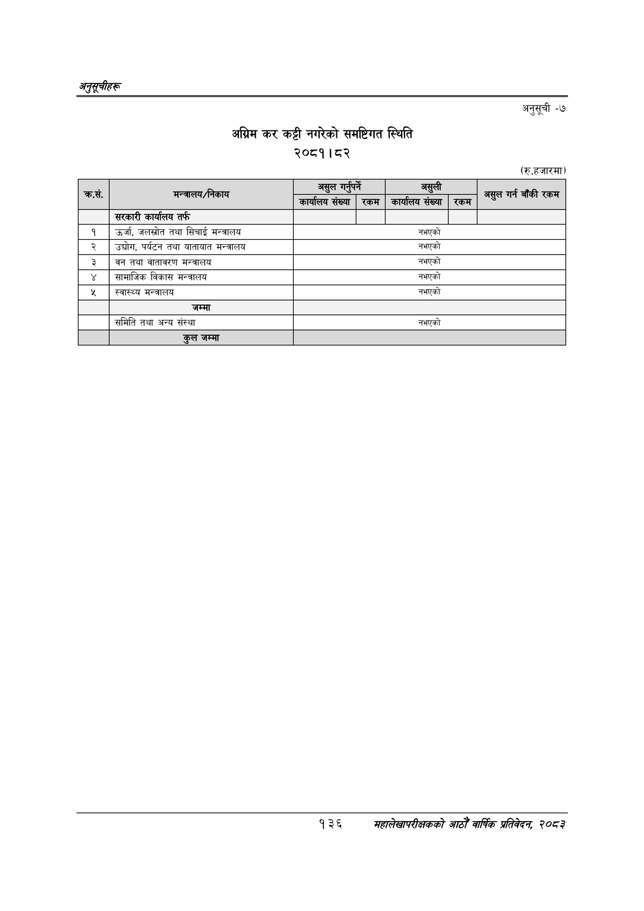

# Page 166 QA

## Rendered page


## Extracted text

```text
अनुतूचीहरू
अग्रिम कर कट्टी नगरेको समष्टिगत स्थिति २०८१।८२
अनुसूची -७
(रु.हजारमा)
१३६
सहालेखापरीक्षकको आठौँ वाषिकि प्रतिवेदन २०८२

| कस |  | जि | असुली | गर्न बाँकी |
| --- | --- | --- | --- | --- |
|  | 'मन्त्रालय/निकाय | कार्यालय संख्या रकम | कार्यालय संख्या रकम | असुल रकम |
|  | सरकारी कार्यालय तर्फ |  |  |  |
| १ | उर्जा, जलस्रोत तथा सिचाई मन्त्रालय |  | नभएको |  |
| २ | उद्योग, पर्यटन तथा यातायात मन्त्रालय |  | नभएको |  |
| ३ | वन तथा वातावरण मन्त्रालय |  | नभएको |  |
| ४ | सामाजिक विकास मन्त्रालय |  | नभएको |  |
| ४५ | स्वास्थ्य मन्त्रालय |  | नभएको |  |
|  | जम्मा |  |  |  |
|  | समिति तथा अन्य संस्था |  | नभएको |  |
|  | तल जम्मा |  |  |  |
```

## Flags
- table_page
- medium_quality_table
