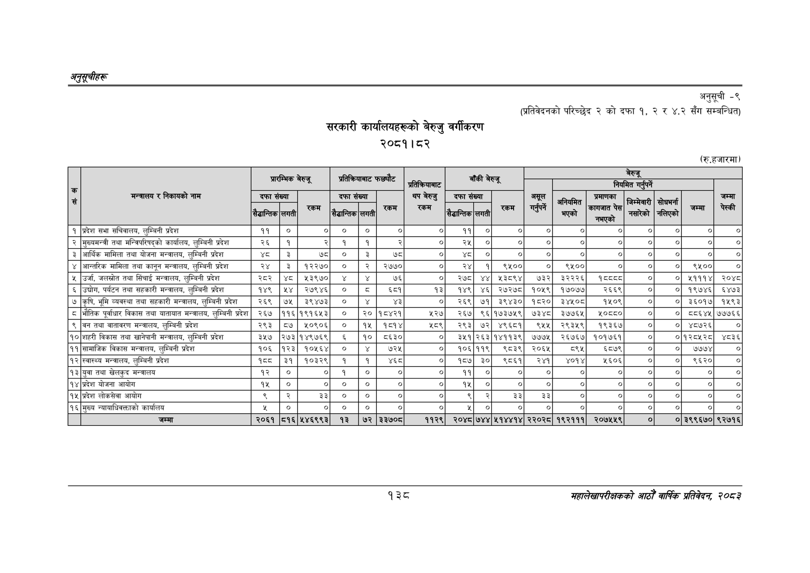

# Page 168 QA

## Rendered page


## Extracted text

```text
अनुतूचीहरू
सरकारी कार्यालयहरूको बेरुजु वर्गीकरण २००८१। ८२
अनुसूची -९
(प्रतिवेदनको परिच्छेद २ को दफा १, २ र ४.२ सँग सम्बन्धित)
(रु.हजारमा)
१३८
सहालेखापरीक्षकको आठौँ वार्षिक प्रतिवेदन २०५३

|  |  |  | प्रारम्भिक | बेरुजू | प्रतिकरियाबाट |  | फछ्यौट | प्रतिकरियाबाट |  | बाँकी | बेरुजू |  |  | नियमित | बैरुजू गर्परने |  |  |  |
| --- | --- | --- | --- | --- | --- | --- | --- | --- | --- | --- | --- | --- | --- | --- | --- | --- | --- | --- |
| . सं | मन्त्रालय र निकायको नाम | दफा सैढान्तिक | संख्या लगती | रकम | दफा सैडान्तिक | संख्या लगती | रकम | थप बेरुजु रकम | दफा अेद्धान्तिक | संख्या लगती | रकम | असूल | अनियमित | _प्रमाणका हु | जिम्मेवारी | सोधमर्ना |  | जम्मा चेस्की |
| १ | प्रदेश सभा सचिवालय, लुम्बिनी प्रदेश | ११ | ० | ० | ० | ० | ० | ० | ११ | ० | ० | ० | ० | ० | ० | ० | ० | ० |
| २ | मुख्यमन्त्री तथा मन्त्रिपरिषद्को कार्यालय, लुम्बिनी प्रदेश | २५ | १ | २ | १ | १ |  | ० | २५ | ० | ० | ० | ० | ० | ० | ० | ० | ० |
| ३ | आर्थिक मामिला तथा योजना मन्त्रालय, लुम्बिनी प्रदेश | ५ | ३ | ७्ट | ० | ३ |  | ० | श्ड | ० | ० | ० | ० | ० | ० | ० | ० | ० |
| ४ | आन्तरिक मामिला तथा कानून मन्त्रालय, लुम्बिनी प्रदेश | २४ | ३ | २२७० | ० | २ | २७७० | ० | २४ | १ | ९४०० | ० | ९१०० | ० |  | ० | ९४०० | ० |
| ५ | उर्जा, जलस्रोत तथा सिँचाई मन्त्रालय, लुम्बिनी प्रदेश | २८२ | ४८ | १५३९७० | ४ |  | ७६ | ० | २७८ | ४४ | भ५३८९४ | ७३२ | ३२२२६ | पेव्व्व्ट | ० | ० | ५१११४ | २०४८ |
|  | उच्चोग, पर्यटन तथा सहकारी मन्त्रालय, लुम्बिनी प्रदेश | १४९ | भ५४ | २७९४६ |  | ड | ६८१ | १३ | १४९ | ४६ | २७२७८ | १०१९ | १७०७७ | २६६९ | ० | ० | १९७४६ | ६४७३ |
| ७ | कृषि, भूमि व्यवस्था तथा सहकारी मन्त्रालय, लुम्बिनी प्रदेश | २६९ | ७५ | ३९४७३ | ० |  |  | ० | २६९ | ७१ | ३९४३० | १८२० | ३४१०८ | १५०९ | ० | ० | ३६०१७ | १५९३ |
| ८ | भौतिक पूर्वाधार विकास तथा यातायात मन्त्रालय, लुम्बिनी प्रदेश | २६७ | ११६ | १९१६५३ | ० | २० | १८४२१ | ५२७ | २६७ | ९६ | १७३७५९ | ७३४८ | ३७७६५ | १०८८० | ० | ० | ८६४५ | ७७७६६ |
| ९ | बन तथा वातावरण मन्त्रालय, लुम्बिनी प्रदेश | २९३ | ८७ | ५०९०६ | ० | १५ | १८१४ | €८९ | २९३ | ७२ | ४९६८१ | ९५५ | २९३५९ | १९३६७ |  | ० | ४८७२६ | ० |
| १० | शहरी विकास तथा खानेपानी मन्त्रालय, लुम्बिनी प्रदेश | ३५२७ | २७३ | १४९७६९ | ६४ | १० | ८६३० | ० | ३९ | २६३ | १४११३९ | ७७७५ | २६७६७ | १०१७६१ | ० |  | ०१२८५२८ | ४८३६ |
| ११ | सामाजिक विकास मन्त्रालय, लुम्बिनी प्रदेश | १०६ | १२३ | १०५६४४ | ० |  | ७२५ | ० | १०६ | ११९ | ९८३९ | २०६५ | ८९५ | ६८७९ | ० | ० | ७७७४ | ० |
| १२ | स्वास्थ्य मन्त्रालय, लुम्बिनी प्रदेश | ९५५ | ३१ | १०३२९ | १ | १ | ४६८ | ० | १८७ | ३० | ९८६१ | २४१ | ४०१४ | १६०६ | ० | ० | ९६२० | ० |
| १३ | युवा तथा खेलकुद मन्त्रालय | १२ | ० | ० | १ | ० |  | ० | ११ | ० | ० | ० | ० | ० | ० | ० | ० | ० |
| १४ | प्रदेश योजना आयोग | १५ | ० | ० | ० | ० | ० | ० | १५ | ० | ० | ० | ० | ० | ० | ० | ० | ० |
| १५ | प्रदेश लोकसेवा आयोग | ९ | २ | ३३ | ० | ० | ० | ० | ९ | २ | ३३ | ३३ | ० | ० | ० | ० | ० | ० |
| १६ | मुख्य न्यायाधिवक्ताको कार्यालय |  | ० | ० | ० | ० | ० | ० | ५ | ० | ० | ० | ० | ० | ० | ० | ० | ० |
|  | जम्मा | २०६१ | ८१६ | ५४६९९३ | ९३ | ७२ | ३३७०८ | ११२९ | २०४८ | ७४४ | ५१४४१४ | २२०२८ | १९२१११ | २०७४५५९ | ० | ० | ३९९६७० | ९२७१६ |
```

## Flags
- table_page
- medium_quality_table
