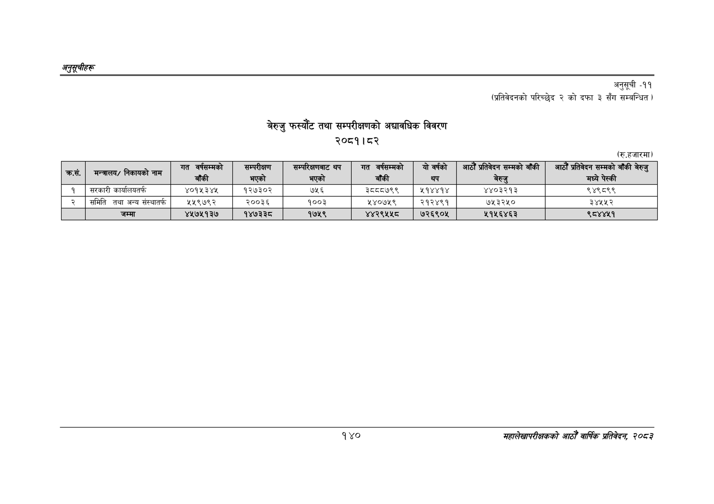

# Page 170 QA

## Rendered page


## Extracted text

```text
अनुतूचीहरू
बेरुजु फस्यौट तथा सम्परीक्षणको अद्यावधिक विवरण
२०८१।८२
अनुसूची -११
(प्रतिवेदनको परिच्छेद २ को दफा ३ सँग सम्बन्धित )
(रु.हजारमा)
१४०
सहालेखापरीक्षकको आठौँ वाषिकि प्रतिवेदन २०८२

| कर्स. | मन्त्रालय/ निकायको नाम | गत वर्षसम्मको बाँकी | सम्परीक्षण भएको | सम्परिक्षणबाट थप भएको | गत वर्षसम्मको बाँकी | योवर्षको थप | गाउँ प्रतिवेदन सम्मको बाँकी बेरुजु | आठौं प्रतिवेदन सम्मको बाँकी बेरुजु मध्ये पेस्की |
| --- | --- | --- | --- | --- | --- | --- | --- | --- |
| १ | सरकारी कार्यालयतर्फ | ४०१५३४४५ | १२७३०२ | ७५६ | ३८८८७९९ | २१४४१४ | ४४०३२१३ | ९४९८९९ |
| २ | समिति तथा अन्य संस्थातर्फ | ५५९७९२ | २००३६ | १००३ | २४०७५९ | २१२४९१ | ७५३२५० | ३४५४५२ |
|  | जम्मा | ४५७५१३७ | १४७३३८ | १७५९ | ४४२९५५८ | ७२६९०५ | २१५६४६३ | ९८४४५१ |
```

## Flags
- table_page
- medium_quality_table
