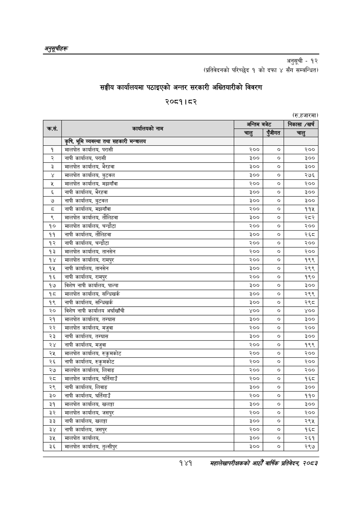

# Page 171 QA

## Rendered page


## Extracted text

```text
अनुतूचीहरू
अनुसूची -१२
(प्रतिवेदनको परिच्छेद १ को दफा ४ सँग सम्बन्धित)
सङ्घीय कार्यालयमा पठाइएको अन्तर सरकारी अख्तियारीको विवरण २०८१।८२
(रु.हजारमा)
१४१
सहालेखापरीक्षकको आठौँ वाषिकि प्रतिवेदन २०८२

| कस. | कार्षासणको नाम | चालु | पुँजीगत | २२६५ चालु |
| --- | --- | --- | --- | --- |
|  | कृषि, भूमि व्यवस्था तथा सहकारी मन्त्रालय |  |  |  |
| १ | मालपोत कार्यालय, परासी | २०० | ० | २०० |
| २ | नापी कार्यालय, परासी | ३०० | ० | ३०० |
| ३ | मालपोत कार्यालय, भैरहवा | ३०० | ० | ३०० |
| ४ | मालपोत कार्यालय, बुटवल | ३०० | ० | २७६ |
| ५ | मालपोत कार्यालय, मझगाँवा | २०० |  | २०० |
| ६ | नापी कार्यालय, भैरहवा | ३०० | ० | ३०० |
| ७ | नापी कार्यालय, बुटवल | ३०० | ० | ३०० |
| ८ | नापी कार्यालय, मझगाँवा | २०० | ० | ११५ |
| ९ | मालपोत कार्यालय, तौलिहवा | ३०० | ० | २८२ |
| १० | मालपोत कार्यालय, चन्द्रौटा | २०० | ० | २०० |
| ११ | नापी कार्यालय, तौलिहवा | ३०० |  | २६८ |
| १२ | नापी कार्यालय, चन्द्रौटा | २०० |  | २०० |
| १३ | मालपोत कार्यालय, तानसेन | २०० |  | २०० |
| १४ | मालपोत कार्यालय, रामपुर | २०० | ० | १९९ |
| १५ | नापी कार्यालय, तानसेन | ३०० | ० | २९९ |
| १६ | नापी कार्यालय, रामपुर | २०० | ० | १९० |
| १७ | बिशेष नापी कार्यालय, पाल्पा | ३०० |  | ३०० |
| १८ | मालपोत कार्यालय, सन्धिखर्क | ३०० | ० | २९९ |
| १९ | नापी कार्यालय, सन्धिखर्क | ३०० |  | २९८ |
| २० | बिशेष नापी कार्यालय अर्घाखाँची | ४०० | ० | ४०० |
| २१ | मालपोत कार्यालय, तम्घास | ३०० | ० | ३०० |
| २२ | मालपोत कार्यालय, मजुवा | २०० | ० | २०० |
| २३ | नापी कार्यालय, तम्घास | ३०० |  | ३०० |
| २४ | नापी कार्यालय, मजुवा | २०० | ० | १९९ |
| २५ | मालपोत कार्यालय, ₹कु:मकोट | २०० | ० | २०० |
| २६ | नापी कार्यालय, रुकुमकोट | २०० |  | २०० |
| २७ | मालपोत कार्यालय, लिवाङ | २०० | ० | २०० |
| २८ | मालपोत कार्यालय, घर्तिगाउँ | २०० | ० | १६८ |
| २९ | नापी कार्यालय, लिवाङ | ३०० | ० | ३०० |
| ३० | नापी कार्यालय, घर्तिगाउँ | २०० |  | ११० |
| ३१ | मालपोत कार्यालय, खलङ्गा | ३०० | ० | ३०० |
| ३२ | मालपोत कार्यालय, जसपुर | २०० | ० | २०० |
| ३३ | नापी कार्यालय, खलङ्गा | ३०० | ० | २९५ |
| ३४ | नापी कार्यालय, जसपुर | २०० | ० | १६८ |
| ३५ | मालपोत कार्यालय, | ३०० | ० | २६१ |
| ३६ | मालपोत कार्यालय, तुल्सीपुर | ३०० | ० | २९७ |
```

## Flags
- table_page
- medium_quality_table
