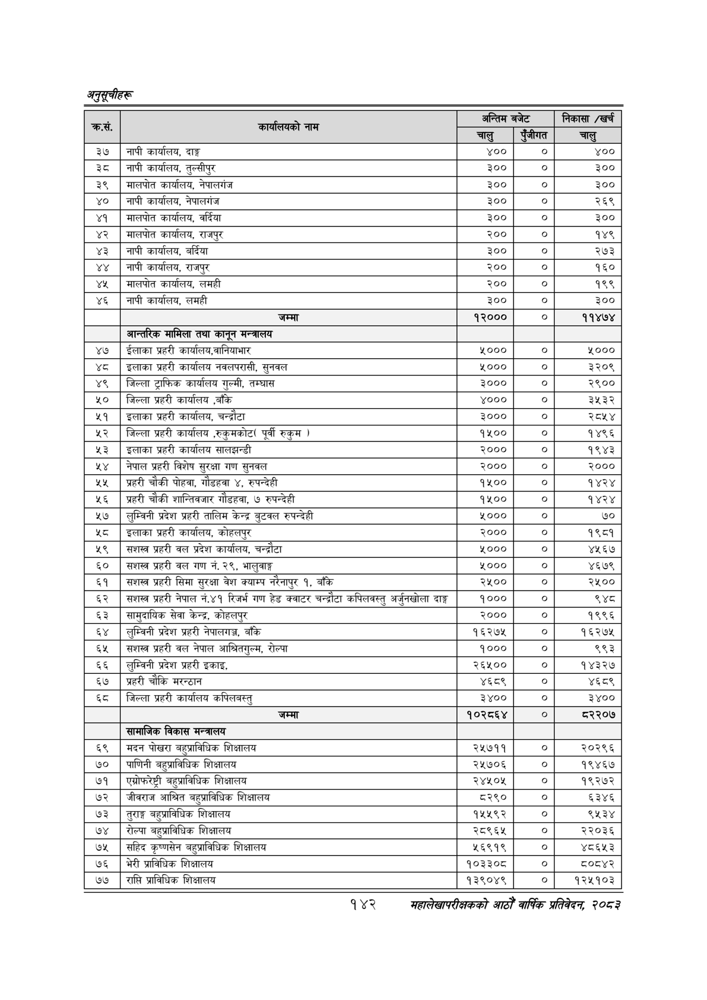

# Page 172 QA

## Rendered page


## Extracted text

```text
१४२
सहालेखापरीक्षकको आठौँ वाषिकि प्रतिवेदन २०८२

| . क्रस.   | कार्यालयको नाम                                                                              | अन्तिम बजेट   | अन्तिम बजेट     | निकासा /खर्च   |
|-----------|---------------------------------------------------------------------------------------------|---------------|-----------------|----------------|
|           |                                                                                             | चालु          | &#124; पुँजीगत  | चालु           |
| ३७        | &#124; नापी कार्यालय, दाङ्ग                                                                 | ४००           | &#124; ०]       | ४००            |
| ३८        | &#124; नापी कार्यालय, तुल्सीपुर                                                             | 300           | ०]              | ३००            |
| ३९        | । मालपोत कार्यालय, नेपालगंज                                                                 | ३००           | &#124; ०]       | ३००            |
| ४०        | &#124; नापी कार्यालय, नेपालगंज                                                              | ३००           | । ०]            | २६९            |
| ४१        | &#124; मालपोत कार्यालय, वर्दिया                                                             | ३००           | । ०]            | ३००            |
| ४२        | &#124; मालपोत कार्यालय, राजपुर                                                              | Roo&#124;     | ०]              | १४९            |
| ४३        | &#124; नापी कार्यालय, वर्दिया                                                               | ३००           | &#124; ०]       | २७३            |
| ४४        | &#124; नापी कार्यालय, राजपुर                                                                | २००           | &#124; ०]       | १६०            |
| ४५        | । मालपोत कार्यालय, लमही                                                                     | zoo&#124;     | ०]              | १९९            |
| ४६        | नापी कार्यालय, लमही                                                                         | ३००           | &#124; ०]       | ३००            |
| ।         |                                                                                             | १२०००         | ०]              | ११४७४          |
|           | &#124; जम्मा आन्तरिक मामिला तथा कानून मन्त्रालय                                             | &#124;        |                 |                |
| ४७        | &#124; ईलाका प्रहरी कार्यालय,वानियाभार                                                      | ५०००          | &#124; ०]       | ५०००           |
| ४८        | । इलाका प्रहरी कार्यालय नवलपरासी, सुनवल                                                     | 4000          | &#124; ०]       | ३२०९           |
| «२        |                                                                                             |               |                 | २९००           |
| ५०        | जिल्ला प्रहरी कार्यालय ,बाँकि                                                               | ४०००          | &#124; ०]       | ३५३२           |
| ५२        | । जिल्ला प्रहरी कार्यालय ,रुकुमकोट( पूर्वी रुकुम )                                          | ५००           | &#124; ०]       | १४९६           |
| ५३२       | &#124; इलाका प्रहरी कार्यालय सालझन्डी                                                       | २०००          | &#124; ०]       | १९४३           |
| ५४        | &#124; नेपाल प्रहरी विशेष सुरक्षा गण सुनवल                                                  | R000          | &#124; ०]       | २०००           |
| ५५        | &#124; प्रहरी चोकी पोहवा, गोडहवा ४, रुपन्देही                                               | १५००]         | ० &#124;        | १४२४           |
| ५६        | &#124; प्रहरी चौकी शान्तिवजार गौडहवा, ७ रुपन्देही                                           | oo            | &#124; o]       | १४२४           |
| ५७        | लुम्विनी प्रदेश प्रहरी तालिम केन्द्र बुटवल रुपन्देही                                        | yooo          | &#124; ० &#
```

## Flags
- table_page
