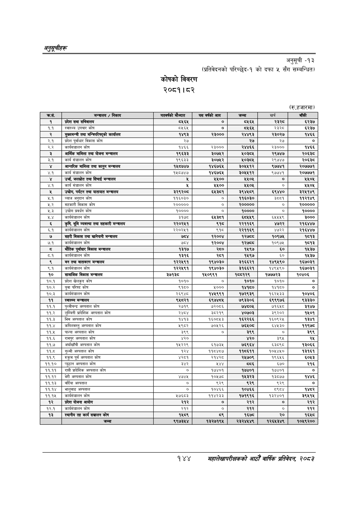

# Page 174 QA

## Rendered page


## Extracted text

```text
अनुतूचीहरू
कोषको विवरण
२०८१।८२
अनुसूची
-१३
(प्रतिवेदनको परिच्छेद-१ को दफा ५ सँग सम्बन्धित)
(रु.हजारमा)
१४४
सहालेखापरीक्षकको आठौँ वाषिकि प्रतिवेदन २०८२

| कास. | मन्त्रालय / निकाय | 'गतवर्षको मोज्दात | 'यस वर्षको आय | जम्मा | खर्च | बाँकी |
| --- | --- | --- | --- | --- | --- | --- |
| १ | प्रदेश सभा सचिवालय | ८५६४ | ० | ८५६४ | ३३३५ | ६२३७ |
| १.१ | स्वास्थ्य उपचार कोष | ८५६५ | ० | ५६४ | २३ | ६२३७ |
| र | मुख्यमन्त्री तथा नत ५ १ १ १ ४ ५ १८५ ६४ ३८ २६ ०.०००००० ५/२१५क) ५ १ १ १ ४ ६ २२९ ६८ ४२ १४ ९२.३५१४१० कार्यालय ५ १ १ १ ४ ७ ४६४ ७१ ३२ १२ ९५.७४९३६७ १४९३ ५ १ १ १ ४ ८ ५७२ ७१ ४२ ११ ९०.३७९१४३ ३३००० ५ १ १ १ ४ ९ ६७३ ७१ ४१ ११ ९१.१२३३६७ २४४९३ ५ १ १ १ ४ १० ७७४ ७१ ४२ ११ ९१.४७७०३६ २३०२७ ५ १ १ १ ४ ११ ८८३ ७१ ३२ १२ ९६.४४७२०५ १४६६ ४ १ १ १ ५ ० २९ ९० ८८७ १६ -१ ५ १ १ १ ५ १ २९ ९३ १७ १० ९५.४२३३२५ २.१ ५ १ १ १ ५ २ ८५ ९० २३ १२ ९३.८५९५४३ प्रदेश ५ १ १ १ ५ ३ ११३ ९० ३४ १६ ९२.५१३९४७ पूर्वाधार ५ १ १ १ ५ ४ १५३ ९० ३२ १२ ९६.२५०१७५ विकास ५ १ १ १ ५ ५ १९० ९० २० १२ ९५.२५०३८१ कोष ५ १ १ १ ५ ६ ४८१ ९३ १५ ९ ९६.६०२८९८ २७ ५ १ १ १ ५ ७ ६९९ ९२ १६ ११ ९६.१३९७०९ २७ ५ १ १ १ ५ ८ ८०० ९३ १४ ९ ९६.८९१५२५ २७ ५ १ १ १ ५ ९ ९०८ ९४ ८ ७ ९३.९५६०२४ ० ४ १ १ १ ६ ० २९ १११ ८८६ १४ -१ ५ १ १ १ ६ १ २९ ११४ १८ १० ९४.२९८२१८ २.२ ५ १ १ १ ६ २ ८४ १११ ५७ १२ ६३.७३१६६३ कार्यसञ्चालन ५ १ १ १ ६ ३ १४७ १११ २० १२ ९६.८४१२८६ कोष ५ १ १ १ ६ ४ ४६४ ११४ ३१ ११ ९५.४६०७२४ १४६६ ५ १ १ १ ६ ५ ५७२ ११४ ४१ १० ८५.७५३७०० २३००० ५ १ १ १ ६ ६ ६७३ ११४ ४१ ११ ९०.८७९६८४ २४४६६ ५ १ १ १ ६ ७ ७७३ ११४ ४१ १० ८४.२३६३७४ २३००० ५ १ १ १ ६ ८ ८८३ ११४ ३२ ११ ९६.२५०५११ १४६६ ४ १ १ १ ७ ० ३४ १२९ ८८२ २६ -१ ५ १ १ १ ७ १ ३४ १३५ ७ ११ ७५.८१७९५५ ३ ५ १ १ १ ७ २ ८५ १३२ ३४ १३ ५६.३६४६७७ आर्थिक ५ १ १ १ ७ ३ १२२ १३२ ३६ १३ ९६.४१२५३७ मामिला ५ १ १ १ ७ ४ १६१ १३६ २० ९ ९६.८६४२२० तथा ५ १ १ १ ७ ५ १८५ १३२ ३१ १३ ९६.०७३९४४ योजना ५ १ १ १ ७ ६ २१९ १३६ ४३ ९ ७७.१६०४८४ मन्त्रालय ५ १ १ १ ७ ७ ४५६ १३५ ४० ११ ९२.६५९२१८ १९६३३ ५ १ १ १ ७ ८ ५७२ १३५ ४१ ११ ३३.२०२९११ ३०७५२ ५ १ १ १ ७ ९ ६७३ १३५ ४२ ११ ६२.६४९६५४ ०३८४ ५ १ १ १ ७ १० ७७४ १२९ ४२ २६ ९१.६७२८५२ २९७४७ ५ १ १ १ ७ ११ ८७४ १३५ ४२ ११ ८७.२१२७९१ २०६३८ ४ १ १ १ ८ ० २९ १५२ ८८७ २२ -१ ५ १ १ १ ८ १ २९ १५६ १७ ११ ९६.१०४८१३ ३.१ ५ १ १ १ ८ २ ८४ १५३ २२ १२ ६७.११२१९० कार्य ५ १ १ १ ८ ३ १११ १५७ ३७ ८ ८४.९०५१२८ संञ्चालन ५ १ १ १ ८ ४ १५३ १५३ २० १२ ९६.८०२०८६ कोष ५ १ १ १ ८ ५ ४५५ १५६ ४० ११ ८७.३९२७३८ १९६३३ ५ १ १ १ ८ ६ ५७२ १५६ ४१ ११ ८८.६३७२१५ ३०७५२ ५ १ १ १ ८ ७ ६७३ १५२ ४१ २२ ०.०००००० ५०३८४५ ५ १ १ १ ८ ८ ७७३ १५६ ४१ १० ६६.१२२५९७ २९७४७ ५ १ १ १ ८ ९ ८७४ १५६ ४२ ११ ९०.८३२४६६ २०६३८ ४ १ १ १ ९ ० ३४ १६७ ८८१ ३१ -१ ५ १ १ १ ९ १ ३४ १७७ ८ १० ९५.६४८५७५ ४ ५ १ १ १ ९ २ ६९ १६७ ५९ ३० ६६.९३९०११ अन्तरिक ५ १ १ १ ९ ३ १३३ १६७ ३४ ३० ९६.९२४३४७ मामिला ५ १ १ १ ९ ४ १७२ १६७ २० ३० ९६.६६७२५९ तथा ५ १ १ १ ९ ५ १९५ १७८ २९ १३ ९६.४७५९४५ कानुन ५ १ १ १ ९ ६ २२८ १७८ ४२ १० ८६.६३८४८९ मन्त्रालय ५ १ १ १ ९ ७ ४४७ १६८ ५० ३० ५७.१५३८६२ १४८७४७ ५ १ १ १ ९ ८ ५६४ १७७ ५० ११ ७६.२२४८०८ १४६७६४ ५ १ १ १ ९ ९ ६६४ १७७ ५० ११ ७६.७०७३०६ ३०५४१२ ५ १ १ १ ९ १० ७७४ १६७ ४० ३१ ८२.६४११९० ९७७४१ ५ १ १ १ ९ ११ ८६५ १७७ ५० ११ ४९.५२४३८७ २०७७७१ ४ १ १ १ १० ० २८ १९६ ८८७ १४ -१ ५ १ १ १ १० १ २८ १९९ १८ १० ९५.८९०५२६ ४.१ ५ १ १ १ १० २ ८५ १९६ २० १२ ६९.१५७६२३ कार्य ५ १ १ १ १० ३ १११ २०० ३७ ८ ५६.०७५८५९ संचालन ५ १ १ १ १० ४ १५३ १९६ २० १२ ९६.१२८३५७ कोष ५ १ १ १ १० ५ ४४६ १९९ ५० १० ५४.७९८२३३ १५८७४७ ५ १ १ १ १० ६ ५६४ १९८ ५० १२ ७९.७०३६५९ १४६७६४ ५ १ १ १ १० ७ ६६४ १९८ ५० १२ ७७.३९११६७ ३०५४१२ ५ १ १ १ १० ८ ७७३ १९९ ४० १० ७३.९६०९७६ ९७७४१ ५ १ १ १ १० ९ ८६५ १९८ ५० ११ ५३.२६७१३६ २०७७७१ ४ १ १ १ ११ ० ३४ २१६ ८८२ १५ -१ ५ १ १ १ ११ १ ३४ २२० ८ १० ९४.६३७७७२ ५ १ १ १ ११ २ ८४ २१७ २३ १४ ६१.६०५८०८ उर्जा, ५ १ १ १ ११ ३ ११२ २१६ ३९ १४ ९६.५९६०६९ जलस्रोत ५ १ १ १ ११ ४ १५४ २२० २१ १० ९६.८७७९७५ तथा ५ १ १ १ ११ ५ १७८ २१६ ३१ १५ ६९.९३६४०९ सिँचाई ५ १ १ १ ११ ६ २१३ २२० ४२ १० ८५.५५२७६५ मन्त्रालय ५ १ १ १ ११ ७ ४८९ २१९ ८ १२ ३०.४३५१८१ ५ १ १ १ ११ ८ ५८१ २१९ ३३ ११ ८२.४१८४१९ ५५०० ५ १ १ १ ११ ९ ६८२ २१९ ३३ ११ ५९.०५३५१३ ५५०५ ५ १ १ १ ११ १० ८०८ २२० ७ ८ ९६.००१२९७ ० ५ १ १ १ ११ ११ ८८३ २१९ ३३ ११ ५९.८९१५५६ ५५०५ ४ १ १ १ १२ ० २८ २३८ ८८८ १४ -१ ५ १ १ १ १२ १ २८ २४१ १८ १० ९५.९८६१९१ ४.१ ५ १ १ १ १२ २ ८५ २३८ २० १२ ७०.७६१३२२ कार्य ५ १ १ १ १२ ३ १११ २४१ ३७ ९ ३६.३०३९४० ५ १ १ १ १२ ४ १५३ २३८ २० १२ ९५.०१७४७९ कोष ५ १ १ १ १२ ५ ४८९ २४१ ८ ११ ३४.०६४२३६ ५ १ १ १ १२ ६ ५८१ २४० ३३ १२ 
```

## Flags
- table_page
- medium_quality_table
