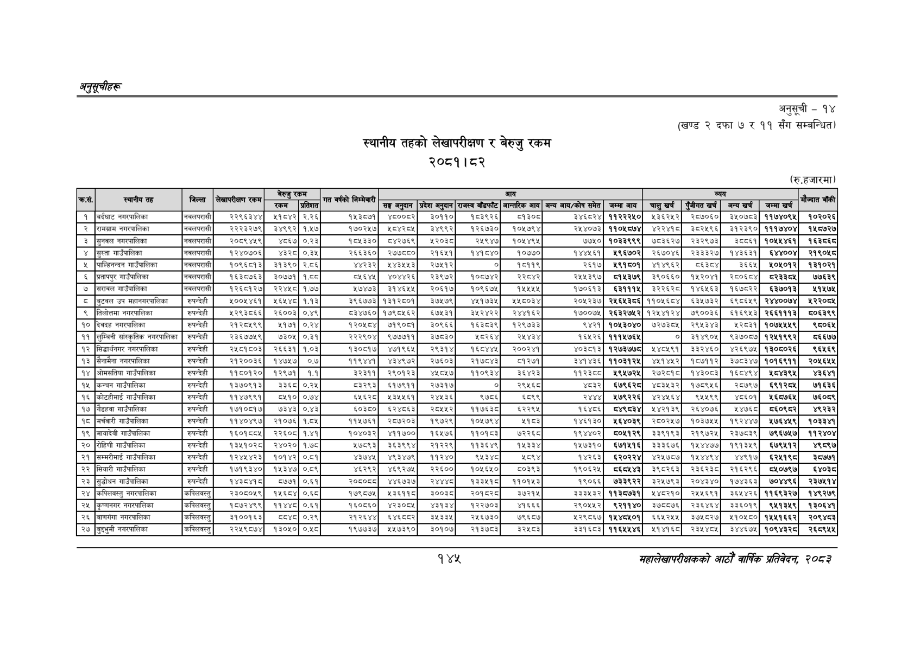

# Page 175 QA

## Rendered page


## Extracted text

```text
अनुतूचीहरू
स्थानीय तहको लेखापरीक्षण र बेरुजु रकम २०८१।८२
अनुसूची -१४
(खण्ड २ दफा ७ र ११ सँग सम्बन्धित)
(रु.हजारमा)
१४४५
महालेखापरीक्षकको आठौ वाषिकि प्रतिवेदन २०८२

|  |  | छन |  |  | रकम |  |  |  |  | आय |  |  |  |  | व्यय |  |  |
| --- | --- | --- | --- | --- | --- | --- | --- | --- | --- | --- | --- | --- | --- | --- | --- | --- | --- |
|  | ३५१ |  |  | रछ | प्रतिशत | २३३८ | सङ्घ अनुदान | प्रदेश अनुदान | राजस्व बाँडफाँट | आन्तरिक आय | अन्य आय/कोष समेत | जम्मा आय | चालु खर्च | पुँजीगत खर्च | बन्य खर्च | जम्मा खर्च |  |
| १ | बर्दघाट नगरपालिका | नवलपरासी | २२९६३४४ | ५१८४२ | २.२६ | १५३८७१ | ४८००८२ | ३०११० | १५३९२६ | ब५१३०८ | ३४६८२४ | ११२२२५० | ५३६२४५२ | २८७०६० | ३४०७८३ | ११७४०९४ | १०२०२६ |
| २ | रामग्राम नगरपालिका | नवलपरासी | २२२३२७९ | ३४९९२ | १.५७ | १७०२५७ | ५८४२८५ | ३४९९२ | १२६७३० | १०५७९४ | २४५४०७३ | ११०४८७४ | ४२२४१८ | ३८२५९६ | ३१२३६० | १११७४०४ | १५८७२७ |
| ३ | सुनवल नगरपालिका | नवलपरासी | २०८९४५९ | ४८६७ | ०३३ | १८५३३० | ८४२७६९ | १२०३८० | र४१९४७ | १०४५४९४५ | ७८५० | १०३३९९९ | ७०३६२७ | २३२९७३ | ३८८६१ | १०५४४६१ | १३८६ |
| ४ | सुस्ता गाउँपालिका | नवलपरासी | १२४०७०६ | ४३२८ | ०.३४५ | २६६३६० |  | २१६४५१ | १४१८४० | १०७७० | १४४४६१ | ४९६७०२ | २६७०४६ | २३३३२७ | १४३६३१ | ६४४००४ | २१९०४५८ |
| ५ | पाल्हिनन्दन गाउँपालिका | नवलपरासी | १०९६८१३ | ३१३९० | २.८६ | ४४२३२ | १५४३५५३ | २७५१२ | ० | १५११९ | २६१७ | ४९१६०१ | ४१४९६२ | चबइड४्ट | ३६६५ | ४०४०१२ | १३१०२१ |
| ६ | प्रतापपुर गाउँपालिका | नवलपरासी | १६३८७६३ | ३०७७१ |  | ५६४५ | ४०४४२६ | २३९७२ | १०८७४२ | र२२८४२ | २५५३९७ | ८१४३७९ | ३९०६६० | १५२०४१ | २८०६८४ | दरइइबर | ७७६३९ |
|  | सरावल गाउँपालिका | नवलपरासी | १२६८१२७ | २२४४८ | १.७७ | ५७४७३ | ३१४६५४५ | २०६१७ | १०९६७५ | ११५१५४५ | १७०६१३ | ६३१११४५ |  | १४६५६३ | १६७८२२ | ६३७०१३ | ११५७५ |
|  | बुटवल उप महानगरपालिका | रुपन्देही | ४००५४६१ | ५६४५४८ | १.१३ | ३९६७७३ | १३१२८०१ | ३७५७९ | ४४१७३५ | १४१८०३४ | २०५२३७ | २४५६४३८६ | ११०५६८४ | ६३४७३२ | ६९८६४९ | २४४००७४ | १२२०८४ |
| ९ | तिलोत्तमा नगरपालिका | रुपन्देही | ५२९३८६६ | २६००३ | ०.४९ | ८३४७६० | १७९८५६२ | ६७५३१ | ३५२४२२ | २४४१६२ | १७००७५ | २६३२७५२ | १२५४१२४ | ७९००३६ | ६१६९५३ | २६६१११३ | ८००६३९९ |
| १० | देवदह नगरपालिका |  | २१२८५९९ | ४१७१ | ०.२४ | १२०५७४ | ७१९०६१ | ३०९६६ | १६३८३९ | १२९७३३ | ९४२१ | १०४५३०४० | ७२७३०५ | २९५३४३ | १२८३१ |  | ९८०६४ |
| ११ | लुम्बिनी सांस्कृतिक नगरपालिका | रुपन्देधि | २३६७७५९ | ७३०५ | ०.३१ | २२२९०४ | ९७७७११ | ३७८३० | ८२६४ | र२४४३४ | १६४२६ | १११५७६४५ | ० | इ१४९०५ | ४३६०५ | १२४१९९२ | ८६६७७ |
| १२ | सिद्धार्थनगर नगरपालिका | रुपन्देहधि | २४८१८०३ | २६६३१ | १.०३ | १३०८१७ | ४७१९६५ | र२९३१४ | १६८४४५ | र२००२४१ | ४०३०१३ | १२७३७७८ | ५४०५९१ | ३३२४६० | ४२६९७५ | १३०६०२६ | ९६४६९ |
| १३ | सैनामैना नगरपालिका | रुपन्देही | २१२००३६ | १४७५७ | ०.७ | ११९४४१ | ४३४९७२ | २७६०३ | २१७८४३ | ५१२७१ | ३४१४३६ | ११०३१२४५ | ४५१४५२ | १८७११२ | ३७५३४७ | १०१६९११ | २०४५६४५४५ |
| १४ | ओमसतिया गाउँपालिका | रुपन्ददी | ११५०१२० | १२९७१ | १.१ | ३२३११ | २९०१२३ |  | ११०९३४ | ३६४२३ | ९९७३५ | ४९५७२४५ | २७२८०१८ | १४३०८३ | १६८४६४ | १८०४३९५ | ४३६४१ |
| १५ | कन्चन गाउँपालिका | रुपन्देही | १३७०९१३ | ३३६५ |  | ८३२९३ | ६१७९११ | २७३१७ | ० | र२९४५६८ | ४८३२ | ६७९६२८ | ४०३५३२ | १७८९५६ | २०७९७ | ६९१२८४ | ७१६३६ |
| १६ | कोटहीमाई गाउँपालिका | रुपन्दही | ११४७९९१ | ८५१० | ०.७४ | ६६२८ | २३४५६१ | २४५३६ | ९७८६ | ६८९९ | २४४४ | ४७९२२६ | ४२४४५६४ | ९४५५९९ | ४८६०१ | ४६५७६४ | ७६०९ |
| १७ | गैडहवा गाउँपालिका | रुपन्देही | १७१०६१७ | ७३४३ | ०.४३ | इ०३८० | ६२४८६३ | र२८५४५२ | ११७६३ड | ६२२९४५ | १६४८६ |  | ५४२१३९ | २६४०७६ | ४७६८ |  | ४९२३२ |
| १८ | मर्चवारी गाउँपालिका | रुपन्देही | ११४०४९७ | २१०७६ | १.८४५ | ११५७६१ | २८७२०३ | १९७२९ | १०४७९४ | ११६३ | १४६१३० | ४६४०३९ | २८०२५७ | १०३७५५ | १९२४४७ | ४७६४४६९ | १०३३४१ |
| १९ | मायादेवी गाउँपालिका |  | १६०१५५४५ | २२६०८ | १.४१ | १०४०३२ | ४११७०० | १६५७ | ११०१८३ | ७२२६८ | १९४४०२ | ब०४१२९ | ३३९१९३ | २१९७२५ | २३७८३९ | ७९६७४७ | ११२४०४ |
| २० | रोहिणी गाउँपालिका |  | १३५१०२८ | २४०२० | १.७८ | ५७८९३ | ३६३९९४ | २१२२९ | ११३६४९ | १४३३४ | १५७३१० | ६७१४१६ | ३३३६७६ | १५४४७७ | १९१३४९ | ६७९५१२ | ४९८९७ |
| २१ | सम्मरीमाई गाउँपालिका | रुपन्देदि | १२४५४२३ | १०१४२ | ०.१ | ४३७४५ | ४९३४७९ | ११२४० | द४३४८ | १८९४ | १४२६३ | ६२०२२४ | ४२५७०८७ | १५४४९
```

## Flags
- table_page
- medium_quality_table
