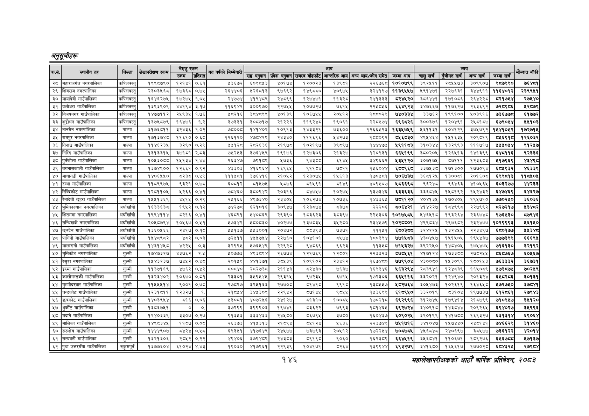

# Page 176 QA

## Rendered page


## Extracted text

```text
महालेखापरीक्षकको आठौ वाषिकि प्रतिवेदन २०८२

|  |  |  |  |  |  |  |  |  |  |  |  |  |  |  |  |  |  |
| --- | --- | --- | --- | --- | --- | --- | --- | --- | --- | --- | --- | --- | --- | --- | --- | --- | --- |
|  |  |  | ५५ | बेरुजु | रकम |  |  |  |  | आय |  |  |  |  | व्यय |  |  |
| २३ | ३२५ |  |  | रकम | प्रतिशत | पापको | सङ्घ अनुदान | प्रदेश अनुदान | राजस्व बाँडफाँट | आन्तरिक आय | अन्य आय/कोष समेत | जम्मा आय | चालु खर्च | पुँजीगत खर्च | अन्य खर्च | जम्मा खर्च |  |
| २८ | महाराजगंज नगरपालिका | कपिलवस्तु | १९९८७९० | १२१४१ | ०.६१ | ५३६७२ | ६०९८४३ | ४०७४ | १२००२३ | १३९८१ | २२६७६८ | १०१०७९९ | ३९२४११ | २८५५७३ | ३०९९०७ | ९८७९९० | ७६४८१ |
| २९ | शिवराज नगरपालिका | कपिलवस्तु | २३०३५६८ | १७३६८ | ०.७५ | २६४४०६ | ५२६८१३ | ९७९२ | १४९५६० | ४०९७५ | ३२४१९७ | ११३९५५७ | ५९१४७१ | २२७६३१ | ३४४९११ | ११६४०१२ | २३९९५१ |
| ३० | मायादेवी गाउँपालिका | कपिलवस्तु | १६४६२७५ | १७२७५ | .०४ | २४७७४ | ४१९४८९ | २४८९९ | १२७४७१ | ११३२८ | २४१३३३ | ८२४५२० | ३८६४४१ | १७१०८६ | २६४२२८ | ८२१७५४ | र२७५४० |
| ३१ | यशोधरा गाउँपालिका | कपिलवस्तु | १३९३९०९ | ४४१९४ | ३.१७ | ११६९४२ | ३००९७० | २२७४५ | १०७७२७ | ७६१५ | २२५०४५६ | ६६४९२३ | ३४७६६७ | ११७६२७ | २६३६६२ | ७२८९८६ |  |
| ३२ | विजयनगर गाउँपालिका | कपिलवस्तु | १४७७११२ | २५९३५ | १.७६ | ४५ | ३८४८९९ | ४०१३९ | १०६७५५ | र२०५१२ | १८८०२९ | ७४०३३४ | ३३७६२ | १९९१०० | ५०३९१६ | ७३६७७८ | ६१७७२ |
| ३३ | शुद्दोधन गाउँपालिका | कपिलवस्तु | १३७५८७९ | १६४७६ | १.२ | ३७३३१ | ३०८७१७ | २१२२६ | ११९२४८० | १९०६१ | २२६४ | ६९६८२६ | ३००३७६ | १२०४६१ | २४०१८७ | ६७९०५४ | ५१०३ |
| ३४ | तानसेन नगरपालिका | पाल्पा | ३१७६८११ | ३२४३६ | १.०२ | ७००८ | १४१४०२ | १०९१३ | १४३३२१ | ७३६०० | १२६६५२३ | १६३४७४९ | ५६११३१ | इ०४१२९ | ३७५७९२ | १४४१०४१२ | १७२७१५ |
| ३५ | रामपुर नगरपालिका | पाल्पा | १७१३७४८ | ११६१० | ०.६८ | १२६१२० | ४७८४२९ | २४३४० | १११६९६ | १४२७३ | १८८०६२ | ० | ४९४५४६४ | १५१६३५ | २०९८१९ | ६९१८ | १२६०३२ |
| ३६ | तिनाउ गाउँपालिका | पाल्पा | ११४६२३५ | ३२९० | ०.२९ | ४१२८ | २८२६३६ | २१९७ | १०२१९७ | ३९८९७ | १४४४७५ | ४९११८३ | ३१०३४४ | १३२९९३ | १११७१७ | २४५५०४४ | ९१२५७ |
| ३७ | निस्दि गाउँपालिका | पाल्पा | १३१३३१५ | ३७१८१ | २.८३ | ७२५३ | ३७६४५९ | १९१७६ | १२७३०६ | २१३२७ | ९०९३१ | ६६४१९९ | ३८०२०५ | १२६५१३ | १४१३९९ | ६इ४०११६ | ९२३३६ |
| ३८ | पुर्वखोला गाउँपालिका | पाल्पा | १०४५३०६८ | १४५१३४ | १.४४ | २६३४७ | ७९१९९ | २७३६ | र४३६८ | ६१४५ | ३४९६६२ | ४३४१२० | ३०७१७५ | ८५७१११ | १२३६८३ | ४१७९६९ | ४३४९८ |
| ३९ | बगनासकाली गाउँपालिका | पाल्पा | १३७४९०० | १२६६१ | ०.९२ | ४३३०३ | ४१६९६४ | १६९६५ | १११८४ | ७८११ | १५६०४४ | हृदद९६द | ३३७५३८ | १७१३०० | १७७०९४ | ६८५९३२ | ४६३३९ |
|  | माथागढी गाउँपालिका | पाल्पा | १४०६५५० | ८२३८ | ०,४५९ | १११४८१ | इ७६४१६ | २१०४२ | १२३०७५ | १४५६१३ | १७०४५च१ | ७०६७३७ | ३६८१२५ | १३००६१ | २०१६०८ | ६९९८१३ | ११५४०५ |
| ४१ | रम्भा गाउँपालिका | पाल्पा | ११८९९७५ | ९३२१ | ०.७८ | ०६१२ | ८१५७५ | २०७६ | ब१५९१ | ८१४९ | ४०९४०७ |  | ९६२४८ | ९६४६३ | ४१०५६५ | ६०३२७७ |  |
| ४२ | रिन्डिकोट गाउँपालिका | पाल्पा | १२८११०५ | १२६६ | ०.४१ | ७४६० | ३८०९४२ | २०३१६ | ८४७७ | १०२७४५ | १३७३४६ | ६३३६३६ | ३३६८४५ | १४५०१९२ | १५२४३२ | ६४७४६९ | ६४६२७ |
| ४३ | रैनादेवी छहरा गाउँपालिका | पाल्पा | १५५१३६९ | ४५१५ | ०.२६९ | २५१६६ | ४९७३४० | र२३४०५ | १०६२७४ | १०७३६ | १४३३६४५ | ७८११२० | ४०४१३५ | १७०४०५ | १९४५७१० | ७७०२५० | ३६०३६ |
| ४४ | भुमिकास्थान नगरपालिका | अर्घाखाँची | १६३३६३८ | १९५२ | ०.१२ | ७४२७ | ६२१०१६ | इ३०९४७ | १२३५७४ | ड३७ड | २२२०६ | ८०६४२१ | ४१४२२७ | १८४९९८ | २२७९९२ | ८२७२१७ | ४१३४८२ |
| ४४५ | नगरपालिका | अर्घाखाँबी | १९९४११४ | ८२१६ | ०.४१ | ४६८९१ | ५४०८६९ | २९३९० | १८३६२३ | ३८३९७ | २२४५३०६ | १०१७४०८४५ | ५४६४१८ | १९३२६४ | २३६७४८ | ९७६४३० | ७९४६ |
| ४६ | सन्धिखर्क नगरपालिका | अर्घाखाँची | २०४८७९४ | १०४५६७ | ०.४५१ | ५७३४२ | ५८०८३० | ४०२७७ | १३७८३५ | ० | २३४४७९ | १०२८६०१ | ४९९८३४ | २९७६८२ | २३२४७७ | १०२९९९३ | ४६१५० |
| ४७ | गाउँपालिका | अर्घाखीबी | १३६०५६६ | २४१७ | ०.१८ | ५५१३७ | ५४५३००१ | २०४७२ | ब५५३९३ | ७३७१ | १११५१ |  | ३२४२२५ | १३२४५४५ | २२३४९७ | ६८०१७७ | ४३४८ |
| ४८ | पाणिनी गाउँपालिका | अर्घाखाबी | १५४८९८२ | ४८२ | ०.०३ | ७२५११ | ४५४५७५४ | २२७६० | १०४१०१ | ५५७४ | १८०३९४ | ७७१४८३ | ४३०४५७ | १५१५०५ | १९५४३७ | ७७७३९९ | ६६६९५ |
| ४९ | मालारानी गाउँपालिका | अर्घाखाबी | १४३१४४८० | ४२२
```

## Flags
- table_page
- medium_quality_table
