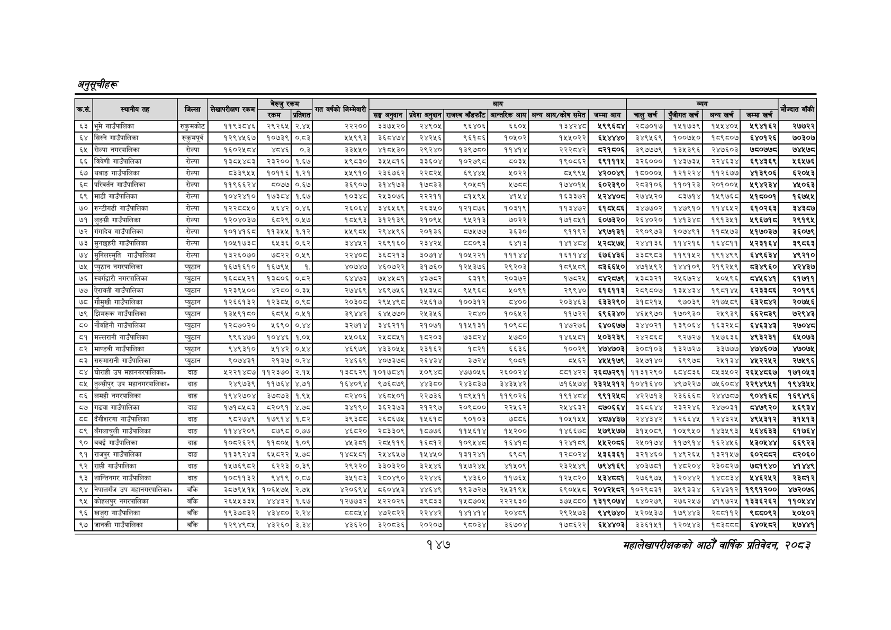

# Page 177 QA

## Rendered page


## Extracted text

```text
महालेखापरीक्षकको आठौ वाषिकि प्रतिवेदन २०८२

|  |  |  |  |  |  |  |  |  |  |  |  |  |  |  |  |  |  |
| --- | --- | --- | --- | --- | --- | --- | --- | --- | --- | --- | --- | --- | --- | --- | --- | --- | --- |
|  |  |  | ५५ | बेरुजु | रकम |  |  |  |  | आय |  |  |  |  | व्यय |  |  |
| २३ | ३२५ |  |  | रकम | प्रतिशत | पापको | सङ्घ अनुदान | प्रदेश अनुदान | राजस्व बाँडफाँट | आन्तरिक आय | अन्य आय/कोष समेत | जम्मा आय | चालु खर्च | पुँजीगत खर्च | अन्य खर्च | जम्मा खर्च |  |
| ६३ | भूमे गाउँपालिका | रुकुमकोट | ११९३८४६ | २९२६४५ |  | २२२०० | इ३७५२० | २४९०५ | ९६४०६ | ६६०५ | ९३ | ४९९६८४ | २०७०१७ | १५१७३९ | १४५५४०५ | १९४१६२ | र२७७२२ |
| ६४ | सिस्ने गाउँपालिका | रुकुमपूर्व | १२९४५६७ | १०७३९ | ०.८३ | ५९९३ | इइड४छ४ | २४२५६ | ब६१८६ | १०५०२ | १५५०२२ | ६४४४४० | ३४९४५६९ | १००७५० | १८९८०७ | ६४०१२६ | ७०३०७ |
| ६५ | रोल्पा नगरपालिका | रोल्पा | १६०२४८४ | ४८४६ | ०.३ | ३३५४५० | ४१०४५३० | २९२४० | १३९७८० | ११४१४ | २२२८४२ | ८२१६०६ | ३९७७७९ | १३५३९६ | २४७६०३ | ७६०७७८ | ७४५७८ |
| ६६ | बिवेणी गाउँपालिका | रोल्पा | १३०५४८३ | २३२०० | १.६७ | ४९५३० | ३४५५८१६ | ३३६०४ | १०२७९८ | ५०३५ | १९०८६२ | ६९१११५ | ३२६००० | १४३७३५ | २२४६३४ | ६९४३६९ | ६५७६ |
| ६७ | थबाङ गाउँपालिका | रोल्पा | ५३३९५५ | ९०९९८ | १.२१ | ४४५९० | २३६७६२ | २२८२४५ | ६९४४५ | ४०३३ | ७९९५ | ४२००४९ | १८०००५ | १२१२२४ | ११२६७७ | ४१३९०६ | ६२०५३ |
| ६८ | परिवर्तन गाउँपालिका | रोल्पा | ११९६६२४ | ८०७७ | ०.६७ | ३६९०७ | ३१४१७३ | १७३३ | ९०५१ |  | १७४०१५ | ६०२३९० | २०३१०६ | ११०१२३ | २०१००५ | १९४२३४ | ४५०६३ |
| ६९ | माडी गाउँपालिका | रोल्पा | १०४२४१० | १७३८४ | १.६४ | १०३४८ | २५३०७६ | २२२११ | ५१५९५ | ४१५४ | १६३३७२ | २४४० | २७४५२० | ०८३७१४ | १५९७६८ | भ१८००१ | १६७५५ |
| ७० | रुन्टीगढी गाउँपालिका | रोल्पा | १२२८८५० | ४६४२ | ०.४६ | २६०६४ | ३४६४५६९ | २६३५० | १२१८७६ | १०३१९ | ११३४७२ | ६१८४८६ | ३४७७०२ | १४७९१० | ११४६४६२ | ६१०२६३ | ३४३८७ |
| ७१ | लुइ्ग्री गाउँपालिका | रोल्पा | १२०४०३७ | ६८२९ | ०,४५७ | १०५९३ | ३१२१३९ | २१०९५ | ब९५२१३ | ७०२२ | १७१०५१ | ६०७३२० | २६४०२० | १४१३४८ | १९१३४१ | ४९६७१५ | २९१९४५ |
| ७२ | गंगादेव गाउँपालिका | रोल्पा | १०१४१६८ | ११३५५ | १.१२ | ५४९८५ | २९४५९६ | २०१३६ | ०७५७७ | ३६३० | २९९८७ | ४९७१३१ | २९०९७३ | १०७४९१ | ११८५७३ | ४१७०३७ | ३६०७९ |
| ७३ | सुनछहरी गाउँपालिका | रोल्पा | १०५१७३८ड | ६५३६ | ०.६२ | ३४४५२ | २६९१६० | रइ३४२५ | ब५८०९३ | ६४१३ | १४१४८४ | ४२८४७४५ | २४४१३६ | ११४२१६ | १६४८११ | ४२३१६४ | ३९८६३ |
| ७४ | सुनिलस्मृति गाउँपालिका | रोल्पा | १३२६०७० | ७८२२ | ०,४५९ | २२४० | इदर१३ | इ०७१४ | क०५२२१ | १११४४ | ९९ | ६७६४३६ | ३३८९८३ | ११९१५२ | १९१४९९ | ६४९६३४ | ४९२१० |
| ७५ | प्युठान नगरपालिका | प्युठान | १६७१६१० | १६७९५ | १ | ४०७४७ | ४६०७२२ | ३१७६० | १२४३७६५ | र२९२०३ | १८९४८६ | ८३६६५० | ४७१५९२ | १४४१०९ | २१९२४५९ | छ८३४९६० | ४२४३७ |
| ७६ | स्वर्गद्वारी नगरपालिका | प्युठान | ८५५४३९ | १३८०६ | ०.८२ | ६५४४छ३ | ७४५४५०८१ | ३७८२ | ५३१९ | २०३७२ | १७८२५ | ८४२८७९ | ५३८३२१ | २५६७२४ | ०५९६ |  | ६१७११ |
| ७७ | ऐरावती गाउँपालिका | प्युठान | १२३९५०० | ४२८० | ०.३५ | २७४६९ | ४६९७४६ | १४५३४८ | ९४९६४८ | १०९१ | २९९४० | १८९९३ | २८९८०७ | १३५४३४ | १९८१४५ | धर२३३८६ | २०१९६ |
| ७८ | गौमुखी गाउँपालिका | प्युटान | १२६६१३२ | १२३८४५ | ०.९८ | २०३०६ | २९५४९८ | २४६१७ | १००३१२ | ८४०० | २०३४६३ | ६३३२९० | ३१८२१५ | ९७०३९ | २१७४५०८९ | धइर४२ | २०७४५६ |
| ७९ | झिमरुक गाउँपालिका | प्युठान | १३५९१८० | ६८९५ | ०.११ | ३९४४२ | ६४५७७० | २१३५६ | २८४० | १०६१२ | ११७२२ | ६९६३४० | ४६५९७० | १७०९३० | २५९३९ | ६६२८३९ | ७२९४३ |
| ८० | नौवहिनी गाउँपालिका | प्युठान | १२८७०२० | १६९० | ०.४४ | ३२७१४ | ३४६२११ | २१०७१ | ११५१३१ | १०८८ | १४७२७६ | ६४०६७७ | ३४४०२१ | १३९०६४ | १६३२४८ | ६४६३४३ | र२७०४८ |
| ८१ | मल्लरानी गाउँपालिका | प्युठान | ९९६४७० | १०४४६ |  | ५४५०६५ | २५८५५१ | १८२०३ | छइ८र४ | १७६० | १४६४०१ | ४०३२३९ | २४२८६८ | ९२७२७ | १४५७६३६ | ४९३२३१ | ६४५०७३ |
| ८२ | माण्डवी गाउँपालिका | प्युठान | ९४९३१० | ४१४२ |  | ४६९७९ | ४३३०४५ | २३१६२ | १८२१ | ६६३६ | १००२९ | ४७४७०३ | ३०५९०३ | १३२७२७ | इ३३५७७७ | ४७४६०७ | ४७०७ |
| ५३ | सरुमारानी गाउँपालिका | प्युठान | ९०७४३१ | २१३७ | ०.२४ | २४६६९ | ४०७३७८ | २६४३४ | ३७२४ | १०६१ | ८५६२ | ४५५१७९ | ३५७१४० | ९९७८ | २४१३४ | ४४५२२४२ | २७५९६ |
| ८४ | घोराही उप महानगरपालिकान | दाङ | ५२२१४८७ | ११२३७० | २.१५ | १३८६२९ | १०१७८४१ | १०९४८ | ४७७०५६ | २
```

## Flags
- table_page
- medium_quality_table
