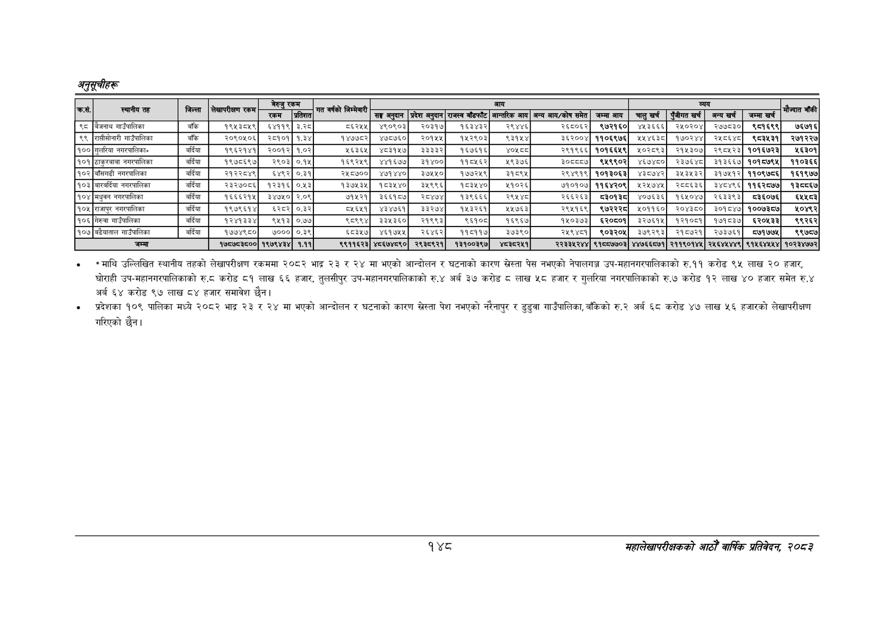

# Page 178 QA

## Rendered page


## Extracted text

```text
० माथि उल्लिखित स्थानीय तहको लेखापरीक्षण रकममा २०८२ भाद्र २३ र २४ मा भएको आन्दोलन र घटनाको कारण स्रेस्ता पेस नभएको नेपालगञ्ज उप-महानगरपालिकाको रु.११ करोढ ९५ लाख ० हजार, घोराही उप-महानगरपालिकाको रु.८ करोड ८१ लाख ६६ हजार, तुलसीपुर उप-महानगरपालिकाको रु.४ अर्ब ३७ करोड लाख ५८ हजार र गुलरिया नगरपालिकाको रु.७ करोड १२ लाख ४० हजार समेत रु.४ अर्ब ६४ करोड ९७ लाख ८४ हजार समावेश छैन।
० प्रदेशका १०९ पालिका मध्ये २०८२ भाद्र २३ र मा भएको आन्दोलन र घटनाको कारण स्रेस्ता पेश नभएको नरैनापुर र डुडुवा गाउँपालिका, बाँकेको रु.२ अर्ब ६८ करोड ४७ लाख ५६ हजारको लेखापरीक्षण गरिएको छैन।
१४८
महालेखापरीक्षकको आठौ वाषिकि प्रतिवेदन २०८२

|  |  |  |  |  |  |  |  |  |  |  |  |  |  |  |  |  |  |
| --- | --- | --- | --- | --- | --- | --- | --- | --- | --- | --- | --- | --- | --- | --- | --- | --- | --- |
|  |  |  | ५५ | बेरुजु | रकम |  |  |  |  | आय |  |  |  |  | व्यय |  |  |
|  |  |  |  | रकम | प्रतिशत | पापको | सङ्घ अनुदान | प्रदेश अनुदान | राजस्व बाँडफाँट | आन्तरिक आय | अन्य आय/कोष समेत | जम्मा आय | चालु खर्च | एंजीगत खर्च | अन्य खर्च | जम्मा खर्च |  |
| ९८ | बैजनाथ गाउँपालिका | बाँकि | १९५३८५९ | ६इ४११९ | २३५ | ८६२५५ | ४९०९०३ | २०३१७ | १६३४३२ | २९४४६ | २६८०६२ | ९७२१६० | ४५३६६६ | २५०२०४ | २७७८३० | ९८१६९९ | ७६७१६ |
| ९९ | राीसोनारी गाउँपालिका | बाँकि | २०९०५०६ | २८१०१ | १.३४ | १४७७८२ | ४७५७६० | २०१५५ | १५२९०३ | ३१५४ | ३६२००४ | ११०६९७६ | »५५४६३८ | १७०२४४ | २५८६४८ | ९८३४३१ | २७१२२७ |
| १०० | गुलरिया नगरपालिका» | वर्दिया | १९६२१४१ | २००१२ | १.०२ | ५६३६५ | ४८३१५७ | ३३३३२ | १६७६१६ | ४०५६८ | २९१९६६ | १०१६६४५९ | »५०२८९३ | २१५३०७ | २९०४५२३ | १०१६७२३ | ४५६३०१ |
| ९०९ | ठाकुरबाबा नगरपालिका | वर्दिया | १९७८६९७ | २९०३ | ०.१५ | १६९२५९ | ४४१६७७ | ३१४०० | ११८६६२ | ९३७६ | ३०८८८७ | ९४९९०२ | ४६७४८० | २३७६४८ | ३१३६६७ | १०१५७९५ | ११०३६६ |
| १०२ | बाँसगढी नगरपालिका | वर्दिया | २१२२८४९ | ६४९२ | ०.३१ | २४५८७०० | ४७१४४० | ३७५१० | १७७२१९ | ज३१८९४५ | २९४६१९ | १०१३०६३ | ४३०७४२ | ३५३४५३२ | ३१७५१२ | ११०९७८६ | १६१९७७ |
| १०३ | बारवर्दिया नगरपालिका | वर्दिया | २३२७०८६ | ९३३९६ | ०४३ | १३७४३५ | १८३४४० | ३४५९९६ | १५३५४० | १०२६ | १०१०७ | ११६४२०९ | ४५२४७४५ | २८८६३६ | ३४८४९६ | ११६२८७७ | १३८८६७ |
| १०४ | मधुवन नगरपालिका | वर्दिया | १६६६२१५ | ३४७५० | २.०९ | ७१५२१ | ३६६१८७ | २८४७४ | १३९६६६ | र२९५४८ | २६६२६३ | दइ०े३ | ४०७६३६ | १६५०४७ | २६३३९३ | ८३६०७६ | ६४४५८३ |
| १०५ | राजापुर नगरपालिका | बर्दिया | १९७९६१४ | ६२८२ | ०.३२ | ८५६५१ | ४३४७६१ | ३२७४ | १५३२६१ | ५७६३ | २९५१६९ |  | ४५०११६० | २०४३८० | इ०१८४७ | १००७३८७ | १०४९२ |
| १०६ | गेरुवा गाउँपालिका | बर्दिया | १२४१३३४ | ९५१३ | ०.७७ | ९८९९४ | ३३५३६० | २१९९३ | ९६१० | १६९६७ | १५०३७३ | ६२०६०१ | ३२७६१५ | १२१००१ | १७१८३७ | ६२०५६३३ | ९९२६२ |
| १०७ | बढैयाताल गाउँपालिका | बर्दिया | १७७४९८० | ७००० | ०.३९ | ६३५७ | ४६१७५५ | २६४६२ | ११५११७ | इ७३९० | २४५९४च१ | ९०३२०४ | ३७९२९३ | २१८०७२१ | २७३७६१ | ७१७७ | ९९७७ |
|  | जम्मा |  | १७५७८३८०० | १९७९४३४ | १.११ | ९९११६२३ | ४८६७४८९० | २९३८९२१ | १३१००३९७ | ४८३८२४५१ | २२३३४५२४४ | ९१८८७७०३ | ४४७६६८७१ | २११९०१४४५ | २५६४५४४९ | ९१५६४५५४ | १०२३४७७२ |
```

## Flags
- table_page
- medium_quality_table
