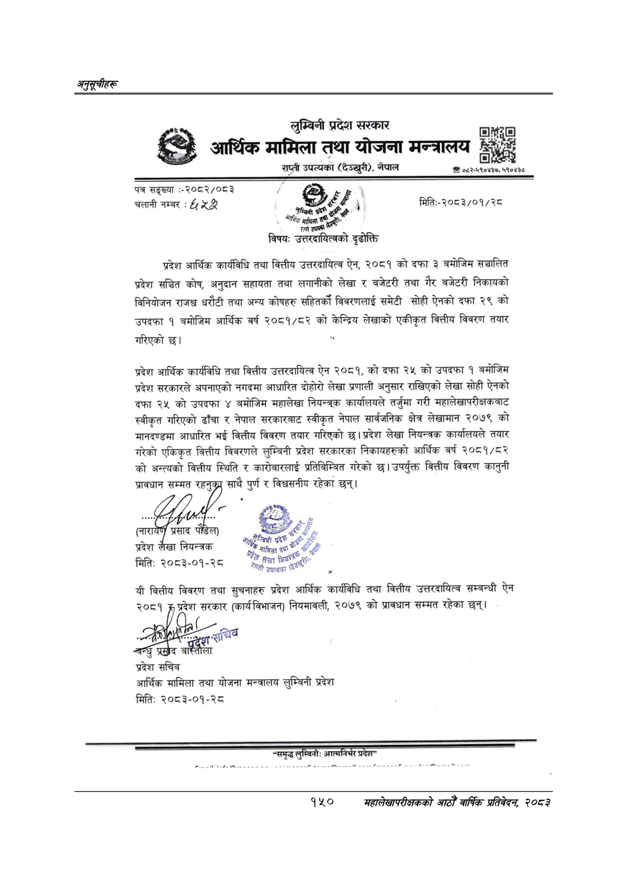

# Page 180 QA

## Rendered page


## Extracted text

```text
अनुतूचीहरू
क्र लुम्बिनी प्रदेश सरकार आर्थिक मामिला तथा योजना मन्त्रालय राप्ती उपत्यका (देउखुरी), नेपाल ०८२-५९०४३७, ५९०४३८ पत्र सङ्ख्या:-२०८२/०८ ३ चलानी नम्बर ४ मितिः-२०८३/०१/२८ विषय: उत्तरदायित्वको प्रदेश आर्थिक कार्यविधि तथा वित्तीय उत्तरदायित्व ऐन, २०८१ को दफा ३ बमोजिम सञ्चालित प्रदेश सञ्चित कोष, अनुदान सहायता तथा लगानीको लेखा र बजेटरी तथा गैर बजेटरी निकायको विनियोजन राजश्व धरौटी तथा अन्य कोषहरु सहितर्को विवरणलाई समेटी सोही ऐनको दफा २९ को उपदफा १ बमोजिम आर्थिक वर्ष २०८१/८२ को केन्द्रिय लेखाको एकीकृत वित्तीय विवरण तयार गरिएको छ। प्रदेश आर्थिक कार्यविधि तथा वित्तीय उत्तरदायित्व ऐन २०८१, को दफा २५ को उपदफा १ बमोजिम प्रदेश सरकारले अपनाएको नगदमा आधारित दोहोरो लेखा प्रणाली अनुसार राखिएको लेखा सोही ऐनको दफा २५ को उपदफा ४ बमोजिम महालेखा नियन्त्रक कार्यालयले तर्जुमा गरी महालेखापरीक्षकबाट स्वीकृत गरिएको ढाँचा र नेपाल सरकारबाट स्वीकृत नेपाल सार्वजनिक क्षेत्र लेखामान २०७९ को मानदण्डमा आधारित भई वित्तीय विवरण तयार गरिएको प्रदेश लेखा नियन्त्रक कार्यालयले तयार गरेको एकिकृत वित्तीय विवरणले लुम्बिनी प्रदेश सरकारका निकायहरुको आर्थिक वर्ष २०८१/८२ को अन्त्यको वित्तीय स्थिति र कारोबारलाई प्रतिविम्बित गरेको छ। उपर्युक्त वित्तीय विवरण कानुनी का साथै पुर्ण र विश्वसनीय रहेका छन्‌। र प्रदेश लेख मितिः २०८३-०१-२८ यी वित्तीय विवरण तथा सुचनाहरु प्रदेश आर्थिक कार्यविधि तथा वित्तीय उत्तरदायित्व सम्बन्धी ऐन छुँ ०८१ प्रदेश सरकार (कार्य विभाजन) नियमावली, २०७९ को प्रावधान सम्मत रहेका छन्‌। प्रदेश सचिव आर्थिक मामिला तथा योजना मन्त्रालय लुम्बिनी प्रदेश मितिः २०८३-०१-२८ आनि
क
२
१
मामिला
सपुत
न
क
सामिता
ह्
सर
०
लि
उपत्यका
न
क
सामिता
ह्
सर
०
लि
उपत्यका
निड
छ
१५०
सहालेखापरीक्षकको आठौँ वाषिकि प्रतिवेदन २०८२
```

## Flags
- None
